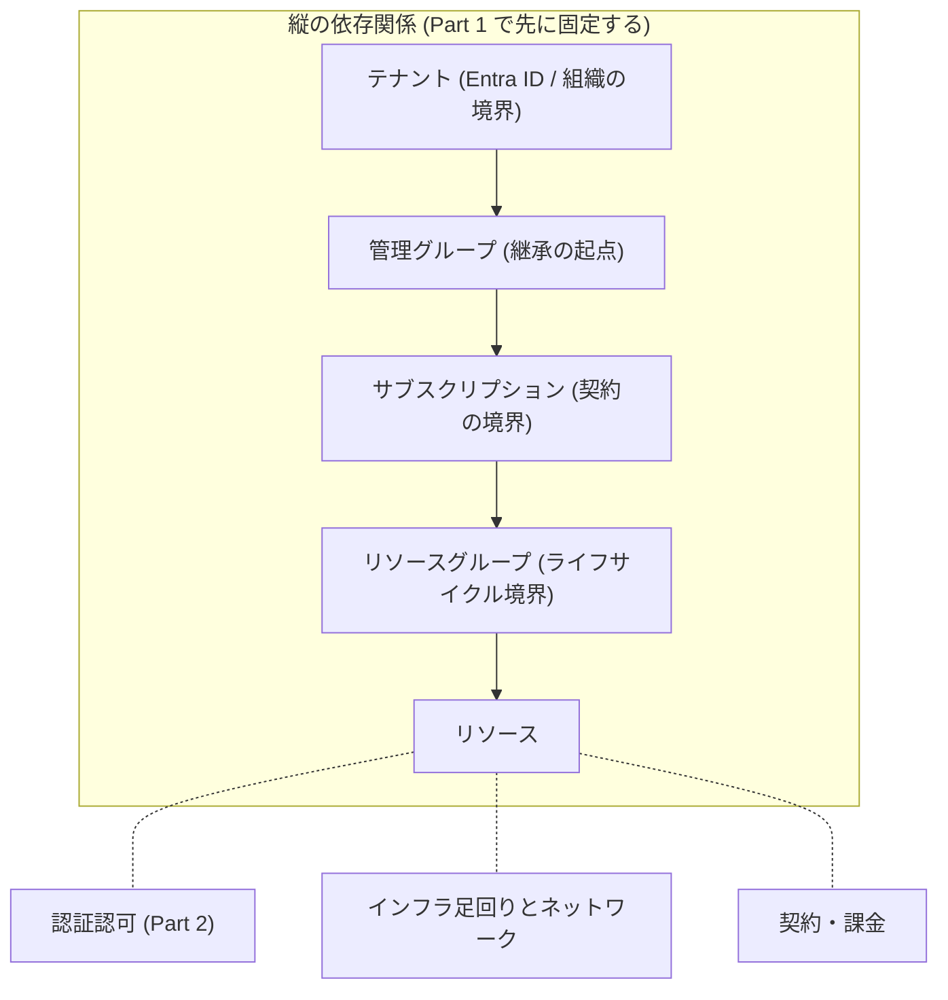

# Azure 自習書 ― ガバナンス階層から積み上げる

Azure の学習でつまずく最大の原因は、個々のサービスの使い方を先に覚えてしまい、サブスクリプションやリソースグループといった土台の構造をあとから継ぎ足すことにあります。本書は逆順を取ります。最初にガバナンス階層を体に入れ、そのあとで個々のサービスを、その階層とどう繋がっているかという縦の関係と、認証認可・ネットワーク・課金とどう繋がっているかという横の関係の両方から学びます。



読者は各章で必ず手を動かします。概念の説明だけで終わる章は作りません。操作した結果が、直前に説明した概念の具体例になっている、という往復を章の中で完結させます。

他クラウドの用語に置き換えて理解する方法（対応表による学習）は使いません。Azure 独自の語彙と構造だけで理解が完結するように書きます。

## 本書の核 ― 6 ブロックの型

Part 4 の各章は、以下の 6 ブロックで統一して書かれています。サービスを 6 つに絞って型を深く固定し、扱わなかったサービスへは読者自身が型を適用して広げる設計です（付録 A と第 24 章がその受け皿）。

| #   | ブロック                                   | 問い                                                                                                           |
| --- | ------------------------------------------ | -------------------------------------------------------------------------------------------------------------- |
| 1   | このサービスは何のためにあるか             | 3 行以内で答えられるか                                                                                         |
| 2   | 縦の依存関係                               | テナント / 管理グループ / サブスクリプション / RG がこのサービスの挙動にどう効くか。効かない層はなぜ効かないか |
| 3   | 横の繋がり（認証認可）                     | 内向き（このサービスから他へ）と外向き（このサービスへ）を分けて                                               |
| 4   | 横の繋がり（インフラ足回りとネットワーク） | ホスティングプランや SKU（性能・価格のグレード）の違いがネットワーク機能・可用性にどう波及するか               |
| 5   | 横の繋がり（契約・課金）                   | 従量課金か専有課金か。課金・無料枠がどの階層で集計されるか                                                     |
| 6   | ハンズオン                                 | 壊す演習とクリーンアップ演習を必ず含む                                                                         |

この型は散文の申し合わせではなく、`scripts/lint/structure-lint.mjs` が CI で機械的に検査しています。

## Operation as Code

本文に載るコマンドと Bicep は、すべてリポジトリ内の実ファイルとして存在します。本文は説明を担い、実行可能な手順は `scripts/` と `infra/` を参照します。読者がコピー&ペーストする対象と、CI が検証する対象を同一にするための構成です。

| ディレクトリ               | 役割                                            |
| -------------------------- | ----------------------------------------------- |
| `manuscript/`              | 原稿（GFM Markdown。図は Mermaid でインライン） |
| `infra/bicep/chapters/`    | 章ごとの Bicep テンプレート                     |
| `infra/bicep/modules/`     | 自作モジュール（第 12 章の教材）                |
| `infra/stacks/`            | Deployment Stacks の deploy / delete ラッパ     |
| `scripts/bootstrap/`       | 実行環境の前提確認                              |
| `scripts/chapters/`        | 本文に載る `az` コマンド列の実体                |
| `scripts/verify/`          | 期待状態の read-only 検証（冪等）               |
| `scripts/teardown/`        | 後始末（soft-delete の purge を含む）           |
| `scripts/lint/`            | 原稿の構成規約と Mermaid 記法の検査             |
| `docs/verification-log.md` | 章 × 検証日 × CLI/API バージョン × 検証状態     |
| `templates/`               | 章のひな形                                      |
| `proposal/`                | 企画書（執筆指示書の原文と章番号対応表）        |

## 目次

読む順序は番号どおりです。Part 1 を飛ばすと本書は成立しません。

### Part 1 ガバナンス階層を体で覚える

| 章  | タイトル                                                                                                | 状態   |
| --- | ------------------------------------------------------------------------------------------------------- | ------ |
| 0   | [Azure を使い始める ― アカウント作成からサブスクリプションまで](manuscript/part1/00-getting-started.md) | 執筆済 |
| 1   | [テナントとサブスクリプション ― 契約と分離の境界](manuscript/part1/01-tenant-and-subscription.md)       | 執筆済 |
| 2   | [管理グループ ― ポリシーと RBAC が上から下に伝わる仕組み](manuscript/part1/02-management-groups.md)     | 執筆済 |
| 3   | [リソースグループ ― ライフサイクルをまとめる単位の設計](manuscript/part1/03-resource-groups.md)         | 執筆済 |
| 4   | [統合ハンズオン ― 4 階層を 1 つのシナリオで通しで作る](manuscript/part1/04-hands-on-four-layers.md)     | 執筆済 |

### Part 2 認証と認可を分離して理解する

| 章  | タイトル                                                                                                            | 状態   |
| --- | ------------------------------------------------------------------------------------------------------------------- | ------ |
| 5   | [Entra ID の基本 ― ユーザー・グループ・サービスプリンシパル・マネージド ID](manuscript/part2/05-entra-id-basics.md) | 執筆済 |
| 6   | [RBAC ― スコープとロールの掛け算で権限が決まる](manuscript/part2/06-rbac.md)                                        | 執筆済 |
| 7   | [マネージド ID ― リソース間の内向き認証](manuscript/part2/07-managed-identity.md)                                   | 執筆済 |
| 8   | [外向き認証 ― アクセスキー・Entra ID 認証・フェデレーション](manuscript/part2/08-outbound-auth.md)                  | 執筆済 |
| 9   | [統合ハンズオン ― ID と権限を 1 つのシナリオで通す](manuscript/part2/09-hands-on-identity.md)                       | 執筆済 |

### Part 3 IaC でリソースを再現可能にする

| 章  | タイトル                                                                                    | 状態   |
| --- | ------------------------------------------------------------------------------------------- | ------ |
| 10  | [ARM テンプレートと Bicep の関係](manuscript/part3/10-arm-and-bicep.md)                     | 執筆済 |
| 11  | [デプロイスコープと Deployment Stacks](manuscript/part3/11-deployment-scopes-and-stacks.md) | 執筆済 |
| 12  | [モジュール化と Azure Verified Modules](manuscript/part3/12-modules-and-avm.md)             | 執筆済 |
| 13  | [統合ハンズオン ― Part 1〜2 の構成を IaC で再現する](manuscript/part3/13-hands-on-iac.md)   | 執筆済 |

### Part 4 サービス別に縦と横の繋がりを辿る

6 ブロックの型で書かれる本書の核。第 14 章がひな形章。

| 章  | タイトル                                                                                              | 状態   |
| --- | ----------------------------------------------------------------------------------------------------- | ------ |
| 14  | [Functions ― Flex Consumption を軸に課金とネットワークの関係を辿る](manuscript/part4/14-functions.md) | 執筆済 |
| 15  | [Storage ― Functions の隠れた依存関係から理解する](manuscript/part4/15-storage.md)                    | 執筆済 |
| 16  | [Key Vault ― RBAC 既定化とアクセスポリシーの歴史](manuscript/part4/16-key-vault.md)                   | 執筆済 |
| 17  | [AKS ― 5 つの ID scenario と Workload ID](manuscript/part4/17-aks.md)                                 | 執筆済 |
| 18  | [Cosmos DB ― コントロールプレーンとデータプレーンの RBAC は別物](manuscript/part4/18-cosmos-db.md)    | 執筆済 |
| 19  | [Networking ― VNet 統合と Private Endpoint が各層にどう効くか](manuscript/part4/19-networking.md)     | 執筆済 |

### Part 5 大規模運用のための設計思想

| 章  | タイトル                                                                                  | 状態   |
| --- | ----------------------------------------------------------------------------------------- | ------ |
| 20  | [Azure Policy ― 強制（Deny）と監査（Audit）の違い](manuscript/part5/20-azure-policy.md)   | 執筆済 |
| 21  | [Cloud Adoption Framework と Landing Zone](manuscript/part5/21-caf-and-landing-zone.md)   | 執筆済 |
| 22  | [マルチサブスクリプション設計の実践](manuscript/part5/22-multi-subscription.md)           | 執筆済 |
| 23  | [コストの見方 ― タグとスコープで課金を切り分ける](manuscript/part5/23-cost-management.md) | 執筆済 |

### Part 6 総合演習

| 章  | タイトル                                                                                      | 状態 |
| --- | --------------------------------------------------------------------------------------------- | ---- |
| 24  | [1 つのアプリケーションをゼロから設計し、全階層を貫通させる](manuscript/part6/24-capstone.md) | 骨格 |

### 付録

| 付録 | タイトル                                                       | 状態 |
| ---- | -------------------------------------------------------------- | ---- |
| A    | [型の適用シート](manuscript/appendix/a-worksheet.md)           | 骨格 |
| B    | [命名規約とタグ設計](manuscript/appendix/b-naming-and-tags.md) | 骨格 |

## ハンズオンの前提

### 必要なもの

- Azure サブスクリプション。ハンズオンで扱うスコープ上、サブスクリプションに対する Owner が必要です（第 6・7・9 章で RBAC ロール割り当てを行うため、Contributor では不足します）。持っていない場合の作り方は第 0 章で扱います
- 第 2・4 章の管理グループ操作は、既定ではテナントの一般ユーザーでも実行できます。組織のテナントで制限されている場合は昇格が必要です
- Azure CLI と Bicep CLI。バージョンは `scripts/bootstrap/check-env.sh` が確認します

顧客環境や本番サブスクリプションでは絶対に実行しないでください。本書のハンズオンはリソースの作成・削除・ポリシー割り当てを含みます。

```bash
az login
az account set --subscription <検証用サブスクリプションID>
./scripts/bootstrap/check-env.sh
```

### コスト

無料枠と低額な SKU（性能・価格のグレード）で完結する構成を前提にしています。ただし以下は課金されます。章の冒頭に概算を明記しています。

| 章                                  | 課金                                                                   |
| ----------------------------------- | ---------------------------------------------------------------------- |
| 17（AKS: Azure Kubernetes Service） | ノードプールの仮想マシンが時間課金。既定では実行しない章として扱います |
| 19（Private Endpoint）              | エンドポイント 1 つあたり時間課金 + データ処理量                       |
| 14〜16, 18, 20                      | 低額。章末の teardown を必ず実行してください                           |

各章の teardown スクリプトは、その章で作ったものを削除します。Key Vault のように論理削除（soft-delete）されるリソースは `purge` まで行います。詳細は第 3 章にあります。

## 執筆と検証

執筆規約は [WRITING_GUIDELINES.md](WRITING_GUIDELINES.md) にあります。検証していない手順は本文に書きません。各章には検証時の CLI バージョンと API バージョンが記録されます。

```bash
npm install
npm run lint            # 書式・構成規約・Mermaid 記法（Azure 不要）
```

現在の検証状況は [docs/verification-log.md](docs/verification-log.md) を参照してください。
