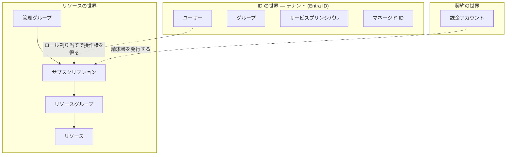
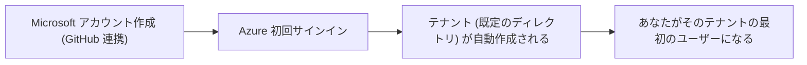

# 第0章 Azure を使い始める ― アカウント作成からサブスクリプションまで

Azure の入門書の多くは、アカウントが既にある前提で始まります。しかし実際には、サインアップの過程でいくつもの登場人物（アカウント、テナント、サブスクリプション）が生まれており、ここを素通りすると「自分がいま何を作ったのか」が分からないまま先へ進むことになります。

本章では、まず本書に登場する概念を図解で定義し、そのうえでアカウント作成からサブスクリプション作成までを実際の画面の流れに沿って辿ります。本章の手順は、本書の執筆時に実際に新規アカウントで通しで実行したものです。

## 本書の登場人物

先に全体像を示します。Azure の世界は、大きく「ID の世界」と「リソースの世界」と「契約の世界」の 3 つに分かれています。



それぞれの定義です。初出の章も添えるので、分からなくなったらここへ戻ってきてください。

| 登場人物                              | 定義                                                                                               | 詳しく扱う章 |
| ------------------------------------- | -------------------------------------------------------------------------------------------------- | ------------ |
| Microsoft アカウント / 組織アカウント | Microsoft のサービスにサインインするための「あなた自身」。Azure より前から存在する概念です         | 本章         |
| Entra ID                              | Microsoft の ID 管理サービス。誰であるかの確認（認証）と、ユーザーやアプリの台帳の管理を担います   | 第1章・第5章 |
| テナント                              | Entra ID の中に組織ごとに用意される、独立した台帳の 1 区画。ユーザーやグループはここに記録されます | 第1章        |
| ユーザー                              | テナントの台帳に載っている人。あなたのアカウントはサインアップ時にテナントへ登録されます           | 第5章        |
| グループ                              | ユーザーをまとめる単位。権限をまとめて付けるために使います                                         | 第5章        |
| サービスプリンシパル                  | 人ではなくプログラムのための ID。CI/CD やアプリケーションがこれで認証します                        | 第5章        |
| マネージド ID                         | Azure が面倒を見てくれるサービスプリンシパル。パスワード管理が不要になります                       | 第7章        |
| 管理グループ                          | サブスクリプションを束ね、ポリシーと権限を上から下へ流す階層                                       | 第2章        |
| サブスクリプション                    | リソースを置く契約の単位。課金・クォータ・使えるサービスの種類がここで区切られます                 | 第1章        |
| リソースグループ                      | リソースを入れる箱。まとめて消せることが最大の特徴です                                             | 第3章        |
| リソース                              | 仮想マシン、ストレージ、データベースなど、実際に動くもの 1 つ 1 つ                                 | Part 4       |
| リソースプロバイダー                  | リソースの種類ごとの提供元。サブスクリプションごとに有効・無効の状態を持ちます                     | 第1章        |
| リージョン                            | リソースが物理的に置かれる場所（japaneast など）。リソースごとに選びます                           | 第3章        |
| ロール割り当て                        | 誰が・どの範囲で・何をできるかの指定。ID の世界とリソースの世界を繋ぐ橋です                        | 第6章        |
| 課金アカウント                        | 支払い方法と請求書の単位。サブスクリプションより上位の契約情報です                                 | 第23章       |
| Azure ポータル                        | ブラウザで操作する管理画面。<https://portal.azure.com>                                             | 本章         |
| Azure CLI                             | ターミナルから操作するコマンド `az`。本書の主な道具です                                            | 本章         |

この表の並びには意味があります。上半分（ID の世界）と下半分（リソースの世界）が別の世界であり、ロール割り当てだけが両者を繋いでいる、という構造が本書全体を貫く軸になります。

## アカウントを作る

ここからは実際のサインアップの流れです。本書の執筆時には GitHub アカウントとの連携でサインアップしたので、その流れで説明します。メールアドレスから新規に作る場合も、生まれるものは同じです。

1. <https://azure.microsoft.com> にアクセスし、サインアップを開始します
2. サインイン方法の選択で GitHub を選びます
3. GitHub 側で認可すると、その GitHub アカウントに紐づいた Microsoft アカウントが作られます（既にあればそれが使われます）

ここで生まれたのは Microsoft アカウント、つまり「あなた自身」の ID だけです。まだ Azure のリソースは何も作れません。

なお、こうして作られたアカウントは、Azure 内部では `live.com#あなたのメールアドレス` という形式で表示されることがあります。組織で管理されるアカウント（勤務先の Entra ID にあるアカウント）とは別物の、個人の Microsoft アカウントであることを示しています。この違いは第5章で扱います。

## テナントはいつ生まれたのか

Azure のポータルに初めてサインインした時点で、あなた専用のテナントが自動的に作られています。ポータル右上のアカウント表示に「既定のディレクトリ」とあるのがそれです。

確認してみます。ポータルの検索窓で「テナントのプロパティ」を開くと、次が見えます。

- 名前: 既定のディレクトリ（自動で付く名前です）
- プライマリドメイン: `あなたの名前などから自動生成.onmicrosoft.com`
- テナント ID: GUID（世界で一意の識別子）

つまり順序はこうです。



誰かに作ってもらった覚えがなくても、テナントは既にあります。「会社で Azure を使っていたときは意識しなかったのに」という場合、それは会社の管理者が作ったテナントの中に、あなたがユーザーとして登録されていたからです。

## サブスクリプションを作る

テナントとユーザーだけでは、リソースは 1 つも作れません。リソースを置く契約の単位であるサブスクリプションが必要です。ポータルに「Azure へようこそ」と表示され、リソースの作成に進めないのは、サブスクリプションがまだ無い状態です。

### 無料アカウントが使えない場合

サインアップ画面には無料アカウント（200 ドル分のクレジット付き）の案内が出ますが、これは新規顧客 1 人につき 1 回だけです。過去に Azure を使ったことがある判定になると、次の表示が出ます。

```text
Looks like you already have an Azure account
The Azure free account is only available to new users and is limited to one per customer
```

この場合は従量課金制（Pay-As-You-Go）でサブスクリプションを作ります。本書の執筆時もこの経路でした。従量課金制は基本料がなく、使った分だけの請求です。作っただけでは課金されません。

### 従量課金制のサインアップ

1. 案内画面から Pay-As-You-Go のサインアップへ進みます
2. サブスクリプションの名前を付けます。本書では `azure-practice-sandbox` としました。用途（本書の検証専用）が名前から分かることが大事です
3. サポートプランは Basic（無料、既定で選択済み）のままにします
4. 支払い情報を入力し、サインアップを完了します

完了したら、ポータルの検索窓で「サブスクリプション」を開いて確認します。次が見えるはずです。

| 項目                  | 意味                                                               |
| --------------------- | ------------------------------------------------------------------ |
| サブスクリプション ID | GUID。CLI やスクリプトからの指定に使います                         |
| ディレクトリ          | このサブスクリプションが紐づくテナント                             |
| 自分の役割            | 所有者（Owner）。作成者には自動で付きます                          |
| プラン                | 従量課金制                                                         |
| 親管理グループ        | テナント ID と同じ GUID。第2章で扱うテナントルート管理グループです |

「自分の役割: 所有者」がこの後のすべての章の前提になります。所有者はこのサブスクリプションの範囲で、リソースの操作も権限の付け替えもできる役割です。

## CLI から確認する

本書の操作は Azure CLI（`az` コマンド）で行います。インストールは公式ドキュメントの手順に従ってください。サインインして、いま作ったものを CLI から確認します。

```bash
az login
```

ブラウザが開き、サインインを求められます。WSL などブラウザ連携が不安定な環境では、次のどちらかが確実です。

```bash
# ブラウザを一切開かず、表示されたコードを任意の端末のブラウザで入力する
az login --use-device-code

# WSL から Windows 側の既定ブラウザを開かせる（wslu がインストール済みの場合）
BROWSER=wslview az login
```

サインインに成功すると、アクセスできるサブスクリプションの一覧が表示されます。

```bash
az account show --query "{name:name, id:id, tenantId:tenantId, user:user.name}" -o table
```

ここに表示される name / id / tenantId が、本章で作ったサブスクリプションとテナントです。以降のすべての章は、この状態から始まります。

## 振り返り

本章で生まれたものを整理します。

| 生まれたもの                   | いつ生まれたか                         |
| ------------------------------ | -------------------------------------- |
| Microsoft アカウント           | GitHub 連携でのサインアップ時          |
| テナント（既定のディレクトリ） | Azure への初回サインイン時に自動作成   |
| ユーザー（テナント内のあなた） | テナント作成と同時                     |
| サブスクリプション             | 従量課金制のサインアップ完了時         |
| 所有者のロール割り当て         | サブスクリプション作成と同時に自動付与 |

アカウントを作った「だけ」のつもりが、ID の世界（テナントとユーザー）と契約の世界（課金アカウントとサブスクリプション）の両方に実体ができています。この 2 つの世界がどう分かれ、どう繋がっているのかを、次章から解きほぐしていきます。

## 検証環境

| 項目           | 値         |
| -------------- | ---------- |
| 検証状態       | verified   |
| 検証日         | 2026-08-08 |
| Azure CLI      | 2.77.0     |
| Bicep CLI      | 0.37.4     |
| API バージョン | -          |

## 理解チェック

1. 会社の Azure 環境を使っていた人が、個人で Azure のアカウントを作りました。会社で使っていたときには存在を意識しなかったテナントを、今回は自分が持つことになります。会社のときと今回で、テナントとの関わり方はどう違っていたのでしょうか
2. サブスクリプションを作った直後、ポータルの「サブスクリプション」画面で「自分の役割: 所有者」と表示されています。この所有者という役割は、誰が・いつ・どの範囲に対して割り当てたものでしょうか
3. 無料アカウントの案内が「1 顧客 1 回」で拒否されるのは、何の単位で回数を数えているからだと考えられますか。テナントの数でも、サブスクリプションの数でもないとしたら何でしょうか
