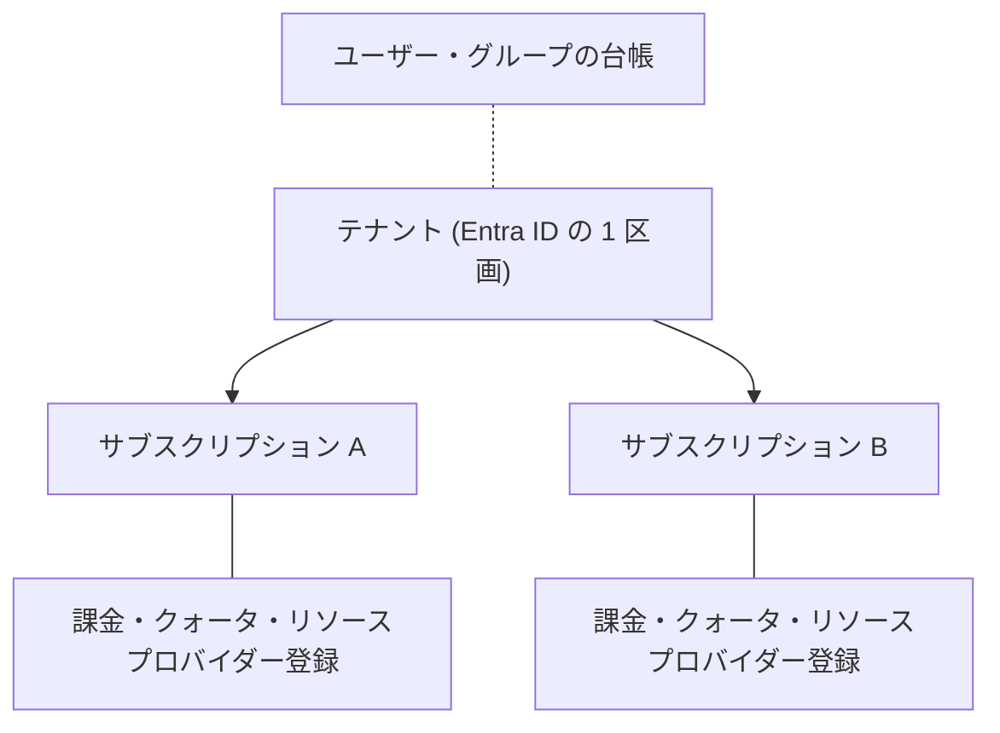

# 第1章 テナントとサブスクリプション ― 契約と分離の境界

第0章で、アカウントを作っただけのつもりが、テナントとサブスクリプションという 2 つの実体が生まれていました。この 2 つは並列の概念ではなく、性質のまったく違う境界であり、それぞれ別のものを分離しています。本章ではこの 2 つを順に解きほぐします。

## そもそも Entra ID とは何か

テナントの前に、その土台である Entra ID から始めます。

Microsoft Entra ID（旧称 Azure Active Directory）は、Microsoft が運営する ID 管理サービスです。仕事は大きく 2 つあります。

1. 認証。サインインしてきた相手が本人かどうかを確かめ、証明書代わりのトークンを発行します
2. 台帳の管理。ユーザー、グループ、アプリケーションの ID を記録し、それぞれの属性（名前、所属、有効か無効かなど）を管理します

Azure のすべての管理操作は、この Entra ID の認証を通ってから実行されます。ポータルへのサインインも、`az login` も、入口は同じです。つまり Azure を使うとは、まず Entra ID に「自分が誰であるか」を認めてもらうことから始まります。

なお Entra ID は Azure 専用ではありません。Microsoft 365（Teams や Outlook）へのサインインも同じ Entra ID が処理しています。ID の管理はどのサービスからも独立した 1 つの共通基盤である、という設計です。

## テナントとは何か

Entra ID は Microsoft が運営する 1 つの巨大なサービスですが、その中身は組織ごとに完全に仕切られています。この仕切られた 1 区画がテナントです。

区画の中には、その組織のユーザー・グループ・アプリケーションの台帳が入っています。区画同士は既定では互いに見えません。あなたのテナントのユーザー一覧を、他社のテナントの管理者が覗くことはできませんし、その逆もできません。

「テナント」という言葉自体は、賃貸ビルの入居者を指す英単語です。ビル（Entra ID というサービス）は Microsoft が 1 つだけ運営していて、その中の区画（テナント）を組織ごとに借りている、という関係がそのまま名前になっています。

第0章で見たとおり、あなたのテナントは Azure への初回サインイン時に自動で作られた「既定のディレクトリ」です。テナントには次の 3 つが備わっています。

| 属性               | 例                                                   | 役割                                                    |
| ------------------ | ---------------------------------------------------- | ------------------------------------------------------- |
| テナント ID        | `aaaabbbb-cccc-dddd-eeee-ffff00001111` の形式の GUID | 世界で一意の識別子。CLI や API はこれで区画を指定します |
| プライマリドメイン | `xxx.onmicrosoft.com`                                | ユーザー名の後半になるドメイン                          |
| 表示名             | 既定のディレクトリ                                   | 人間向けの名前。あとから変更できます                    |

自分のテナントを CLI で確認します。

```bash
az account show --query "{tenantId:tenantId, tenantDomain:tenantDefaultDomain, user:user.name}" -o table
```

ここで大事なことが 1 つあります。テナントには課金の概念がありません。テナントは「誰が」を管理する場所であって、「いくら払うか」を管理する場所ではないのです。料金の話は次のサブスクリプションから始まります。

## サブスクリプションとは何か

サブスクリプションは、リソースを置くための契約の単位です。第0章で従量課金制のサインアップをして作ったものがこれです。

サブスクリプションは 3 つの異なるものを同時に区切っています。この 3 つが 1 つの単位にまとまっていることが、Azure の設計を理解する鍵になります。

| 区切っているもの         | 意味                                                                                       |
| ------------------------ | ------------------------------------------------------------------------------------------ |
| 課金                     | 請求書はサブスクリプション単位で発行されます。無料枠もサブスクリプション単位で集計されます |
| クォータ                 | vCPU 数やパブリック IP 数などの上限が、サブスクリプションとリージョンの組ごとに決まります  |
| リソースプロバイダー登録 | どの種類のリソースを作れるかが、サブスクリプションごとの状態として管理されます             |

3 つ目は他の 2 つと性質が違います。課金とクォータは「どれだけ使えるか」の話ですが、リソースプロバイダー登録は「そもそも使えるか」の話です。これは後半の演習で実際に確かめます。



テナントとサブスクリプションの関係は 1 対多です。サブスクリプションは必ず 1 つのテナントに紐づき、その紐づけが「誰がこのサブスクリプションを操作できるかの判定に、どのテナントの台帳を使うか」を決めています。

ID は台帳（テナント側）にあり、課金とクォータは契約（サブスクリプション側）にある。この分かれ方が、認証（誰であるか）と認可（何ができるか）が別の層にあるという Azure 全体の構造の現れです。Part 2 で正面から扱います。

現在のアカウントから見えるサブスクリプションを一覧します。

```bash
az account list --query "[].{name:name, id:id, tenantId:tenantId, state:state}" -o table
```

複数のテナントに所属している場合、`az login` したテナントに属するサブスクリプションしか出てきません。別のテナントのものを見るには `az login --tenant <テナントID>` で入り直します。テナントが分離の境界であるとは、そういう意味です。

## リソースプロバイダー登録 ― Azure 独自の前提

Azure のリソースは、種類ごとに「リソースプロバイダー」という単位で提供されています。`Microsoft.Storage`、`Microsoft.Web`、`Microsoft.KeyVault` といった名前空間がそれです。

各リソースプロバイダーは、サブスクリプションごとに登録済みか未登録かの状態を持ちます。未登録のプロバイダーのリソースは作れません。

作りたてのサブスクリプションでこの状態を見ると、意外な光景になっています。

```bash
az provider list --query "[?registrationState=='Registered'].namespace" -o tsv | sort | head
az provider list --query "[?registrationState=='NotRegistered'].namespace" -o tsv | wc -l
```

本書の検証時、新規サブスクリプションでは Microsoft.KeyVault も Microsoft.Web も未登録でした。登録済みはごく一部で、大半のプロバイダーは未登録から始まります。それでも普段この状態に気づかないのには理由があり、それを次の演習で確かめます。

### 壊す演習 ― 未登録プロバイダーの素の挙動を観察する

未登録のプロバイダーのリソースを作ろうとすると何が起きるかを、2 つの経路で試します。結果が違います。以下のコマンドと出力は、すべて本書の検証環境（作りたての従量課金サブスクリプション）で実際に実行した結果です。

まず、演習で使うリソースグループを作ります。リソースグループの意味は第3章で扱うので、ここでは「リソースを入れる箱を先に用意した」とだけ理解してください。

```bash
az group create --name azp-ch01-rg --location japaneast \
  --tags azp-book=azure-practice azp-chapter=ch01 azp-lifecycle=ephemeral
```

次に、いま未登録のプロバイダーを確認します。本書の検証時は Microsoft.Web（App Service など）が未登録だったので、それを例にします。もし手元で既に Registered になっている場合は、前節の一覧コマンドで未登録のものを選び直し、以降の名前空間を読み替えてください。この演習は一度成功させると（経路 2 の自動登録で）プロバイダーが登録済みに変わるため、同じプロバイダーでは再現できなくなります。登録を消して作り直すことは、後述する理由からしてはいけません。

```bash
az provider show --namespace Microsoft.Web --query registrationState -o tsv
```

```text
NotRegistered
```

経路 1: 管理の窓口へ直接リクエストを送ります。Azure のすべての管理操作は、Azure Resource Manager（以下 ARM）という共通の窓口が受け付けています。ポータルのボタンも az コマンドも、最終的にはこの ARM へ HTTP リクエストを送っているにすぎません。`az rest` は、その ARM へ生のリクエストを送るコマンドです。

```bash
sub=$(az account show --query id -o tsv)
az rest --method put \
  --url "https://management.azure.com/subscriptions/$sub/resourceGroups/azp-ch01-rg/providers/Microsoft.Web/serverfarms/azp-ch01-probe?api-version=2024-04-01" \
  --body '{"location":"japaneast","sku":{"name":"F1","tier":"Free"}}'
```

```text
ERROR: Conflict({"error":{"code":"MissingSubscriptionRegistration","message":"The subscription is not registered to use namespace 'Microsoft.Web'. See https://aka.ms/rps-not-found for how to register subscriptions."}})
```

エラーコードが権限（AuthorizationFailed）でもクォータでもなく、MissingSubscriptionRegistration であることを確認してください。権限は足りている、それでも作れない。サブスクリプションが課金とは別に「使えるリソースの種類」という状態を持っていることの現れです。

なお、最初のリソースグループ作成を飛ばしてこのコマンドを打つと、別のエラーが先に返ります。

```text
ERROR: Not Found({"error":{"code":"ResourceGroupNotFound","message":"Resource group 'azp-ch01-rg' could not be found."}})
```

ARM は前提を手前から順に検査します。リソースグループの存在確認が先、プロバイダー登録の確認はその後です。目的のエラーに出会うには、そこまでの前提をすべて満たしておく必要があります。エラーが想定と違うときは、まず「どの段階の検査で止まったのか」を疑ってください。

経路 2: 同じことを `az deployment` でやってみます。これは、作りたいリソースの構成を Bicep（Azure のリソース構成をコードで書くための言語。第10章で扱います）のファイルに書いておき、ARM へまとめて送るコマンドです。テンプレートは `infra/bicep/chapters/ch01-provider/app-plan.bicep` にあります。

```bash
az deployment group create --resource-group azp-ch01-rg \
  --template-file infra/bicep/chapters/ch01-provider/app-plan.bicep
```

本書の検証環境では、このデプロイは失敗しました。ただし、経路 1 とはまったく別の理由でです。

```text
ERROR: {"status":"Failed","error":{"code":"DeploymentFailed", ... "details":[{"code":"Unauthorized",
"message":"... Operation cannot be completed without additional quota.
Additional details - Current Limit (Total VMs): 0 ... Amount required for this deployment (Total VMs): 1 ..."}]}}
```

MissingSubscriptionRegistration はどこにも出ていません。代わりにクォータ不足で落ちています。作りたての従量課金サブスクリプションでは、App Service の仮想マシン枠の上限が 0 のことがあり、無料の F1 プランですら 1 枠を要求するため作れないのです（上限の引き上げはポータルから申請できます）。

ここでプロバイダーの状態をもう一度見ると、面白いことが起きています。

```bash
az provider show --namespace Microsoft.Web --query registrationState -o tsv
```

```text
Registered
```

デプロイは失敗したのに、未登録だったプロバイダーが登録済みに変わっています。`az deployment` は、テンプレートが参照する未登録プロバイダーを自動で登録してから、リソースの作成に進んでいたのです。1 回のコマンドの裏で「登録」と「作成」の 2 段が動いていて、登録は成功し、作成はクォータで失敗した、というのがこの出力の読み方です。

普段プロバイダー登録に気づかないのは、この自動登録が黙って面倒を見てくれているからです。自動登録に頼れない場面（登録の権限を持たないサービスプリンシパルでの実行など）で、経路 1 の素のエラーに初めて出会うことになります。

もう 1 つ、クォータのエラーの外側のコードが Unauthorized だったことにも注意してください。中のメッセージを読めばクォータの話だと分かりますが、コードだけ見ると権限の問題に見えます。Azure のエラーは、コードではなく詳細メッセージまで読んで、権限・スコープ・登録・クォータのどの軸の話かを切り分けてください。

登録は明示的にもできます。登録は非同期で、完了まで数分かかることがあります。

```bash
az provider register --namespace Microsoft.Web --wait
```

登録と解除には Registering / Unregistering という遷移中の状態があります。Unregistering の最中に同じプロバイダーのデプロイをぶつけたときの、実際の出力です。

```text
{"code":"MissingSubscriptionRegistration","message":"The subscription registration is in 'Unregistering' state.
The subscription must be registered to use namespace 'Microsoft.Web'. ..."}
```

エラーコードは未登録のときと同じですが、メッセージが遷移中の状態まで教えてくれています。遷移中は `az deployment` の自動登録も助けてくれません。状態が落ち着くまで待ってから再実行してください。

なお、執筆時の検証で一度だけ、同じ状況で「The content for this response was already consumed」という、原因を何も語らない表示に出会いました。CLI がエラー応答の処理に失敗したときの表示で、再実行すれば本来のエラーが出ます。プロバイダー絡みで意味不明なエラーに出会ったら、まず `az provider show` で状態を確認し、それから再実行してください。

なお、この演習を「登録済みのプロバイダーを `az provider unregister` で未登録に戻して」再現しようとしてはいけません。そのプロバイダーのリソースが 1 つでも残っていると unregister は失敗しますし、成功すると既存リソースの管理操作が壊れます。演習はもともと未登録のものだけで行ってください。

演習が終わったら、リソースグループを片付けます。

```bash
az group delete --name azp-ch01-rg --yes
```

### この演習で確認できたこと

サブスクリプションは請求書の単位であるだけでなく、リソースを作れるかどうかを決める状態を 2 種類持っています。プロバイダー登録（そもそもその種類を使えるか）とクォータ（どれだけ使えるか）です。どちらもテナントには存在しません。テナントとサブスクリプションが別の境界である、というのはこういうことです。

また、同じ「作れない」でも、リソースグループ不在・登録不足・クォータ不足で別々のエラーが別々の順序で返ることを見ました。エラーの切り分けはこの先の章でも繰り返し使います。

## サブスクリプションを分ける動機

サブスクリプションが課金・クォータ・リソースプロバイダー登録の境界であるということは、これらを分けたいときにサブスクリプションを分けることになる、という意味でもあります。

- 部門ごとにコストを分けて請求したい
- 本番環境のクォータを、検証環境の実験で食い潰されたくない
- 環境ごとに使えるリソースの種類を制限したい

逆に言えば、これらを分ける必要がないなら、サブスクリプションを増やす理由は薄いのです。増やすと、第2章で扱う管理グループでの束ね方と権限の設計が複雑になります。この判断基準は第22章で本格的に扱います。

## 検証環境

| 項目           | 値                                                                         |
| -------------- | -------------------------------------------------------------------------- |
| 検証状態       | verified                                                                   |
| 検証日         | 2026-08-08                                                                 |
| Azure CLI      | 2.77.0                                                                     |
| Bicep CLI      | 0.37.4                                                                     |
| API バージョン | Microsoft.Web/serverfarms@2024-04-01, Microsoft.KeyVault/vaults@2024-11-01 |

## 理解チェック

1. 同じユーザーが、同じテナントに属する 2 つのサブスクリプション A と B に対して、A では仮想マシンを作れるのに B では作れません。権限はどちらも同じロールが同じ範囲で割り当てられています。原因として考えられるものを 2 つ挙げてください
2. `az account list` の結果に、確かにアクセス権を持っているはずのサブスクリプションが出てきません。何を確認すべきでしょうか
3. CI/CD 用のサービスプリンシパルで Bicep のデプロイを実行したところ、手元では成功する同じテンプレートが MissingSubscriptionRegistration で失敗しました。手元の実行と何が違ったのか、この章で見た 2 つの経路の違いを踏まえて説明してください
