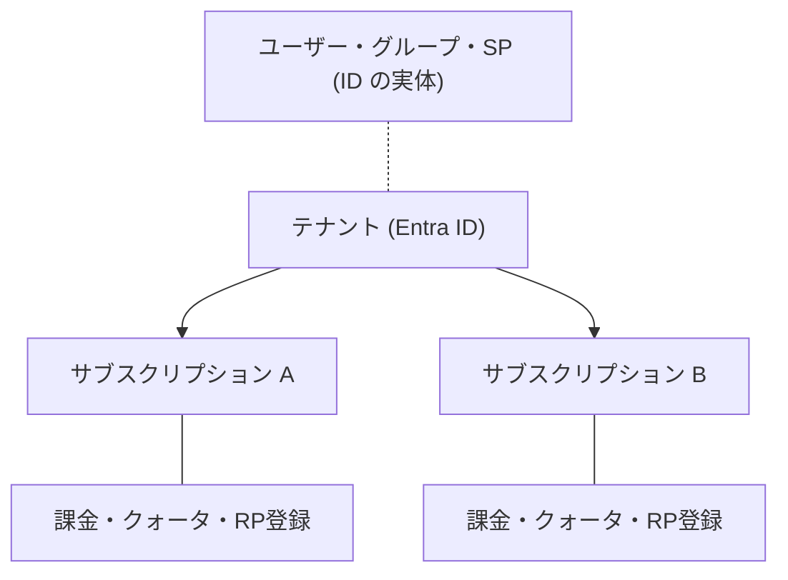

# 第1章 テナントとサブスクリプション ― 契約と分離の境界

Azure で最初に覚えるべきものは、仮想マシンでもストレージでもない。リソースを置く場所を決めている 2 つの境界、テナントとサブスクリプションである。この 2 つは並列の概念ではなく、性質がまったく違う境界であり、それぞれ別のものを分離している。

本章では 2 つの境界を分けて理解し、サブスクリプションが持つ「リソースプロバイダー登録」という Azure 独自の状態を先に見ておく。これは後続のほぼ全章で暗黙の前提になる。

## テナントは組織と ID の境界

テナントは Microsoft Entra ID のインスタンスであり、組織を表す。ユーザー、グループ、アプリケーション登録、サービスプリンシパルといった ID の実体はすべてテナントに属する。

テナントは 1 つのドメイン（`contoso.onmicrosoft.com` のような初期ドメイン）を持ち、テナント ID という GUID で識別される。ログインしているテナントは次で確認できる。

```bash
az account show --query "{tenantId:tenantId, tenantDomain:tenantDefaultDomain, user:user.name}" -o table
```

ここで重要なのは、**テナントには課金の概念がない**ということである。テナントは「誰が」を管理する場所であって、「いくら払うか」を管理する場所ではない。

## サブスクリプションは契約と分離の境界

サブスクリプションは 3 つの異なるものを同時に区切っている。この 3 つが 1 つの単位にまとまっていることが、Azure の設計を理解する鍵になる。

| 区切っているもの         | 意味                                                                                   |
| ------------------------ | -------------------------------------------------------------------------------------- |
| 課金                     | 請求書はサブスクリプション単位で発行される。無料枠もサブスクリプション単位で集計される |
| クォータ                 | vCPU 数やパブリック IP 数などの上限がサブスクリプション × リージョン単位で決まる       |
| リソースプロバイダー登録 | どの種類のリソースを作れるかがサブスクリプションごとの状態として管理される             |

3 つ目は他の 2 つと性質が違う。課金とクォータは「どれだけ使えるか」の話だが、リソースプロバイダー登録は「そもそも使えるか」の話である。



ID はテナント側にあり、課金とクォータはサブスクリプション側にある。1 つのテナントに複数のサブスクリプションがぶら下がる関係であり、その逆はない。

## テナントとサブスクリプションの関係は 1 対多

サブスクリプションは必ず 1 つのテナントに紐づく。この紐づけが、「誰がこのサブスクリプションのリソースを操作できるか」の判定にどのテナントの ID を使うかを決めている。

複数のサブスクリプションが同じテナントに属している場合、同じユーザーがそれぞれに別々の権限を持てる。ID は共通で、権限は個別、という構造である。ここで既に、**認証（誰であるか）と認可（何ができるか）が別の層にある**ことが現れている。この分離は Part 2 で正面から扱う。

現在のアカウントから見えるサブスクリプションを一覧する。

```bash
az account list --query "[].{name:name, id:id, tenantId:tenantId, state:state}" -o table
```

複数のテナントに所属している場合、`az login` したテナントに属するサブスクリプションしか一覧に出ない。テナントを跨いだ操作は `az login --tenant <テナントID>` で切り替える必要がある。テナントが ID の境界であるとは、そういう意味である。

## リソースプロバイダー登録 ― Azure 独自の前提

Azure のリソースは種類ごとに「リソースプロバイダー」という単位で提供される。`Microsoft.Storage`、`Microsoft.Web`、`Microsoft.KeyVault` といった名前空間がそれである。

各リソースプロバイダーは、サブスクリプションごとに登録済みか未登録かの状態を持つ。未登録のプロバイダーのリソースは作れない。作ろうとすると、権限でもクォータでもない理由でデプロイが失敗する。

```bash
az provider list --query "[].{namespace:namespace, state:registrationState}" -o table | head -20
```

なぜこの仕組みがあるのか。サブスクリプションで利用するサービスを明示的に有効化させることで、意図しないサービスの利用を防ぎ、またサービス側もどのサブスクリプションに対して機能を展開すべきかを把握できる。多くの場合、初回のリソース作成時に自動で登録されるため意識されないが、IaC で一括デプロイするときや、権限を絞ったサービスプリンシパルで実行するときに顕在化する。

登録は明示的に行える。

```bash
az provider register --namespace Microsoft.KeyVault
az provider show --namespace Microsoft.KeyVault --query registrationState -o tsv
```

登録は非同期で、完了まで数分かかることがある。`Registering` から `Registered` に変わるまで待つ必要がある。

### 壊す演習 ― 未登録プロバイダーでデプロイを失敗させる

未登録のプロバイダーに属するリソースを作ろうとするとどうなるかを観察する。

まず、自分のサブスクリプションで実際に未登録のプロバイダーを探す。

```bash
az provider list --query "[?registrationState=='NotRegistered'].namespace" -o tsv | head
```

ここで出た名前空間のうち、無料で作れるリソースを持つものを 1 つ選ぶ。何が出るかはサブスクリプションの利用履歴によって違うため、本書では具体的な名前空間を固定していない。

**登録済みのプロバイダーを `az provider unregister` で未登録に戻して演習を作ろうとしてはいけない。** そのプロバイダーのリソースが 1 つでも存在すると unregister は失敗し、逆に成功してしまうと既存リソースの管理操作が壊れる。演習は「もともと未登録のもの」で行う。

選んだプロバイダーのリソースを作ろうとすると、次のようなエラーが返る。

```text
(MissingSubscriptionRegistration) The subscription is not registered to use namespace 'Microsoft.XXX'.
See https://aka.ms/rps-not-found for how to register subscriptions.
```

エラーコードが `AuthorizationFailed` でも `QuotaExceeded` でもなく `MissingSubscriptionRegistration` であることを確認してほしい。権限は足りている、クォータも空いている、それでも作れない。**サブスクリプションという境界が、課金とクォータとは別に「使えるリソースの種類」という状態を持っている**ことの現れである。

登録すれば同じコマンドが通る。

```bash
az provider register --namespace Microsoft.XXX --wait
```

### この演習で確認できたこと

サブスクリプションは請求書の単位であるだけでなく、リソースを作れるかどうかを決める状態を持つ。この状態はテナントには存在しない。テナントとサブスクリプションが別の境界である、というのはこういうことである。

## サブスクリプションを分ける動機

サブスクリプションが課金・クォータ・リソースプロバイダー登録の境界であるということは、これらを分けたいときにサブスクリプションを分けることになる、という意味でもある。

- 部門ごとにコストを分けて請求したい
- 本番環境のクォータを検証環境の実験で食い潰されたくない
- 環境ごとに触れるリソースの種類を制限したい

逆に言えば、これらを分ける必要がないなら、サブスクリプションを増やす理由は薄い。サブスクリプションを増やすと、後述する管理グループでの束ね方と RBAC の設計が複雑になるからである。この判断基準は第22章で本格的に扱う。

## 検証環境

| 項目           | 値      |
| -------------- | ------- |
| 検証状態       | pending |
| 検証日         | -       |
| Azure CLI      | -       |
| Bicep CLI      | -       |
| API バージョン | -       |

## 理解チェック

1. 同じユーザーが、同じテナントに属する 2 つのサブスクリプション A と B に対して、A では仮想マシンを作れるが B では作れない。権限は両方とも同じロールが同じスコープで割り当てられている。何が原因として考えられるか。2 つ挙げよ
2. `az account list` の結果に、確かに自分がアクセス権を持っているはずのサブスクリプションが出てこない。ログインしているテナントは正しい。何を確認すべきか
3. あるサービスプリンシパルに、サブスクリプションスコープで Contributor を割り当てた。しかしこのサービスプリンシパルから新しい種類のリソースを初めて作ろうとするとデプロイが失敗する。Contributor は権限として十分なはずである。なぜ失敗しうるか
