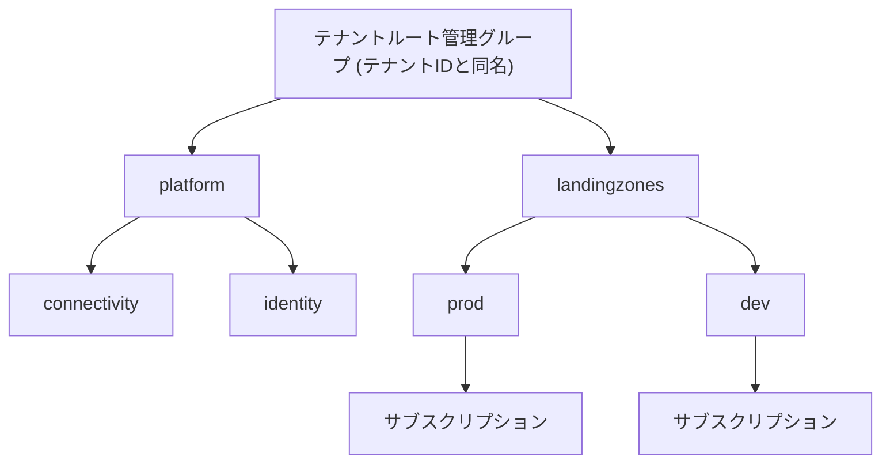

# 第2章 管理グループ ― ポリシーと RBAC が上から下に伝わる仕組み

サブスクリプションが増えると、同じ設定を全部のサブスクリプションに手で入れて回ることになる。管理グループはこの繰り返しをなくすための階層である。

ただし管理グループは「サブスクリプションのフォルダ」ではない。**継承の経路**である。フォルダは中身を整理するだけだが、管理グループは上に置いたものを下に流す。この違いが、階層設計を後から動かしにくくしている原因でもある。

## 管理グループはテナントに属する

第1章で、ID の実体はテナントに属し、課金とクォータはサブスクリプションに属すると述べた。管理グループはテナント側にある。サブスクリプションの中にあるのではない。

テナントには必ず 1 つ「テナントルート管理グループ」が存在し、そのテナントのすべてのサブスクリプションは、明示的に別の場所へ移動しない限りこの直下にいる。テナントルート管理グループの名前はテナント ID と同じ GUID である。

```bash
az account management-group list --query "[].{name:name, displayName:displayName}" -o table
```

このコマンドが権限エラーになる場合、管理グループへのアクセス権がない。管理グループはテナント全体に影響する階層であるため、サブスクリプションの Owner であっても自動では触れない。テナントルートでの昇格、または Management Group Contributor などのロールが要る。



## 何が継承されるのか

管理グループを通じて下に流れるものは 2 つある。

| 流れるもの              | 効果                                                                     |
| ----------------------- | ------------------------------------------------------------------------ |
| Azure Policy の割り当て | 配下のすべてのサブスクリプション・リソースグループ・リソースに適用される |
| RBAC のロール割り当て   | 配下のすべてのスコープで有効になる                                       |

流れないものもある。**課金は流れない。** 管理グループは請求の単位ではなく、その配下のサブスクリプションの請求をまとめる機能も持たない。コストの集約は Cost Management 側でスコープとして管理グループを指定することで行うが、これは請求書が分かれるかどうかとは別の話である。この区別は第23章で扱う。

クォータも流れない。クォータはサブスクリプション × リージョンで決まるままである。

つまり管理グループは、第1章で見たサブスクリプションの 3 つの境界のうち、どれも束ねない。管理グループが束ねるのは**統制**であって、契約ではない。

## 継承は上書きできない

ここが管理グループの最も重要な性質である。上位で割り当てられたポリシーや RBAC は、下位で解除できない。

- 上位で `Deny` のポリシーが割り当てられていれば、下位でどう設定しても作れない
- 上位で割り当てられたロールは、下位のスコープで削除できない

RBAC は加算的（additive）である。あるスコープで許可されたことは、下位のスコープで禁止できない。「サブスクリプション全体では Contributor だが、この 1 つのリソースグループだけは読み取り専用にしたい」という要求は、RBAC のロール割り当てだけでは実現できない。実現するには、上位の割り当て自体をやめて下位に配り直すか、Azure Policy や拒否割り当て（deny assignment）といった別の仕組みを使うことになる。

この非対称性が、階層設計を後から動かしにくくしている。上に置いたものは下すべてに効くので、階層の途中に新しい管理グループを挟んだり、サブスクリプションを別の枝へ移したりすると、そのサブスクリプションに効くポリシーとロールの集合が丸ごと入れ替わる。移動先の枝に何が効いているかを把握していなければ、移動した瞬間に本番が壊れる。

## 階層は「効かせたいものの単位」で切る

したがって管理グループの階層は、組織図をそのまま写すのではなく、**同じ統制を効かせたいものの単位**で切る。

組織図を写した階層は、組織改編のたびに動かすことになる。しかし統制は組織改編とは独立に変わらないことが多い。「本番環境には必ずこのポリシーを効かせる」という要求は、部署が変わっても変わらない。

現在広く使われている切り方は、プラットフォーム（ネットワークや ID など全社共通の基盤）と、ランディングゾーン（実際のワークロードが載る場所）を分け、ランディングゾーンをさらに本番と非本番に分けるものである。この設計思想は第21章で扱う。

## ハンズオン ― 管理グループを作って継承を観察する

管理グループの作成には、テナントルートでの権限が必要である。権限がない場合は本節を読むだけにとどめ、第4章の統合ハンズオンでも該当ステップがスキップされることを確認してほしい。

手順の実体は `scripts/chapters/ch04-foundation.sh` にある。第4章で 4 階層を通しで作るときに、この章の内容も一緒に実行する。ここでは継承の観察に必要な最小のコマンドだけを示す。

```bash
# 管理グループを作る。指定しなければテナントルート管理グループの子になる
az account management-group create --name azp-demo --display-name "継承の観察用"

# サブスクリプションを配下に移す。課金の付け替えではなく、継承経路の付け替えである
az account management-group subscription add \
  --name azp-demo \
  --subscription "$(az account show --query id -o tsv)"

# 配下に何がいるかを確認する
az account management-group show --name azp-demo --expand --query "children[].{type:type, name:displayName}" -o table
```

### 継承を確認する

管理グループスコープで割り当てたロールが、配下のサブスクリプションから見えることを確認する。

```bash
mg_id="/providers/Microsoft.Management/managementGroups/azp-demo"
sub_id="/subscriptions/$(az account show --query id -o tsv)"

# 管理グループスコープに Reader を割り当てる
az role assignment create --assignee "$(az ad signed-in-user show --query id -o tsv)" \
  --role Reader --scope "$mg_id"

# サブスクリプションスコープから見ると、継承された割り当てとして現れる
az role assignment list --scope "$sub_id" --include-inherited \
  --query "[?roleDefinitionName=='Reader'].{scope:scope, role:roleDefinitionName}" -o table
```

`--include-inherited` を外すと、この割り当ては一覧から消える。サブスクリプションスコープには何も割り当てていないからである。**権限が「見えない場所から効いている」ことがありうる**というのが、管理グループを導入したときに最初に戸惑う点である。トラブルシュートの際は常に `--include-inherited` を付けて確認する習慣をつけたい。

### クリーンアップ

管理グループは中身が空でないと削除できない。サブスクリプションを先にテナントルート管理グループへ戻す必要がある。

```bash
tenant_id=$(az account show --query tenantId -o tsv)
az account management-group subscription add --name "$tenant_id" \
  --subscription "$(az account show --query id -o tsv)"
az account management-group delete --name azp-demo
```

削除の順序に意味があることは、第3章で扱うリソースグループのライフサイクルと同じ構造である。**依存されている側は、依存している側より後にしか消せない。**

## 検証環境

| 項目           | 値      |
| -------------- | ------- |
| 検証状態       | pending |
| 検証日         | -       |
| Azure CLI      | -       |
| Bicep CLI      | -       |
| API バージョン | -       |

## 理解チェック

1. あるサブスクリプションで、リソースグループスコープに割り当てられたロールを削除したのに、対象ユーザーがまだそのリソースグループを操作できる。何が起きているか。どのコマンドで確認できるか
2. 本番用サブスクリプションを、`landingzones/dev` 管理グループから `landingzones/prod` へ移した。移動そのものは成功したが、その直後から一部のリソースが作成できなくなった。課金もクォータも変わっていない。何が起きたと考えられるか
3. 「サブスクリプション全体では編集できるが、この 1 つのリソースグループだけは読み取り専用にしたい」という要求がある。RBAC のロール割り当てだけでこれを実現できるか。できない場合、その理由は RBAC のどの性質によるか
