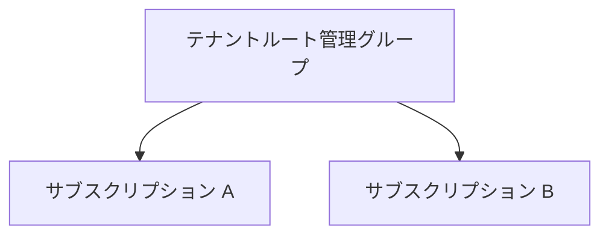
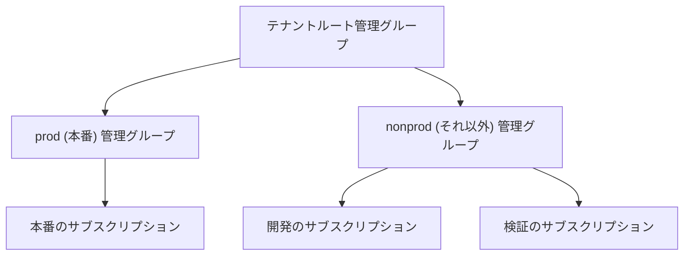
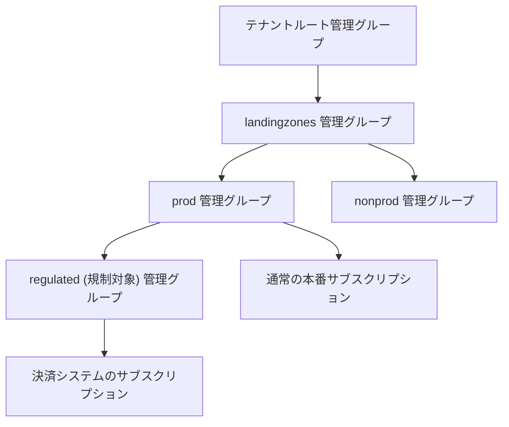
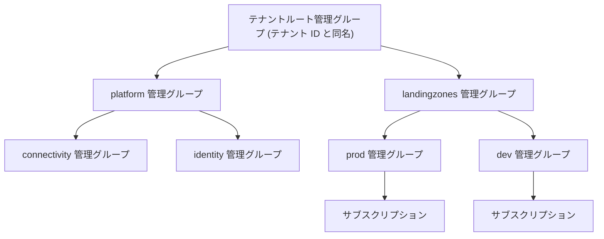
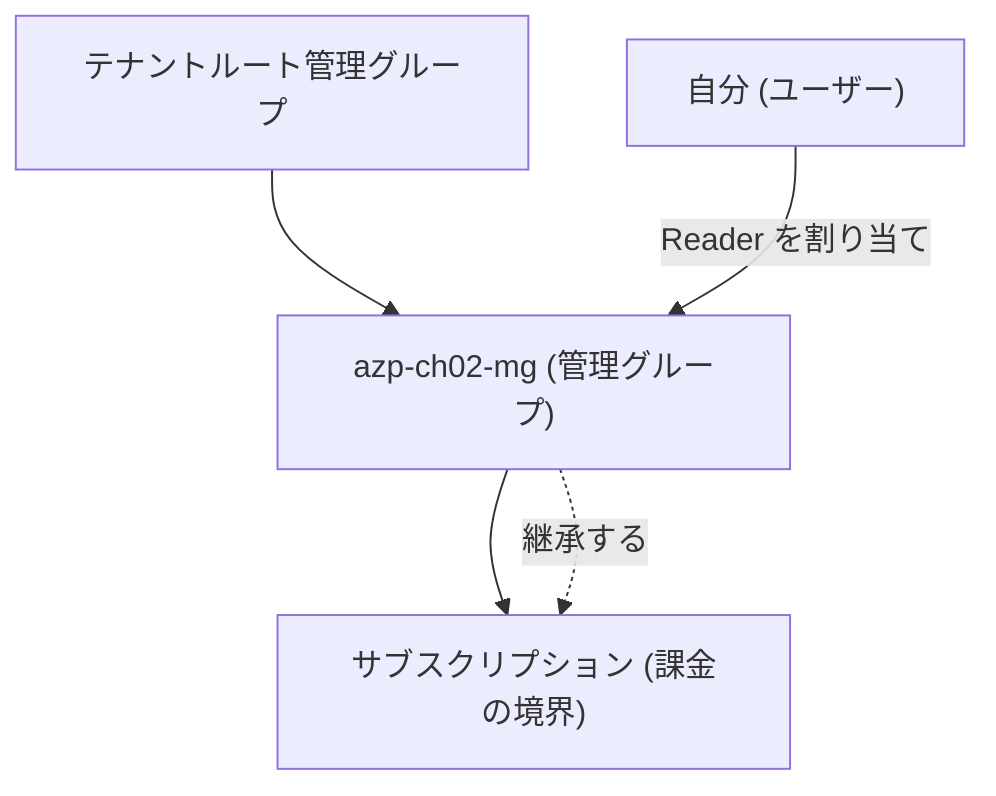

# 第 2 章 管理グループ ― ポリシーと RBAC が上から下に伝わる仕組み

サブスクリプションが増えると、同じ設定をすべてのサブスクリプションに手で入れて回ることになります。管理グループは、この繰り返しをなくすための階層です。

管理グループとは、サブスクリプションをまとめるグループです。グループの中にグループを作って、木構造に組むこともできます（最大 6 段）。

管理グループにできることは、実質 2 つしかありません。ポリシー（構成のルール。第 20 章）を割り当てること、そしてロール（第 6 章）を割り当てることです。リソースを中に入れることはできず、名前と親子関係のほかに設定らしい設定もありません。

では何のためにあるのか。グループに割り当てたポリシーとロールが、そのグループに入っているすべてのサブスクリプションに効くからです。サブスクリプションが 100 個あるとき、同じルールを 100 回設定する代わりに、100 個をまとめたグループへ 1 回だけ割り当てます。この「1 回の割り当てを配下全体に効かせる」ことが、管理グループの唯一の存在理由です。

ここで語を 1 つ決めます。本書では、ポリシーの割り当てとロールの割り当てをまとめて統制と呼びます。どちらも「配下で何を許すか」を上から決めるものだからです。

木構造と聞くと、ファイルをフォルダで整理する絵を思い浮かべるかもしれません。形は似ていますが、目的が違います。フォルダ分けは人間が見つけやすくするための整理であり、分け方を変えても中身の挙動は変わりません。管理グループの分け方は、どのサブスクリプションにどのルールが効くかを直接決めます。整理のための入れ物ではなく、統制を一括で効かせるための単位です。この性質が、階層設計をあとから動かしにくくしている原因でもあります。

## 管理グループはテナントに属する

第 1 章で、ID の台帳はテナントに、課金とクォータはサブスクリプションにあると整理しました。管理グループはテナント側にあります。サブスクリプションの中にあるのではありません。

テナントには必ず 1 つ、テナントルート管理グループが存在します。名前はテナント ID と同じ GUID です。そのテナントのすべてのサブスクリプションは、明示的に動かさない限りこの直下にあります。第 0 章でポータルに表示されていた「親管理グループ: テナント ID と同じ GUID」がまさにこれでした。

紛らわしい点を先に整理しておきます。名前が同じ GUID なので、テナントルート管理グループは第 0 章で作られた「既定のディレクトリ」（テナント）そのものに見えますが、別物です。テナントは ID の台帳であり、テナントルート管理グループはテナントの作成と同時に自動で用意される、統制の階層の起点です。2 つは識別子を共有しているだけで、種類が違います。ポータルでも Microsoft Entra ID（テナント）と管理グループは別の画面に現れます。

### よくある構成パターン

構成は難しく考える必要はありません。段階的に育てるのが普通です。

パターン 1 は、何もしないことです。サブスクリプションが少ないうちはルート直下のままで十分です。第 0 章を終えた時点のあなたの環境がこの形です。



パターン 2 は、環境で分けることです。本番にだけ厳しいルールを効かせたくなったら、最初の分岐を作ります。



パターン 3 は、多段にすることです。グループの中にグループを作れるので、分類を重ねられます。たとえば本番の中でも、規制の対象になるシステムにだけ、さらに厳しいルールを足したい場合です。



多段の意味は、ルールの積み重ねです。S1 のサブスクリプションには、ルート・landingzones・prod・regulated の 4 か所に割り当てたルールがすべて効きます。深い場所ほど、積み重なった厳しい環境になります。あるサブスクリプションに何が効いているかは、ルートからの経路上のすべての割り当ての合算であり、これを確認する方法が後述の `--include-inherited` です。

なお、深くできるからといって深くしすぎると、この合算を人間が把握できなくなります。上限は 6 段ですが、実務の目安は 3〜4 段までに保つことです。

パターン 4 は、実務の標準形です。次の図は、大きめの組織で広く使われている階層の例です。

図に入る前に、語を 1 つ決めます。本書ではワークロードを、動かしたいアプリケーションと、それが動くために必要なリソース一式を指す語として使います。

図中の platform は全社共通の基盤を置く枝です。配下の connectivity はネットワーク基盤、identity は ID 基盤を置きます。landingzones は実際のワークロードが載るサブスクリプションを置く枝で、本番（prod）と開発（dev）で統制の強さを分けています。この分け方の意味は本章の後半と第 21 章で扱うので、ここでは「ルートの下に目的別の枝が並ぶ」という形だけ押さえてください。



## 何が継承されるのか

管理グループを通じて継承されるものは 2 つあります。

| 継承されるもの          | 効果                                                                       |
| ----------------------- | -------------------------------------------------------------------------- |
| Azure Policy の割り当て | 配下のすべてのサブスクリプション・リソースグループ・リソースに適用されます |
| RBAC のロール割り当て   | 配下のすべての範囲で有効になります                                         |

継承されないものもあります。課金は継承されません。管理グループは請求の単位ではなく、配下のサブスクリプションの請求をまとめる機能も持ちません。コストを管理グループ単位で集計して眺めることはできますが（第 23 章）、それは請求書が分かれるかどうかとは別の話です。クォータも継承されません。サブスクリプションとリージョンの組で決まったままです。

つまり管理グループは、第 1 章で見たサブスクリプションの 3 つの境界のどれも束ねません。管理グループが束ねるのは統制であって、契約ではないのです。

## 継承は上書きできない

ここが管理グループの最も重要な性質です。上位で割り当てられたポリシーやロールは、下位で解除できません。

- 上位で拒否（Deny）のポリシーが効いていれば、下位でどう設定しても作れません
- 上位で割り当てられたロールは、下位の範囲から削除できません

RBAC は加算的です。あるスコープで許可されたことを、下位のスコープで打ち消すことはできません。「サブスクリプション全体では編集できるが、この 1 つのリソースグループだけは読み取り専用にしたい」という要求は、ロール割り当てだけでは実現できないのです。実現するには、上位の割り当て自体をやめて下位へ配り直すか、Azure Policy のような別の仕組みを使うことになります。

この非対称性が、階層設計をあとから動かしにくくしています。上に置いたものは下のすべてに効くので、親と子の間に新しい管理グループを 1 段追加（入れ子を深く）したり、サブスクリプションを別の枝へ移したりすると、そのサブスクリプションに効いているポリシーとロールの集合が丸ごと入れ替わります。移動先の枝に何が効いているかを把握しないまま移動すると、その瞬間に本番が壊れます。

## 階層は同じ統制を効かせたい単位で分ける

したがって管理グループの階層は、組織図をそのまま写すのではなく、同じ統制を効かせたいものの単位で分けます。

組織図を写した階層は、組織改編のたびに動かすことになります。しかし統制は組織改編とは独立に変わらないことが多いのです。「本番環境には必ずこのポリシーを効かせる」という要求は、部署名が変わっても変わりません。

現在広く使われている切り方は、プラットフォーム（ネットワークや ID など全社共通の基盤）とランディングゾーン（実際のワークロードが載る場所）を分け、ランディングゾーンをさらに本番と非本番で分けるものです。この設計思想は第 21 章で扱います。

## 誰が管理グループを触れるのか

管理グループの権限には、実測で確かめた注意点が 2 つあります。一覧は見られないのに作成はできること、そして権限エラーが伝播の途中で一時的に出ることです。

1 つ目。管理グループの一覧表示（`az account management-group list`）は、テナントルートに対する読み取り権限が要るため、サブスクリプションの所有者であっても失敗することがあります。一方で、新しい管理グループの作成は、既定ではテナントの一般ユーザーにも許可されています（Entra の階層設定で制限されていない場合）。つまり「一覧は見られないのに作れる」という状態が普通に起きます。作成した人は、その管理グループの所有者になります。

2 つ目。管理グループの作成や、管理グループスコープへのロール割り当ては、内部の伝播の都合で一時的に AuthorizationFailed を返すことがあります。本書の検証では、まったく同じコマンドが数十秒後に成功しました。権限エラーに見えても、即座に諦めずに少し待って再試行してください。本書のスクリプトはすべてこのリトライを入れてあります。

## ハンズオン ― 管理グループを作って継承を観察する

以下の手順は本書の検証環境（新規テナント、サブスクリプション所有者、昇格なし）で実行し、動作を確認済みです。

管理グループを作ります。親を指定しなければテナントルートの子になります。

```bash
az account management-group create --name azp-ch02-mg --display-name "継承の観察用"
```

作られたことを確認します。ここで AuthorizationFailed が出ても、上に書いた 2 つの事実のとおり、作成自体は成功していることがあります。一覧ではなく名前を指定して取得するのが確実です。

```bash
az account management-group show --name azp-ch02-mg --query name -o tsv
```

```text
azp-ch02-mg
```

サブスクリプションを配下に移します。課金の付け替えではなく、継承経路の付け替えです。

```bash
az account management-group subscription add \
  --name azp-ch02-mg \
  --subscription "$(az account show --query id -o tsv)"
```

### 継承を確認する

管理グループスコープで割り当てたロールが、配下のサブスクリプションから見えることを確認します。

```bash
mg_id="/providers/Microsoft.Management/managementGroups/azp-ch02-mg"
sub_id="/subscriptions/$(az account show --query id -o tsv)"
me=$(az ad signed-in-user show --query id -o tsv)
```

管理グループスコープに Reader を割り当てます。一時的に失敗したら、少し待ってから再試行してください。

```bash
az role assignment create --assignee "$me" --role Reader --scope "$mg_id"
```

サブスクリプション側から見ると、継承された割り当てとして現れます。

```bash
az role assignment list --scope "$sub_id" --include-inherited \
  --query "[].{role:roleDefinitionName, scope:scope}" -o table
```

本書の検証環境での実際の出力です（サブスクリプション ID は伏せています）。割り当て直後は一覧に現れないことがあります。伝播には実測で数十秒かかったので、出てこないときは少し待って再実行してください。

```text
Role    Scope
------  ------------------------------------------------------------
Owner   /subscriptions/<サブスクリプションID>
Owner   /subscriptions/<サブスクリプションID>
Owner   /providers/Microsoft.Management/managementGroups/azp-ch02-mg
Reader  /providers/Microsoft.Management/managementGroups/azp-ch02-mg
```

4 行それぞれに来歴があります。サブスクリプションの Owner は第 0 章のサインアップで自動付与されたもの（検証環境では 2 重に付いていました）、管理グループの Owner は先ほどの管理グループ作成で作成者に自動付与されたもの、Reader がいま割り当てたものです。下 2 行の scope 列は、サブスクリプションではなく管理グループを指しています。そして `--include-inherited` を外すと、この下 2 行は一覧から消えます。サブスクリプション自体には何も割り当てていないからです。

権限が「見えない場所から効いている」ことがあります。これが管理グループを導入したときに最初に戸惑う点です。権限の調査では常に `--include-inherited` を付ける習慣をつけてください。

### ここまでで出来上がったもの

片付ける前に、いま出来上がっている形を見ます。



見どころは、Reader を割り当てた場所が 1 か所しかないことです。サブスクリプションには何も割り当てていないのに、`--include-inherited` を付けた一覧には Reader が現れます。線が上から下へ 1 つあるだけで、下の階層の権限が決まります。次の片付けでは、この線を作った順序と逆に辿ります。サブスクリプションをテナントルートへ戻してから、空になった管理グループを削除します。

### クリーンアップ

管理グループは中身が空でないと削除できません。サブスクリプションを先にテナントルートへ戻します。

テナントルート管理グループの名前はテナント ID と同じです。それを控えて、サブスクリプションをそこへ戻します。

```bash
tenant_id=$(az account show --query tenantId -o tsv)
az account management-group subscription add --name "$tenant_id" \
  --subscription "$(az account show --query id -o tsv)"
```

中身が空になったので、管理グループを削除できます。

```bash
az account management-group delete --name azp-ch02-mg
```

削除の順序に意味があるのは、第 3 章で扱うリソースグループのライフサイクルと同じ構造です。依存されている側は、依存している側より後にしか消せません。

## 検証環境

| 項目           | 値                                                 |
| -------------- | -------------------------------------------------- |
| 検証状態       | verified                                           |
| 検証日         | 2026-08-08                                         |
| Azure CLI      | 2.77.0                                             |
| Bicep CLI      | 0.37.4                                             |
| API バージョン | Microsoft.Authorization/roleAssignments@2022-04-01 |

## 理解度チェック

1. ハンズオンでは、管理グループに割り当てた Reader が `az role assignment list --scope <サブスクリプション>` の結果に出てきませんでした。`--include-inherited` を付けると出てきます。この差は何を意味していますか。権限の調査でどちらを使うべきですか
2. 「よくある構成パターン」のパターン 3 で、決済システムのサブスクリプションに効くルールは、どの管理グループへの割り当ての合算になりますか。経路を順に挙げてください
3. ハンズオンのクリーンアップで、サブスクリプションを先にテナントルートへ戻してから管理グループを削除しました。順序を逆にするとどうなりますか。本文のどの性質が理由ですか
