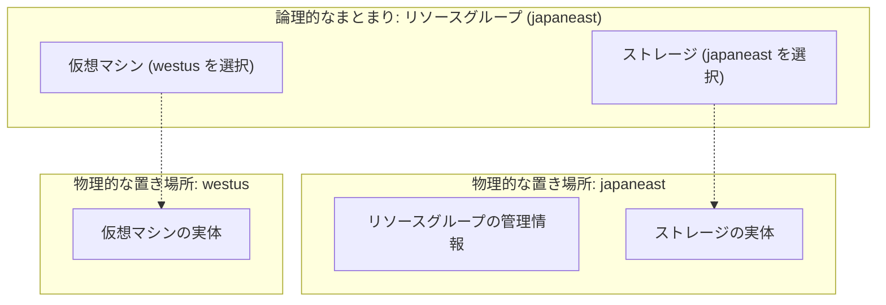
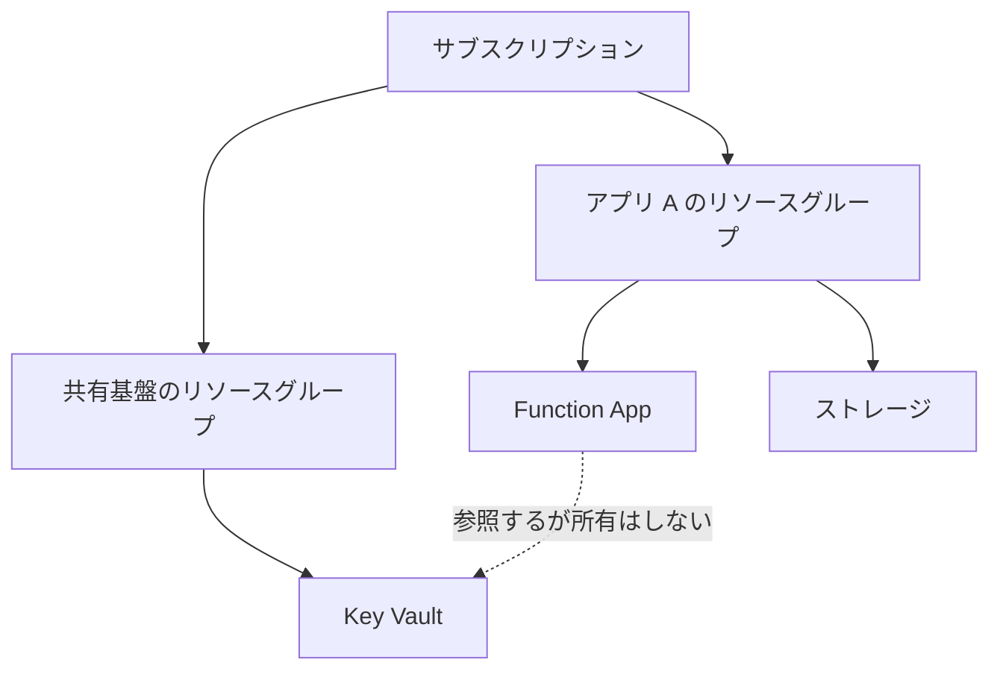
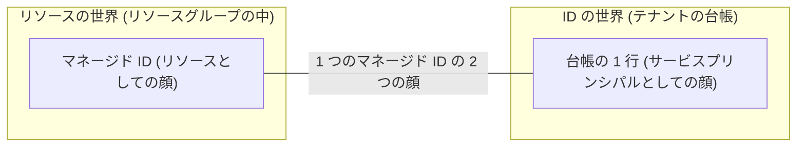

# 第3章 リソースグループ ― ライフサイクルをまとめる単位の設計

リソースグループは、Azure でリソースを 1 つでも作るなら必ず作ることになる入れ物です。必須であるがゆえに、深く考えずに作ってしまいがちです。

しかしリソースグループには 1 つだけ明確な設計原則があります。一緒に消えるべきものをまとめる、です。この原則を外すと、あとで何も消せなくなります。

## リソースグループはライフサイクルの境界

リソースグループを削除すると、その中のリソースはすべて削除されます。個別に残すものを選ぶことはできません。これがリソースグループの本質的な機能であり、同時に唯一の強い制約でもあります。

したがって、リソースグループに何を入れるかという問いは、どれとどれが同時に消えてよいかという問いと同じです。

- 同じアプリケーションのために存在し、そのアプリケーションが不要になれば全部不要になるもの: 同じリソースグループに入れます
- 複数のアプリケーションから共有され、1 つのアプリケーションが消えても残るべきもの: 別のリソースグループに分けます

「本番」「開発」といった環境で切るのも、「Web 層」「DB 層」といった役割で切るのも、それ自体は間違いではありません。ただしその切り方が「同時に消えるか」と一致していなければ、いずれ削除できないリソースグループができあがります。

## リソースグループが持つ属性は少ない

リソースグループが持つのは、名前、リージョン（リソースが置かれる場所。第0章の表で定義しました）、タグ、そしてロックです。ロックは本書で初出なので一言説明します。誤操作を防ぐ安全装置で、削除禁止（CanNotDelete）か読み取り専用（ReadOnly）をリソースグループやリソースに掛けられます。掛かっている間は、たとえ Owner でも該当の操作が拒否されます。「権限はあるのに操作できない」ときに疑う対象の 1 つとして覚えておいてください。

```bash
az group show --name <名前> --query "{name:name, location:location, tags:tags}" -o json
```

リージョンについて、ここで立ち止まって説明します（第0章の表で「詳しくは第3章」とした話です）。Azure のデータセンターは世界中にあり、地理的なまとまりごとに名前が付いています。東日本が japaneast、西日本が japanwest、米国西部が westus という具合です。このまとまりがリージョンで、リソースを作るときは毎回どこに置くかを選びます。本書のハンズオンがコマンドに `--location japaneast` を渡してきたのが、まさにこの選択でした。利用者に近いリージョンほど通信の遅延が小さく、リージョンによって使えるサービスの顔ぶれや料金も少し違います。

そのうえで、意外に感じる事実を 1 つ。リソースグループのリージョンと、中のリソースのリージョンは、別々に選べます。一致させる必要はありません。japaneast のリソースグループに、westus の仮想マシンを置けます。



なぜこうなるのか。リソースグループは物理的な入れ物ではなく、論理的なまとまりだからです。リソースの実体は、それぞれのリソースが選んだリージョンに置かれます。リソースグループが持っているのは「どれとどれが仲間か」という管理情報だけで、実体を抱えてはいません。

ではリソースグループのリージョンは何を意味するのでしょうか。図のとおり、その管理情報（どのリソースが所属しているかという台帳）の保管場所です。そのリージョンに障害が起きると、中のリソースは動いていても、リソースグループへの管理操作（一覧、タグ変更、削除など）ができなくなることがあります。

## 上の階層との関係

リソースグループの上には、ここまでの章で見てきた 3 つの階層（テナント・管理グループ・サブスクリプション）があります。それぞれがリソースグループに何をもたらすのか、逆に何は無関係なのかを整理しておきます。

| 階層               | リソースグループとの関係                                                                                                                                                             |
| ------------------ | ------------------------------------------------------------------------------------------------------------------------------------------------------------------------------------ |
| テナント           | リソースグループの作成や削除に直接は関わりません。関係するのは 1 点だけで、リソースグループに権限を割り当てるとき、その相手（ユーザーやグループ）の名簿はテナントにあります（第1章） |
| 管理グループ       | 管理グループに割り当てたポリシーとロールは、配下のサブスクリプションを通ってリソースグループにも届きます（第2章の継承）。リソースグループの側でこれを拒否することはできません        |
| サブスクリプション | リソースグループは、必ずどれか 1 つのサブスクリプションの中に作ります。どのサブスクリプションに属するかが、請求先と使えるリソースの種類（第1章）を決めます                           |

サブスクリプションを跨いでリソースを移す操作（`az resource move`）は存在しますが、リソースの種類ごとに可否が違い、移動中はリソースがロックされます。リソースグループの所属サブスクリプションは、あとから気軽に変えられるものではありません。第1章で「分ける必要がないならサブスクリプションを増やさない」と述べた理由の 1 つがこの不可逆性です。



図の破線に注目してください。アプリ A のリソースグループを削除しても、共有基盤の Key Vault は残ります。これは正しい設計です。しかし逆に、共有基盤のリソースグループを消すと、アプリ A は動かなくなります。参照関係はリソースグループの境界を越えますが、削除の連鎖は越えないのです。

## クリーンアップ演習 ― 何が消え、何が残るか

リソースグループを削除したときに、何が消えて何が残るかを観察します。

題材にはマネージド ID を使います。第0章の表で「Azure が面倒を見てくれる、プログラムのための ID」と紹介したもので、詳しくは第7章で扱います。この演習では中身に深入りせず、マネージド ID が 2 つの顔を持つことだけ分かれば十分です。

1 つ目の顔はリソースです。ストレージなどと同じように、リソースグループの中に作ります（今回使うユーザー割り当てという種類は、独立したリソースとして自分で作るタイプです。名前の意味は第7章で説明します）。

2 つ目の顔は、テナントの台帳の 1 行です。作った ID がサインインの相手として認められるためには、第1章で見た ID の台帳（テナント）に載っている必要があります。マネージド ID を作ると、Azure がこの台帳への登録も自動で行います（この登録された 1 行が、第0章の表にあったサービスプリンシパルです）。



つまり 1 つのマネージド ID が、リソースの世界と ID の世界に 1 つずつ足を置いています。ここで本章の問いです。リソースグループを消せば、リソースの世界の顔は確実に消えます。では、台帳側の 1 行はどうなるでしょうか。

実際にやってみます。以下は頭からコピペで実行できる列で、出力は本書の検証環境の実物です（なお、こうした後片付けを本書では teardown と呼び、スクリプト名もこれに合わせています）。

```bash
# 器と、題材のマネージド ID を作ります
az group create --name azp-ch03-rg --location japaneast \
  --tags azp-book=azure-practice azp-chapter=ch03 azp-lifecycle=ephemeral
az identity create --name azp-ch03-id --resource-group azp-ch03-rg

# 削除の前に、台帳側の 1 行を指す識別子を控えておきます
principal_id=$(az identity show --name azp-ch03-id --resource-group azp-ch03-rg --query principalId -o tsv)
echo "$principal_id"

# リソースグループごと削除します（完了まで待ちます）
az group delete --name azp-ch03-rg --yes

# 台帳側の 1 行はどうなったかを確認します
az ad sp show --id "$principal_id"
```

```text
ERROR: Resource '01712186-...' does not exist or one of its queried reference-property
objects are not present.
```

台帳側の 1 行も消えていました。マネージド ID の台帳側は、リソース側の削除に追随して消される設計です。ただし反映には時間差がありえます。本書の検証では削除完了直後に消えていましたが、数分残ることもあります。「消えているはず」を確認するこの 1 手を、削除の習慣に含めてください。

より確実に残るのは、ロール割り当ての残骸です。ID を先に消すと、その ID を指していたロール割り当てが対象不明のまま残ります。

```bash
# 削除された ID を指すロール割り当てを探します
az role assignment list --all \
  --query "[?principalName==null].{scope:scope, role:roleDefinitionName, id:principalId}" -o table
```

これが溜まると、誰に何の権限があるのかが読めなくなります。リソースグループを消しても、Entra ID 側と RBAC 側の掃除は自動では完結しない、と覚えておいてください。マネージド ID は第7章、RBAC は第6章で扱います。

## 消えたように見えて消えていないもの ― 論理削除（soft-delete）と物理削除（purge）

もう 1 つ、削除しても消えないものがあります。論理削除（soft-delete）されるリソースです。

いくつかの Azure サービスは、削除操作を受けても実体を即座には消さず、一定期間保持します。誤削除からの復旧を可能にするための機能です。しかし裏返すと「削除したのに名前が空かない」という形で現れます。

| サービス                     | 論理削除の対象                                     | 既定の保持期間 | 物理削除の操作             |
| ---------------------------- | -------------------------------------------------- | -------------- | -------------------------- |
| Key Vault                    | Vault 本体とシークレット・キー・証明書             | 90 日          | `az keyvault purge`        |
| Storage                      | BLOB、コンテナー、ファイル共有（有効化した場合）   | 設定による     | 保持期間の経過を待つ       |
| Cosmos DB                    | アカウント（継続的バックアップを構成している場合） | 構成による     | 復元をスキップして新規作成 |
| Recovery Services コンテナー | バックアップ項目                                   | 14 日          | 論理削除の解除後に削除     |

最も引っかかりやすいのは Key Vault です。Key Vault の名前は世界で一意であり、論理削除の保持期間中はその名前が予約されたままになります。

ここで、道具によって見え方が違うという実測結果を示します。本書の検証で、Vault を削除した直後に同じ名前で作り直すことを 2 つの経路で試しました。

| 経路                               | 結果                                                                    |
| ---------------------------------- | ----------------------------------------------------------------------- |
| `az keyvault create`（CLI）        | 失敗せず、論理削除状態から自動復元されます                              |
| Bicep / ARM テンプレートのデプロイ | ConflictError: Exist soft deleted vault with the same name で失敗します |

CLI は「同名の削除済み Vault が自分のサブスクリプションにあるなら復元する」ところまで面倒を見てくれます。一方、テンプレートの素のデプロイは復元を指定しない限り衝突します。第1章の壊す演習と同じ構図で、道具が挙動の差を作っています。IaC でハンズオンを繰り返す本書では、削除だけでは不十分で、purge まで行って初めて再実行可能になります。

```bash
# 論理削除された Key Vault を一覧します
az keyvault list-deleted --query "[].{name:name, deletionDate:properties.deletionDate, purgeDate:properties.scheduledPurgeDate}" -o table
```

この一覧は、まだ何も削除していない環境では空が返ります（それが正常です。この時点のあなたの環境も空のはずです）。参考として、後の章のハンズオン（第16章）で Vault を削除した直後に、本書の検証環境で採取した出力を載せます。

```text
Name            DeletionDate               PurgeDate
--------------  -------------------------  -------------------------
azpch01kv26696  2026-08-08T02:36:16+00:00  2026-11-06T02:36:16+00:00
```

PurgeDate が削除日のちょうど 90 日後になっています。この日まで、この名前は誰にも使えません。完全に削除して名前を解放するのが物理削除（purge）です。

```bash
az keyvault purge --name <名前> --location <リージョン>
```

purge には専用の権限（`Microsoft.KeyVault/locations/deletedVaults/purge/action`）が要ります。また、purge protection を有効にした Vault は、保持期間が過ぎるまで誰にも purge できません。本番ではこれが安全装置として働きますが、教材では再実行の障害になります。本書のハンズオンでは purge protection を有効にしません。

Key Vault の 2 つの認可モデルと合わせて、第16章で改めて扱います。

## 命名とタグ

リソースグループには、あとで機械的に扱えるだけの情報を名前とタグに入れておきます。本書のハンズオンは次の規約を使います。

```text
<接頭辞>-<章>-rg        例: azp-ch04-rg
```

タグは 3 つ付けます。

| タグ            | 用途                                                       |
| --------------- | ---------------------------------------------------------- |
| `azp-book`      | 本書が作ったリソースであることの目印                       |
| `azp-chapter`   | どの章が作ったか。teardown が対象を絞るために使います      |
| `azp-lifecycle` | `ephemeral` を付けます。消してよいものであることの明示です |

タグは自動では継承されません。リソースグループに付けたタグは、その中のリソースには付きません。継承させたい場合は Azure Policy の modify 効果を使います。この構造は第20章と付録Bで扱います。

## 検証環境

| 項目           | 値                                   |
| -------------- | ------------------------------------ |
| 検証状態       | verified                             |
| 検証日         | 2026-08-08                           |
| Azure CLI      | 2.77.0                               |
| Bicep CLI      | 0.37.4                               |
| API バージョン | Microsoft.KeyVault/vaults@2024-11-01 |

## 理解度チェック

1. japaneast のリソースグループに westus の仮想マシンを置きました。japaneast リージョンの大規模障害時、この仮想マシンはどうなりますか。仮想マシン自体の稼働と、それに対する管理操作を分けて答えてください
2. Bicep で Key Vault を含む構成をデプロイし、リソースグループごと削除してから、同じテンプレートを再デプロイしたら ConflictError になりました。`az keyvault create` なら同じ名前で成功します。この差はどこから来ますか。また、再デプロイを通すには何をすべきでしょうか
3. `az role assignment list --all` の結果に principalName が空のロール割り当てが並んでいます。どういう経緯で生まれ、放置すると何が困りますか
