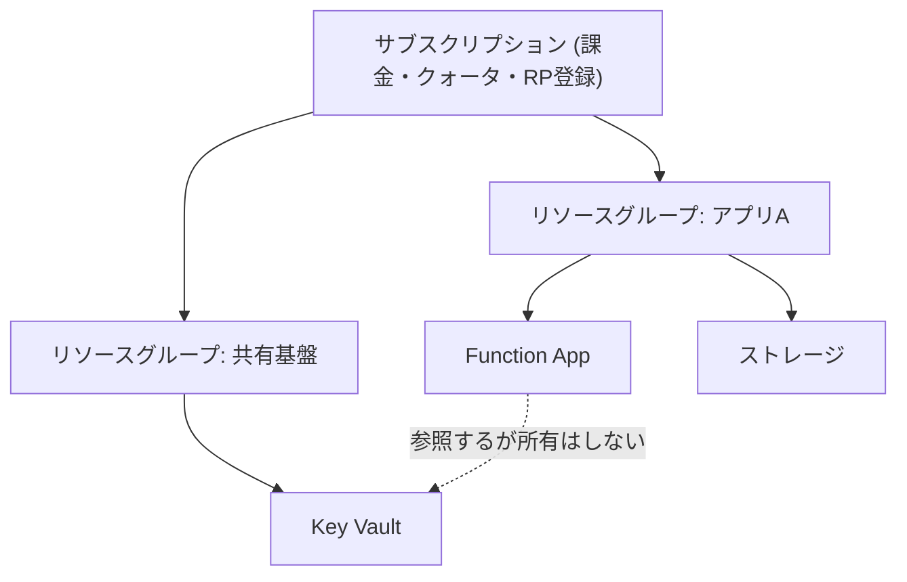

# 第3章 リソースグループ ― ライフサイクルをまとめる単位の設計

リソースグループは、Azure でリソースを 1 つでも作るなら必ず作ることになる入れ物である。必須であるがゆえに、深く考えずに作ってしまいやすい。

しかしリソースグループには 1 つだけ明確な設計原則がある。**一緒に消えるべきものをまとめる**。この原則を外すと、あとで何も消せなくなる。

## リソースグループはライフサイクルの境界である

リソースグループを削除すると、その中のリソースはすべて削除される。個別に選ぶことはできない。これがリソースグループの本質的な機能であり、同時に唯一の強い制約でもある。

したがって、リソースグループに何を入れるかという問いは、**どれとどれが同時に消えてよいか**という問いと同じである。

- 同じアプリケーションのために存在し、そのアプリケーションが不要になれば全部不要になるもの → 同じリソースグループ
- 複数のアプリケーションから共有され、1 つのアプリケーションが消えても残るべきもの → 別のリソースグループ

「本番」「開発」といった環境で切るのも、「Web 層」「DB 層」といった役割で切るのも、それ自体は間違いではない。ただしその切り方が「同時に消えるか」と一致していなければ、いずれ削除できないリソースグループができあがる。

## リソースグループが持つ属性は少ない

リソースグループが持つのは、名前、リージョン、タグ、そしてロック程度である。

```bash
az group show --name <名前> --query "{name:name, location:location, tags:tags}" -o json
```

ここで注意すべきは **リソースグループのリージョンは、中のリソースのリージョンを縛らない** ことである。`japaneast` のリソースグループに `westus` の仮想マシンを置ける。

ではリソースグループのリージョンは何を意味するのか。リソースグループそのもののメタデータ（どのリソースが所属しているかという情報）が格納される場所である。そのリージョンが障害を起こすと、中のリソース自体は動いていても、リソースグループに対する管理操作ができなくなる。

## 縦の関係 ― 上の階層はどう効くか

| 階層               | リソースグループへの効き方                                                                       |
| ------------------ | ------------------------------------------------------------------------------------------------ |
| テナント           | 直接は効かない。ただし RBAC の割り当て対象となる ID はテナント側にいる                           |
| 管理グループ       | 上位で割り当てたポリシーと RBAC が継承される。リソースグループで解除できない                     |
| サブスクリプション | リソースグループはサブスクリプションの中にしか作れない。跨いだ移動は「移動」ではなく別操作になる |

サブスクリプションを跨いでリソースを移す操作（`az resource move`）は存在するが、これはリソースの種類ごとに可否が違い、移動中はリソースがロックされる。リソースグループの所属サブスクリプションは、あとから気軽に変えられるものではない。第1章で「サブスクリプションを増やす理由は薄いなら増やさない」と述べたのは、この不可逆性が理由の一つである。



図の破線が問題になる。アプリ A のリソースグループを削除しても、共有基盤の Key Vault は残る。これは正しい。しかし逆に、共有基盤のリソースグループを消すと、アプリ A は動かなくなる。**参照関係はリソースグループの境界を越えるが、削除の連鎖は越えない。**

## クリーンアップ演習 ― 何が消え、何が残るか

リソースグループを削除したときに何が消えて何が残るかを、実際に観察する。

ここで観察するのは、**リソースグループの外に実体を持つもの**である。代表例がユーザー割り当てマネージド ID である。

マネージド ID のリソース自体はリソースグループの中にある。しかしその ID に対応するサービスプリンシパルは Entra ID 側、つまりテナントに存在する。第1章で見た「ID の実体はテナントに属し、リソースはサブスクリプションに属する」というねじれが、削除の場面で表面化する。

```bash
# 削除前に principalId を控えておく
principal_id=$(az identity show --name azp-ch03-id --resource-group azp-ch03-rg --query principalId -o tsv)
echo "$principal_id"

# リソースグループごと削除する
az group delete --name azp-ch03-rg --yes
az group wait --name azp-ch03-rg --deleted

# Entra ID 側に残っているかを確認する
az ad sp show --id "$principal_id"
```

マネージド ID に紐づくサービスプリンシパルは、リソースの削除に追随して削除される設計だが、反映には時間差がある。削除直後は `az ad sp show` がまだ結果を返すことがある。

より明確に残るのは、**ロール割り当ての残骸**である。リソースグループスコープで割り当てたロールは、リソースグループの削除とともに意味を失うが、割り当ての対象だった ID が別の場所で使われていれば ID 自体は残る。逆に ID を先に消すと、ロール割り当てが「Identity not found」として残る。

```bash
# 削除された ID を指すロール割り当てを探す
az role assignment list --all --query "[?principalName==null].{scope:scope, role:roleDefinitionName, id:principalId}" -o table
```

これが溜まると、誰に何の権限があるのかが読めなくなる。**リソースグループを消しても、Entra ID 側と RBAC 側の掃除は自動では終わらない。** マネージド ID の詳細は第7章、RBAC は第6章で扱う。

## 消えたように見えて消えていないもの ― 論理削除と purge

もう一つ、リソースグループの削除では消えないものがある。**論理削除（soft-delete）** されたリソースである。

いくつかの Azure サービスは、削除操作を受けても実体を即座には消さず、一定期間保持する。誤削除からの復旧を可能にするための機能である。しかしこれは「削除したのに名前が空かない」という形で現れる。

| サービス                     | 論理削除の対象                                   | 既定の保持期間 | 完全削除の操作             |
| ---------------------------- | ------------------------------------------------ | -------------- | -------------------------- |
| Key Vault                    | Vault 本体とシークレット・キー・証明書           | 90 日          | `az keyvault purge`        |
| Storage                      | BLOB、コンテナー、ファイル共有（有効化した場合） | 設定による     | 保持期間の経過を待つ       |
| Cosmos DB                    | アカウント（同名再作成時に復元候補として現れる） | 30 日          | 復元をスキップして新規作成 |
| Recovery Services コンテナー | バックアップ項目                                 | 14 日          | 論理削除の解除後に削除     |

Cosmos DB の行だけ条件付きである点に注意してほしい。アカウント単位の復元が効くのは継続的バックアップ（continuous backup）を構成している場合であり、既定の定期バックアップのみの構成では同じようには復元できない。この違いは第18章で実際に確認する。

最も引っかかりやすいのは Key Vault である。Key Vault の名前はグローバルに一意であり、論理削除の保持期間中はその名前が予約されたままになる。同じ名前で作り直そうとすると、次のように失敗する。

```text
(ConflictError) Exist soft deleted vault with the same name.
```

したがって、ハンズオンを何度も繰り返す教材では、削除だけでは不十分である。本書の teardown スクリプトが `purge` まで行っているのはこのためである。

```bash
# 論理削除された Key Vault を一覧する
az keyvault list-deleted --query "[].{name:name, deletionDate:properties.deletionDate}" -o table

# 完全に削除する
az keyvault purge --name <名前> --location <リージョン>
```

purge には専用の権限（`Microsoft.KeyVault/locations/deletedVaults/purge/action`）が要る。また、purge protection を有効にした Vault は保持期間が過ぎるまで purge できない。本番環境ではこれが安全機構として働くが、教材では逆に障害になる。**本書のハンズオンでは purge protection を有効にしない。**

Key Vault の 2 つの認可モデルと合わせて、第16章で改めて扱う。

## 命名とタグ

リソースグループには、あとで機械的に扱えるだけの情報を名前とタグに入れておく。本書のハンズオンは次の規約を使う。

```text
<接頭辞>-<章>-rg        例: azp-ch04-rg
```

タグは 3 つ付ける。

| タグ            | 用途                                                 |
| --------------- | ---------------------------------------------------- |
| `azp-book`      | 本書が作ったリソースであることの目印                 |
| `azp-chapter`   | どの章が作ったか。teardown が対象を絞るために使う    |
| `azp-lifecycle` | `ephemeral` を付ける。消してよいものであることの明示 |

タグは自動では継承されない。リソースグループに付けたタグは、その中のリソースには付かない。継承させたい場合は Azure Policy の `modify` 効果を使う。この構造は第20章と付録Bで扱う。

## 検証環境

| 項目           | 値      |
| -------------- | ------- |
| 検証状態       | pending |
| 検証日         | -       |
| Azure CLI      | -       |
| Bicep CLI      | -       |
| API バージョン | -       |

## 理解チェック

1. `japaneast` のリソースグループに `westus` の仮想マシンを置いた。`japaneast` リージョンで大規模障害が発生した場合、この仮想マシンはどうなるか。仮想マシン自体の稼働と、それに対する管理操作を分けて答えよ
2. あるリソースグループを削除したあと、同じ名前の Key Vault を同じ名前で作り直そうとしたら失敗した。権限は十分にある。何が起きているか。確認するコマンドと解決手順を述べよ
3. `az role assignment list --all` の結果に、`principalName` が空のロール割り当てがいくつも並んでいる。これはどういう経緯で生まれるか。放置すると何が困るか
