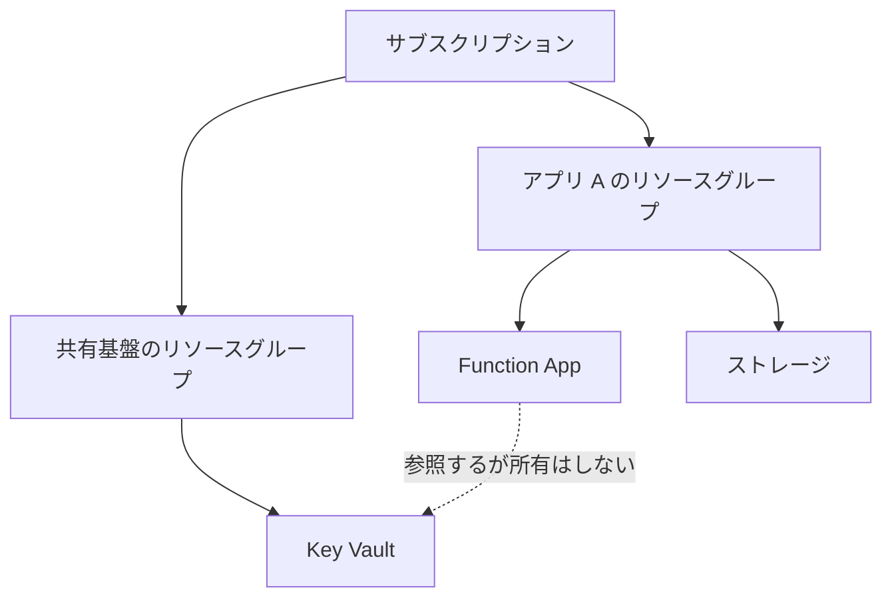

# 第3章 リソースグループ ― ライフサイクルをまとめる単位の設計

リソースグループは、Azure でリソースを 1 つでも作るなら必ず作ることになる入れ物です。必須であるがゆえに、深く考えずに作ってしまいがちです。

しかしリソースグループには 1 つだけ明確な設計原則があります。一緒に消えるべきものをまとめる、です。この原則を外すと、あとで何も消せなくなります。

## リソースグループはライフサイクルの境界

リソースグループを削除すると、その中のリソースはすべて削除されます。個別に残すものを選ぶことはできません。これがリソースグループの本質的な機能であり、同時に唯一の強い制約でもあります。

したがって、リソースグループに何を入れるかという問いは、どれとどれが同時に消えてよいかという問いと同じです。

- 同じアプリケーションのために存在し、そのアプリケーションが不要になれば全部不要になるもの: 同じリソースグループに入れます
- 複数のアプリケーションから共有され、1 つのアプリケーションが消えても残るべきもの: 別のリソースグループに分けます

「本番」「開発」といった環境で切るのも、「Web 層」「DB 層」といった役割で切るのも、それ自体は間違いではありません。ただしその切り方が「同時に消えるか」と一致していなければ、いずれ削除できないリソースグループができあがります。

## リソースグループが持つ属性は少ない

リソースグループが持つのは、名前、リージョン、タグ、ロック程度です。

```bash
az group show --name <名前> --query "{name:name, location:location, tags:tags}" -o json
```

ここで注意すべき点があります。リソースグループのリージョンは、中のリソースのリージョンを縛りません。japaneast のリソースグループに westus の仮想マシンを置けます。

ではリソースグループのリージョンは何を意味するのでしょうか。リソースグループ自体のメタデータ（どのリソースが所属しているかという情報）の保管場所です。そのリージョンに障害が起きると、中のリソースは動いていても、リソースグループへの管理操作（一覧、タグ変更、削除など）ができなくなることがあります。

## 縦の関係 ― 上の階層はどう効くか

| 階層               | リソースグループへの効き方                                                           |
| ------------------ | ------------------------------------------------------------------------------------ |
| テナント           | 直接は効きません。ただしロール割り当ての対象になる ID の台帳はテナント側にあります   |
| 管理グループ       | 上位で割り当てたポリシーとロールが継承されます。リソースグループ側では解除できません |
| サブスクリプション | リソースグループはサブスクリプションの中にしか作れません                             |

サブスクリプションを跨いでリソースを移す操作（`az resource move`）は存在しますが、リソースの種類ごとに可否が違い、移動中はリソースがロックされます。リソースグループの所属サブスクリプションは、あとから気軽に変えられるものではありません。第1章で「分ける必要がないならサブスクリプションを増やさない」と述べた理由の 1 つがこの不可逆性です。



図の破線に注目してください。アプリ A のリソースグループを削除しても、共有基盤の Key Vault は残ります。これは正しい設計です。しかし逆に、共有基盤のリソースグループを消すと、アプリ A は動かなくなります。参照関係はリソースグループの境界を越えますが、削除の連鎖は越えないのです。

## クリーンアップ演習 ― 何が消え、何が残るか

リソースグループを削除したときに何が消えて何が残るかを観察します。観察対象は、リソースグループの外に実体を持つものです。

代表例がユーザー割り当てマネージド ID です。マネージド ID のリソース自体はリソースグループの中にありますが、その ID に対応するサービスプリンシパルは Entra ID 側、つまりテナントの台帳に記録されています。第1章で見た「ID は台帳に、リソースは契約に」という分かれ方が、削除の場面で表面化します。

以下は第4章の統合ハンズオンの teardown で実際に観察する手順です（検証済み）。

```bash
# 削除前に ID の識別子を控えておきます
principal_id=$(az identity show --name azp-ch04-id --resource-group azp-ch04-rg --query principalId -o tsv)

# リソースグループごと削除します
az group delete --name azp-ch04-rg --yes
az group wait --name azp-ch04-rg --deleted

# Entra ID 側にサービスプリンシパルが残っているかを確認します
az ad sp show --id "$principal_id"
```

マネージド ID に紐づくサービスプリンシパルは、リソースの削除に追随して削除される設計ですが、反映には時間差がありえます。本書の検証時は、リソースグループの削除完了を待った時点でサービスプリンシパル側も消えていました。

より確実に残るのは、ロール割り当ての残骸です。ID を先に消すと、その ID を指していたロール割り当てが対象不明のまま残ります。

```bash
# 削除された ID を指すロール割り当てを探します
az role assignment list --all \
  --query "[?principalName==null].{scope:scope, role:roleDefinitionName, id:principalId}" -o table
```

これが溜まると、誰に何の権限があるのかが読めなくなります。リソースグループを消しても、Entra ID 側と RBAC 側の掃除は自動では完結しない、と覚えておいてください。マネージド ID は第7章、RBAC は第6章で扱います。

## 消えたように見えて消えていないもの ― 論理削除と purge

もう 1 つ、削除しても消えないものがあります。論理削除（soft-delete）されるリソースです。

いくつかの Azure サービスは、削除操作を受けても実体を即座には消さず、一定期間保持します。誤削除からの復旧を可能にするための機能です。しかし裏返すと「削除したのに名前が空かない」という形で現れます。

| サービス                     | 論理削除の対象                                     | 既定の保持期間 | 完全削除の操作             |
| ---------------------------- | -------------------------------------------------- | -------------- | -------------------------- |
| Key Vault                    | Vault 本体とシークレット・キー・証明書             | 90 日          | `az keyvault purge`        |
| Storage                      | BLOB、コンテナー、ファイル共有（有効化した場合）   | 設定による     | 保持期間の経過を待つ       |
| Cosmos DB                    | アカウント（継続的バックアップを構成している場合） | 構成による     | 復元をスキップして新規作成 |
| Recovery Services コンテナー | バックアップ項目                                   | 14 日          | 論理削除の解除後に削除     |

最も引っかかりやすいのは Key Vault です。Key Vault の名前は世界で一意であり、論理削除の保持期間中はその名前が予約されたままになります。

ここで、道具によって見え方が違うという実測結果を示します。本書の検証で、Vault を削除した直後に同じ名前で作り直すことを 2 つの経路で試しました。

| 経路                               | 結果                                                                    |
| ---------------------------------- | ----------------------------------------------------------------------- |
| `az keyvault create`（CLI）        | 失敗せず、論理削除状態から自動復元されます                              |
| Bicep / ARM テンプレートのデプロイ | ConflictError: Exist soft deleted vault with the same name で失敗します |

CLI は「同名の削除済み Vault が自分のサブスクリプションにあるなら復元する」ところまで面倒を見てくれます。一方、テンプレートの素のデプロイは復元を指定しない限り衝突します。第1章の壊す演習と同じ構図で、道具が挙動の差を作っています。IaC でハンズオンを繰り返す本書では、削除だけでは不十分で、purge まで行って初めて再実行可能になります。

```bash
# 論理削除された Key Vault を一覧します
az keyvault list-deleted --query "[].{name:name, deletionDate:properties.deletionDate, purgeDate:properties.scheduledPurgeDate}" -o table
```

本書の検証環境で、Vault を削除した直後の実際の出力です。

```text
Name            DeletionDate               PurgeDate
--------------  -------------------------  -------------------------
azpch01kv26696  2026-08-08T02:36:16+00:00  2026-11-06T02:36:16+00:00
```

PurgeDate が削除日のちょうど 90 日後になっています。この日まで、この名前は誰にも使えません。完全に削除して名前を解放するには purge します。

```bash
az keyvault purge --name <名前> --location <リージョン>
```

purge には専用の権限（`Microsoft.KeyVault/locations/deletedVaults/purge/action`）が要ります。また、purge protection を有効にした Vault は、保持期間が過ぎるまで誰にも purge できません。本番ではこれが安全装置として働きますが、教材では再実行の障害になります。本書のハンズオンでは purge protection を有効にしません。

Key Vault の 2 つの認可モデルと合わせて、第16章で改めて扱います。

## 命名とタグ

リソースグループには、あとで機械的に扱えるだけの情報を名前とタグに入れておきます。本書のハンズオンは次の規約を使います。

```text
<接頭辞>-<章>-rg        例: azp-ch04-rg
```

タグは 3 つ付けます。

| タグ            | 用途                                                       |
| --------------- | ---------------------------------------------------------- |
| `azp-book`      | 本書が作ったリソースであることの目印                       |
| `azp-chapter`   | どの章が作ったか。teardown が対象を絞るために使います      |
| `azp-lifecycle` | `ephemeral` を付けます。消してよいものであることの明示です |

タグは自動では継承されません。リソースグループに付けたタグは、その中のリソースには付きません。継承させたい場合は Azure Policy の modify 効果を使います。この構造は第20章と付録Bで扱います。

## 検証環境

| 項目           | 値                                   |
| -------------- | ------------------------------------ |
| 検証状態       | verified                             |
| 検証日         | 2026-08-08                           |
| Azure CLI      | 2.77.0                               |
| Bicep CLI      | 0.37.4                               |
| API バージョン | Microsoft.KeyVault/vaults@2024-11-01 |

## 理解度チェック

1. japaneast のリソースグループに westus の仮想マシンを置きました。japaneast リージョンの大規模障害時、この仮想マシンはどうなりますか。仮想マシン自体の稼働と、それに対する管理操作を分けて答えてください
2. Bicep で Key Vault を含む構成をデプロイし、リソースグループごと削除してから、同じテンプレートを再デプロイしたら ConflictError になりました。`az keyvault create` なら同じ名前で成功します。この差はどこから来ますか。また、再デプロイを通すには何をすべきでしょうか
3. `az role assignment list --all` の結果に principalName が空のロール割り当てが並んでいます。どういう経緯で生まれ、放置すると何が困りますか
