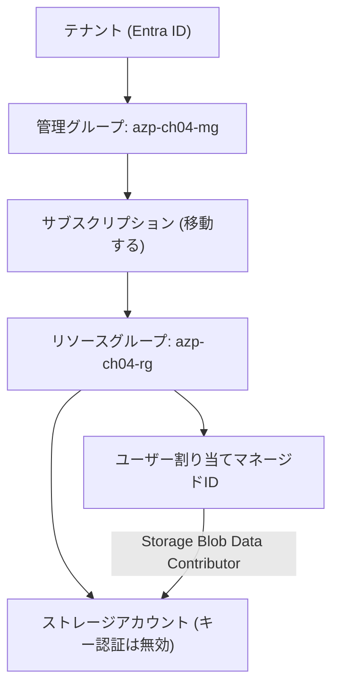

# 第4章 [統合ハンズオン] 4 階層を 1 つのシナリオで通しで作る

第1〜3章で、テナント、管理グループ、サブスクリプション、リソースグループという 4 つの階層をそれぞれ見た。本章ではこの 4 つを 1 本のシナリオで通しで作り、階層が実際にどう積み重なっているかを手で確認する。

Part 1 はここで閉じる。以降の章は、この 4 階層の上に何を載せるかという話になる。

## このハンズオンで作るもの



意図的に、階層と一致しないものを 1 つ混ぜてある。マネージド ID からストレージへのロール割り当てのスコープは、**リソースグループでもサブスクリプションでもなく、ストレージアカウントというリソース単体**である。RBAC のスコープ選択がガバナンス階層と一致するとは限らない、という Part 2 の主題をここで先に見ておく。

## 前提の確認

顧客環境や本番サブスクリプションでは実行しないこと。

```bash
az login --tenant <検証用テナントID>
az account set --subscription <検証用サブスクリプションID>
./scripts/bootstrap/check-env.sh
```

`check-env.sh` は、Azure CLI と Bicep CLI のバージョン、サブスクリプションスコープのロール、管理グループへのアクセス可否、そして未登録のリソースプロバイダー（第1章の壊す演習の候補）を表示する。

管理グループを列挙できないと表示された場合、本章の第 1 ステップはスキップされる。サブスクリプションの Owner であっても管理グループには自動でアクセスできない、という第2章の内容の実地確認でもある。

## 実行

手順の実体は `scripts/chapters/ch04-foundation.sh` にある。本文はこのスクリプトの各ステップを説明する。読者が実行する対象と本文が説明する対象を一致させるため、コマンドの実体はスクリプト側にしか置いていない。

```bash
./scripts/chapters/ch04-foundation.sh
```

### ステップ 1 ― 管理グループを作る

```bash
az account management-group create --name azp-ch04-mg --display-name "azure-practice 第4章"
```

親を指定していないため、テナントルート管理グループの子になる。管理グループはテナントに属し、どのサブスクリプションの中にも入っていない。作成時にサブスクリプション ID を指定する引数がないことがその証拠である。

権限が足りない場合、スクリプトは警告を出して先へ進む。これは意図した挙動である。第2章・第4章の該当手順を `blocked` として記録し、勝手に「検証済み」にしないためである。

### ステップ 2 ― サブスクリプションを管理グループの下へ移す

```bash
az account management-group subscription add --name azp-ch04-mg --subscription "$sub_id"
```

この操作で変わるのは**継承の経路だけ**である。請求先も、クォータも、リソースプロバイダーの登録状態も変わらない。管理グループが束ねるのは統制であって契約ではない、という第2章の話がここで確認できる。

### ステップ 3 ― リソースグループとリソースを Bicep でデプロイする

```bash
az deployment sub create \
  --location japaneast \
  --template-file infra/bicep/chapters/ch04-foundation/main.bicep \
  --parameters infra/bicep/chapters/ch04-foundation/main.parameters.json
```

コマンドが `az deployment group create` ではなく `az deployment sub create` であることに注目してほしい。**リソースグループを作る操作そのものが、サブスクリプションスコープの操作である。** リソースグループスコープのテンプレートからリソースグループは作れない。

`infra/bicep/chapters/ch04-foundation/main.bicep` の冒頭にこう書かれている。

```bicep
targetScope = 'subscription'
```

そしてリソースグループの中身は、別ファイル `contents.bicep` に切り出してモジュールとして呼んでいる。

```bicep
module contents 'contents.bicep' = {
  name: '${prefix}-${chapter}-contents'
  scope: rg
  params: { ... }
}
```

スコープの違うものを 1 つのファイルに混ぜられない、という制約がモジュール分割の動機になっている。この構造は第11章と第12章で本格的に扱う。

### ステップ 4 ― 各階層をポータルで確認する

CLI で作ったものを、今度はポータルで縦に辿る。同じものが別の見え方をすることを確認するのが目的である。

1. Azure ポータルで「管理グループ」を開く。テナントルート管理グループの下に `azp-ch04-mg` があり、その下にサブスクリプションがある
2. サブスクリプションを開き、「リソースグループ」で `azp-ch04-rg` を確認する
3. リソースグループを開き、ストレージアカウントとマネージド ID があることを確認する
4. ストレージアカウントを開き、「アクセス制御 (IAM)」→「ロールの割り当て」で、マネージド ID に `Storage Blob Data Contributor` が付いていることを確認する
5. 同じ画面で「継承されたロールの割り当てを含める」を有効にすると、管理グループやサブスクリプションから降りてきている割り当ても一覧に現れる

ステップ 4 と 5 の差が、第2章で `--include-inherited` を付けたときの差と同じものである。

## 検証

```bash
./scripts/verify/ch04-foundation.sh
```

このスクリプトは read-only で、以下を確認する。

| 確認項目                                   | 何を裏付けるか                                   |
| ------------------------------------------ | ------------------------------------------------ |
| 管理グループが存在する                     | テナント側の階層が作れた                         |
| リソースグループが存在する                 | サブスクリプションスコープのデプロイが通った     |
| ストレージアカウントが存在する             | リソースグループスコープのモジュールが実行された |
| `allowSharedKeyAccess` が `false`          | キー認証を止める構成が反映された（第8章の予告）  |
| マネージド ID にロールが割り当てられている | リソーススコープの RBAC が効いている             |

最後の項目だけリトライが入っている。**RBAC のロール割り当ては即座には伝播しない。** デプロイが成功していても、直後の照会では見えないことがある。共通ライブラリの `retry` 関数が 10 秒間隔で 6 回まで待つ。

## 壊す演習 ― スコープを間違えたテンプレートをデプロイする

`targetScope` の指定がスコープの制約そのものであることを、失敗させて確認する。

`main.bicep` の 1 行目を次のように書き換えて（あるいはコピーを作って）デプロイしてみる。

```bicep
targetScope = 'resourceGroup'
```

そして `az deployment group create` でデプロイすると、リソースグループの定義でエラーになる。

```text
The template resource 'rg' at line '...' is invalid.
Resource type 'Microsoft.Resources/resourceGroups' is not a valid resource type at scope 'ResourceGroup'.
```

権限の問題ではない。**そのスコープでは、そもそもその種類のリソースを書けない。** 第1章の壊す演習で見た `MissingSubscriptionRegistration` と同じく、権限とは別の軸で失敗が起きている。Azure のエラーを読むときは、まず「これは権限の話か、スコープの話か、登録の話か」を切り分けるとよい。

確認したら `targetScope` を `subscription` に戻す。

## クリーンアップ演習

```bash
./scripts/teardown/ch04-foundation.sh
```

削除は作成の逆順ではない。**依存されている側は、依存している側より後にしか消せない。**

1. マネージド ID の `principalId` を控える（削除後に何が残ったかを照合するため）
2. リソースグループを削除する。中のストレージ、マネージド ID、ロール割り当てが一緒に消える
3. Entra ID 側にサービスプリンシパルが残っているかを確認する
4. サブスクリプションをテナントルート管理グループへ戻す
5. 管理グループを削除する

ステップ 4 を飛ばしてステップ 5 を実行すると失敗する。**管理グループは中身が空でないと削除できない。** ステップ 3 では、リソースグループを消してもテナント側のオブジェクトは即座には消えないことがあると確認できる（第3章）。

## 振り返り

このハンズオンで、Part 1 の 3 章がそれぞれ実地で確認できた。

| 章                                    | どこで確認できたか                                                                                                             |
| ------------------------------------- | ------------------------------------------------------------------------------------------------------------------------------ |
| 第1章（テナントとサブスクリプション） | 管理グループの作成にサブスクリプション ID が要らないこと。`check-env.sh` が未登録プロバイダーを列挙すること                    |
| 第2章（管理グループ）                 | サブスクリプション移動で継承経路だけが変わること。ポータルで継承された割り当てが別扱いになること                               |
| 第3章（リソースグループ）             | リソースグループ削除で中身が一括で消えること。テナント側のオブジェクトは追随に時間差があること。削除の順序に依存関係があること |

さらに、まだ説明していない 2 つのことが先に現れている。1 つは RBAC のスコープがガバナンス階層と一致しないこと、もう 1 つはスコープがテンプレートに書ける内容を決めること。前者は Part 2、後者は Part 3 で扱う。

## 検証環境

| 項目           | 値      |
| -------------- | ------- |
| 検証状態       | pending |
| 検証日         | -       |
| Azure CLI      | -       |
| Bicep CLI      | -       |
| API バージョン | -       |

## 理解チェック

1. このハンズオンで作ったストレージアカウントへのロール割り当てを、リソースではなくリソースグループのスコープに変えたとする。動作上は同じように見えるが、あとから何が困るか。第2章で見た RBAC の性質を使って答えよ
2. `az deployment sub create` に `--location japaneast` が要るのはなぜか。リソースグループのリージョンは `main.parameters.json` の `location` で別に指定しているのに、なぜコマンド側にもリージョンが要るのか
3. teardown を途中で中断し、リソースグループだけが消えて管理グループが残った状態になった。この状態から安全に片付けるには、どの順序で何を確認すればよいか
