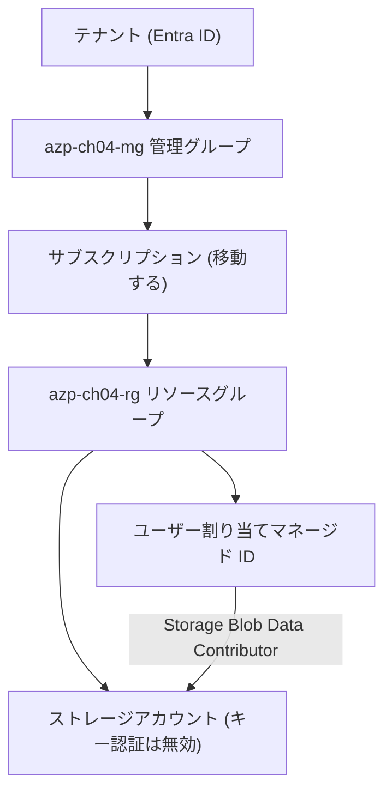

# 第 4 章 ハンズオン ― 4 階層を 1 つのシナリオで通しで作る

第 0〜3 章で、テナント、管理グループ、サブスクリプション、リソースグループという 4 つの階層をそれぞれ見てきました。本章ではこの 4 つを 1 本のシナリオで通しで作り、どれがどれの内側にあるのかを手で確認します。

本章で第 1 部は終わりです。ここまでで作ったテナント・管理グループ・サブスクリプション・リソースグループは、リソースを置く場所と、そこに効く権限やルールを決める土台です。以降の章では、この土台の上に実際のリソースを作っていきます。リソースとは第 0 章の表で「実際に動くもの 1 つ 1 つ」と紹介したもので、計算を行う仮想マシン、データを保管するストレージ、データベースなどがあります。

## このハンズオンで作るもの

土台を作るだけでは、それが何を束ねているのかが見えません。そこで、リソースグループの中にリソースを 2 つ作ります。図に入る前に、この 2 つと、その間を結ぶものを紹介します。

1 つ目はストレージアカウントです。ファイルやデータを置くための入れ物で、Azure でもっともよく使うリソースの 1 つです。中身の仕組みは第 15 章で扱うので、ここでは「リソースグループの中に置かれる、データの置き場」とだけ捉えてください。

2 つ目はユーザー割り当てマネージド ID です。第 3 章のクリーンアップ演習で作ったのと同じ種類のもので、リソースとしての顔とテナントの台帳の 1 行という 2 つの顔を持ちます。本章では本章のものを新しく作ります。

この 2 つを結ぶのがロール割り当てです。第 0 章の表で「誰が・どの範囲で・何をできるかの指定」と紹介したもので、詳しくは第 6 章で扱います。ここで使う Storage Blob Data Contributor は、ストレージアカウントの中のデータを読み書きできるロールに付いている名前です。ロールには Azure が用意した名前が付いており、割り当てるときはこの名前で指定します。

ストレージアカウントには、もう 1 つ指定を入れます。キー認証（アクセスキーによる認証）を無効にする設定です。アクセスキーは、その文字列さえ知っていれば誰でも通れる合鍵にあたるもので、本書は最初から使わない構成で通します。無効にしたうえで何を使って読み書きするのかが、いま紹介したマネージド ID とロール割り当ての組み合わせです。この判断の理由は第 8 章で扱います。



意図的に、階層と一致しないものを 1 つ混ぜてあります。マネージド ID からストレージへのロール割り当てのスコープは、リソースグループでもサブスクリプションでもなく、ストレージアカウントというリソース単体です。ロール割り当てのスコープ選択がガバナンス階層と一致するとは限らない、という第 2 部の主題をここで先に見ておきます。

## 前提の確認

顧客環境や本番サブスクリプションでは実行しないでください。第 0 章で作った検証用サブスクリプションを使います。

まず Azure にサインインします。ブラウザが開き、サインインが済むと使えるサブスクリプションの一覧が表示されます。

```bash
az login
```

WSL（Windows Subsystem for Linux）から実行していて、ブラウザが開かない場合は、Windows 側の既定ブラウザを開かせます。`wslu` パッケージの `wslview` を使う形で、第 0 章で入れたものです。

```bash
BROWSER=wslview az login
```

ブラウザ連携を使わずに、表示されたコードを別の端末のブラウザで入力する手もあります。

```bash
az login --use-device-code
```

サブスクリプション ID を覚えておく必要はありません。次のコマンドで一覧が出ます。`IsDefault` が `True` の行が、いまコマンドの宛先になっているサブスクリプションです。

```bash
az account list --output table
```

一覧から検証用のものを選び、`SubscriptionId` 列の値を次のコマンドに渡します。この指定以降、`az` コマンドはすべてこのサブスクリプションに向かいます。

```bash
az account set --subscription <検証用サブスクリプションID>
```

宛先が意図したものになったかを確認します。名前と ID が表示されます。

```bash
az account show --query "{name:name, id:id}" -o table
```

前提が揃っているかを検査するスクリプトを実行します。

```bash
./scripts/bootstrap/check-env.sh
```

`check-env.sh` は、Azure CLI と Bicep CLI のバージョン、サブスクリプションのロール、管理グループの列挙と作成の可否、未登録のリソースプロバイダー（第 1 章の壊す演習の候補）を表示します。

第 2 章で見たとおり、管理グループは列挙できなくても作成はできることがあります。check-env はこの 2 つを分けて調べ、作成の可否で第 2 章・第 4 章の実行可否を判定します。

## 実行

手順の実体は `scripts/chapters/ch04-foundation.sh` にあります。本文はこのスクリプトの各ステップを説明します。読者が実行する対象と本文が説明する対象を一致させるため、コマンドの実体はスクリプト側にだけ置いています。

```bash
./scripts/chapters/ch04-foundation.sh
```

### ステップ 1 ― 管理グループを作る

```bash
az account management-group create --name azp-ch04-mg --display-name "azure-practice 第4章"
```

成功すると、作られた管理グループが返ります。本書の検証環境での実際の出力です（識別子はダミーに置き換えています）。

```text
{
  "details": {
    "parent": {
      "displayName": "Tenant Root Group",
      "id": "/providers/Microsoft.Management/managementGroups/<テナントID>",
      "name": "<テナントID>"
    },
    "updatedBy": "<あなたのオブジェクトID>",
    "updatedTime": "2026-08-09T04:51:49.764616+00:00",
    "version": 2
  },
  "displayName": "azure-practice 第4章",
  "id": "/providers/Microsoft.Management/managementGroups/azp-ch04-mg",
  "name": "azp-ch04-mg",
  "tenantId": "<テナントID>",
  "type": "Microsoft.Management/managementGroups"
}
```

見どころは `parent` です。親を指定していないのに Tenant Root Group の子になっており、その名前がテナント ID と同じ値です（第 2 章で触れたとおりです）。管理グループはテナントに属し、どのサブスクリプションの中にも入っていません。作成コマンドにサブスクリプション ID を渡す引数が無いことがその証拠です。

### ステップ 1 でつまずいたとき

このコマンドは、権限に問題が無くても次のエラーで失敗することがあります。本書の検証環境で実際に出たものです。

```text
(AuthorizationFailed) The client '<あなたのUPN>' with object id '<あなたのオブジェクトID>' does not
have authorization to perform action 'Microsoft.Management/managementGroups/read' over scope
'/providers/Microsoft.Management/managementGroups/azp-ch04-mg' or the scope is invalid.
If access was recently granted, please refresh your credentials.
```

読むべきは、失敗した操作が `read` であることと、末尾の「権限を与えたばかりなら資格情報を更新してください」です。管理グループを作ると、作った本人に対する所有者のロール割り当てが同時に作られます。作成そのものは受理されているのに、その割り当てがまだ行き渡っておらず、直後の読み取りが弾かれた、という状態です。第 2 章で見た伝播遅延が、作成の内側で起きています。

まず、本当に作られていないのかを確かめてください。

```bash
az account management-group show --name azp-ch04-mg --query name -o tsv
```

名前が返るなら、作成は成功しています。エラーの見た目に反して、次のステップへ進んで構いません。

```text
azp-ch04-mg
```

ここで注意したいのが、一覧には出ないことがある点です。

```bash
az account management-group list --query "[].name" -o tsv
```

一覧はテナントルートに対する読み取りを使うため、いま作った管理グループが即座には現れないことがあります。本書の検証でも、`show` では見えるのに `list` には出ない状態を観測しました。見えないことを「作られていない」と読み違えないでください。

`show` も失敗する場合は、少し待ってから作成コマンドをもう一度実行します。このコマンドは同じ名前なら何度実行しても同じ結果になるので、再実行で壊れるものはありません。`scripts/chapters/ch04-foundation.sh` はこのリトライを組み込んであり、本書の検証でも 1 回目が失敗して再試行で成功しています。

再試行しても失敗が続く場合は、伝播ではなく権限の問題です。テナントの設定で管理グループの作成が制限されているか、テナントルートでの権限が要る状態です。組織のテナントではありうる制限で、個人で解消できるとは限りません。その場合は管理グループの手順を飛ばしてください。第 3 章までに作ったサブスクリプションとリソースグループだけでも、ステップ 3 以降は成立します。スクリプトは警告を出して先へ進み、該当手順を blocked として記録する運びにしています。

### ステップ 2 ― サブスクリプションを管理グループの下へ移す

```bash
az account management-group subscription add --name azp-ch04-mg --subscription "$sub_id"
```

この操作で変わるのは継承の経路だけです。請求先も、クォータも、リソースプロバイダーの登録状態も変わりません。管理グループが束ねるのは統制であって契約ではない、という第 2 章の内容がここで確認できます。

### ステップ 3 ― リソースグループとリソースを Bicep でデプロイする

```bash
az deployment sub create \
  --location japaneast \
  --template-file infra/bicep/chapters/ch04-foundation/main.bicep \
  --parameters infra/bicep/chapters/ch04-foundation/main.parameters.json
```

コマンドが `az deployment group create` ではなく `az deployment sub create` であることに注目してください。リソースグループを作る操作そのものが、サブスクリプションスコープの操作です。リソースグループスコープのテンプレートからリソースグループは作れません。

`infra/bicep/chapters/ch04-foundation/main.bicep` の冒頭にこう書かれています。

```bicep
targetScope = 'subscription'
```

そしてリソースグループの中身は、別ファイル `contents.bicep` に切り出してモジュールとして呼んでいます。

```bicep
module contents 'contents.bicep' = {
  name: '${prefix}-${chapter}-contents'
  scope: rg
  params: { ... }
}
```

スコープの違うものを 1 つのファイルに混ぜられない、という制約がモジュール分割の動機になっています。この構造は第 11 章と第 12 章で本格的に扱います。

### ステップ 4 ― 各階層をポータルで確認する

CLI で作ったものを、今度はポータルで縦に辿ります。同じものが別の見え方をすることを確認するのが目的です。

1. ポータルで「管理グループ」を開きます。テナントルートの下に azp-ch04-mg があり、その下にサブスクリプションがあります
2. サブスクリプションを開き、「リソースグループ」で azp-ch04-rg を確認します
3. リソースグループを開き、ストレージアカウントとマネージド ID があることを確認します
4. ストレージアカウントの「アクセス制御 (IAM)」で、マネージド ID に Storage Blob Data Contributor が付いていることを確認します
5. 同じ画面で「継承されたロールの割り当てを含める」を有効にすると、上の階層から降りてきている割り当ても一覧に現れます

手順 4 と 5 の差が、第 2 章で `--include-inherited` を付けたときの差と同じものです。

## 検証

```bash
./scripts/verify/ch04-foundation.sh
```

このスクリプトは読み取り専用で、以下を確認します。

| 確認項目                           | 何を裏付けるか                                    |
| ---------------------------------- | ------------------------------------------------- |
| 管理グループが存在する             | テナント側の階層が作れた                          |
| リソースグループが存在する         | サブスクリプションスコープのデプロイが通った      |
| ストレージアカウントが存在する     | リソースグループスコープのモジュールが実行された  |
| allowSharedKeyAccess が false      | キー認証を止める構成が反映された（第 8 章の予告） |
| マネージド ID にロールが付いている | リソーススコープの RBAC が効いている              |

最後の項目にはリトライが入っています。ロール割り当ては即座には伝播しません。デプロイが成功していても、直後の照会では見えないことがあります。

## 壊す演習 ― スコープを間違えたテンプレートをデプロイする

targetScope の指定がスコープの制約そのものであることを、失敗させて確認します。

`main.bicep` の冒頭にある targetScope の行を次のように書き換えて（あるいはコピーを作って）、`az deployment group create` でデプロイしてみます。

```bicep
targetScope = 'resourceGroup'
```

次のエラーで止まります。実際の出力です（ファイルパスの部分は環境によって変わります）。

```text
ERROR: main.bicep(20,63) : Error BCP135: Scope "resourceGroup" is not valid for this resource type. Permitted scopes: "subscription". [https://aka.ms/bicep/core-diagnostics#BCP135]
main.bicep(35,10) : Error BCP134: Scope "resource" is not valid for this module. Permitted scopes: "resourceGroup". [https://aka.ms/bicep/core-diagnostics#BCP134]
```

注目すべきは、このエラーが Azure から返ってきたものではないことです。`az deployment` はテンプレートを ARM へ送る前に Bicep のコンパイルを行い、スコープ違反はその型検査（BCP135）が止めます。リクエストは Azure に届いてすらいません。2 つ目の BCP134 は、リソースグループの定義だけでなく、その中身を書き込むモジュールのスコープ指定も連鎖して不正になったことを示しています。

権限の問題ではありません。そのスコープでは、そもそもその種類のリソースを書けないのです。第 1 章で見た登録やクォータのエラーが ARM まで届いてから返されるのに対し、スコープ違反は手元のコンパイルで止まります。失敗には「どの軸か」だけでなく「どの層で起きたか」という切り分けもある、というのがこの演習の収穫です。

確認したら targetScope を subscription に戻してください。

## クリーンアップ演習

```bash
./scripts/teardown/ch04-foundation.sh
```

削除は作成の逆順ではありません。依存されている側は、依存している側より後にしか消せません。

1. マネージド ID の principalId を控えます（削除後に何が残ったかを照合するため）
2. リソースグループを削除します。中のストレージ、マネージド ID、ロール割り当てが一緒に消えます
3. Entra ID 側にサービスプリンシパルが残っているかを確認します
4. サブスクリプションをテナントルートへ戻します
5. 管理グループを削除します

手順 4 を飛ばして 5 を実行すると失敗します。管理グループは中身が空でないと削除できません。手順 3 では、テナント側のオブジェクトの削除には時間差がありうることを確認します（本書の検証では、リソースグループの削除完了を待った時点で消えていました）。

## 振り返り

このハンズオンで、第 1 部の各章の内容がそれぞれ実地で確認できました。

| 章      | どこで確認できたか                                                                               |
| ------- | ------------------------------------------------------------------------------------------------ |
| 第 0 章 | 検証用サブスクリプションと所有者ロールが前提として働いた                                         |
| 第 1 章 | 管理グループの作成にサブスクリプション ID が不要だった。check-env が未登録プロバイダーを列挙した |
| 第 2 章 | サブスクリプション移動で継承経路だけが変わった。ポータルで継承された割り当てが別扱いだった       |
| 第 3 章 | リソースグループ削除で中身が一括で消えた。削除の順序に依存関係があった                           |

さらに、まだ説明していない 2 つのことが先に現れています。1 つはロール割り当てのスコープがガバナンス階層と一致しないこと、もう 1 つはスコープがテンプレートに書ける内容を決めることです。前者は第 2 部、後者は第 3 部で扱います。

## 検証環境

| 項目           | 値                                                                                                                                                                                                           |
| -------------- | ------------------------------------------------------------------------------------------------------------------------------------------------------------------------------------------------------------ |
| 検証状態       | verified                                                                                                                                                                                                     |
| 検証日         | 2026-08-08                                                                                                                                                                                                   |
| Azure CLI      | 2.77.0                                                                                                                                                                                                       |
| Bicep CLI      | 0.37.4                                                                                                                                                                                                       |
| API バージョン | Microsoft.Resources/resourceGroups@2025-04-01, Microsoft.Storage/storageAccounts@2025-01-01, Microsoft.ManagedIdentity/userAssignedIdentities@2024-11-30, Microsoft.Authorization/roleAssignments@2022-04-01 |

## 理解度チェック

1. このハンズオンのロール割り当てのスコープを、ストレージアカウントからリソースグループに変えたとします。動作上は同じに見えますが、あとから何が困るでしょうか。第 2 章で見た RBAC の性質を使って答えてください
2. `az deployment sub create` には `--location japaneast` が必要です。リソースグループのリージョンはパラメーターで別に渡しているのに、なぜコマンド側にもリージョンが要るのでしょうか。第 3 章の「リソースグループのリージョンは何のためにあるか」から考えてください
3. teardown を途中で中断し、リソースグループだけが消えて管理グループが残った状態になりました。この状態から安全に片付けるには、どの順序で何を確認すればよいでしょうか
