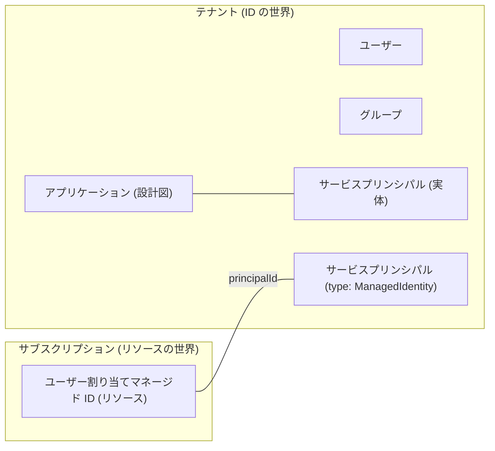

# 第5章 Entra ID の基本 ― ユーザー・グループ・サービスプリンシパル・マネージド ID

第1章で、Entra ID は認証と台帳の管理を担う共通基盤であり、テナントはその中の仕切られた 1 区画だと述べました。本章ではその台帳の中身、つまり ID の登場人物を 1 体ずつ確かめます。

本章で固定したいのは 1 つのねじれです。ID の実体はテナントに属し、リソースはサブスクリプションに属する。この 2 つの世界は別々に管理されていて、第2部の残りの章で扱うロール割り当てだけが両者を繋ぎます。

以下の出力はすべて本書の検証環境で実際に実行した結果です。ID やドメインなどの実値は伏せ字にしています。

## まず自分は誰なのか

いまサインインしている自分自身を、台帳の側から見てみます。

```bash
az ad signed-in-user show --query "{displayName:displayName, upn:userPrincipalName, id:id}" -o json
```

```text
{
  "displayName": "<表示名>",
  "id": "7a4fe343-xxxx-xxxx-xxxx-xxxxxxxxxxxx",
  "upn": "taro.yamada_example.com#EXT#@<初期ドメイン>.onmicrosoft.com"
}
```

upn（ユーザープリンシパル名）の形に注目してください。第0章で GitHub 連携で作ったのはメールアドレス形式の Microsoft アカウントでしたが、テナントの台帳の中では `元のアドレスの @ を _ に変えたもの#EXT#@テナントのドメイン` という別の名前で記録されています。`#EXT#` は外部ユーザーの印です。

つまり、自分で作った自分のテナントであっても、個人の Microsoft アカウントは「外から招かれた ID」としてテナントに投影されています（投影 = 本体は別の場所にあり、このテナント用の写しが台帳に置かれる、という意味です）。第1章の ARM のエラーで `live.com#メールアドレス` という表記を見ましたが、あれも同じ人物の別表記です。1 人の人間が、文脈によって 3 つの表記（元のメールアドレス、live.com# 付き、#EXT# 付き）で現れることを知っておくと、ログやエラーを読むときに混乱しません。

## ユーザーとグループ

ユーザーは台帳に記録された人です。作りたてのテナントには 1 人しかいません。

```bash
az ad user list --query "[].{name:displayName, upn:userPrincipalName}" -o table
```

```text
Name      Upn
--------  -------------------------------------------------------------
<表示名>  taro.yamada_example.com#EXT#@<初期ドメイン>.onmicrosoft.com
```

グループはユーザーをまとめる器です。権限は個人にではなくグループに割り当て、人の出入りはグループのメンバー管理で吸収する、というのが組織運用の基本形になります（第6章で扱います）。作って確かめます。

```bash
az ad group create --display-name azp-ch05-group --mail-nickname azp-ch05-group \
  --query "{name:displayName, id:id}" -o json
```

```text
{
  "id": "94ff7b57-6bfb-4252-b7dd-59e86a36a112",
  "name": "azp-ch05-group"
}
```

ここで作ったものはテナントの台帳に入ります。サブスクリプションもリソースグループも一切関与していないことに注意してください。作成コマンドにサブスクリプションを指定する引数がそもそもありません。

## サービスプリンシパル ― プログラムのための ID

人だけが Azure を操作するわけではありません。デプロイを自動化する仕組みや、アプリケーション自身も Azure の API を呼びます。そのための ID がサービスプリンシパルです。

実は、作りたてのテナントにも既に大量のサービスプリンシパルがいます。

```bash
az ad sp list --all --query "length(@)" -o tsv
az ad sp list --all --query "[0:6].displayName" -o tsv
```

```text
47
Windows Azure Active Directory
Microsoft Graph
Azure Key Vault
Microsoft_Azure_Support
Microsoft Modern Contact Master
Azure Storage Discovery Resource Provider
```

ユーザー 1 人、グループ 0 のテナントに、サービスプリンシパルが 47 体。これらは Microsoft のサービス自身の ID です。Microsoft Graph や Azure Key Vault といったサービスがあなたのテナントで動くとき、それぞれがこの投影された ID として振る舞います。

### アプリケーションとサービスプリンシパルは別物

自分でも 1 体作って、構造を確かめます。

```bash
az ad sp create-for-rbac --name azp-ch05-sp
```

```text
WARNING: The output includes credentials that you must protect. Be sure that you do not
include these credentials in your code or check the credentials into your source control.
{
  "appId": "3ff75678-dd8a-4556-98d7-73101d6845a3",
  "displayName": "azp-ch05-sp",
  "password": "<シークレット。二度と表示されません>",
  "tenant": "<テナントID>"
}
```

このコマンドの裏では 2 つのオブジェクトが作られています。見比べます。

```bash
az ad app show --id 3ff75678-dd8a-4556-98d7-73101d6845a3 --query "{id:id, appId:appId}" -o json
az ad sp show --id 3ff75678-dd8a-4556-98d7-73101d6845a3 --query "{id:id, appId:appId}" -o json
```

```text
{
  "appId": "3ff75678-dd8a-4556-98d7-73101d6845a3",
  "id": "2b138f7e-e1f3-4847-80d1-792d202802e9"
}
{
  "appId": "3ff75678-dd8a-4556-98d7-73101d6845a3",
  "id": "db41e908-6d86-457c-ab21-be584d342e2c"
}
```

appId は同じなのに、id が違います。前者がアプリケーション（設計図。どんな権限を要求するかの定義）、後者がサービスプリンシパル（そのアプリがこのテナントで実際に振る舞うときの実体）です。Microsoft Graph のような他社製アプリの場合、設計図は Microsoft のテナントにあり、あなたのテナントには実体だけが投影されます。先ほどの 47 体はこの仕組みで生まれたものです。

もう 1 つ、出力の警告にも意味があります。サービスプリンシパルはパスワード（シークレット）で認証するため、その値の保管と定期的な更新が運用の重荷になります。この重荷を消すのが次のマネージド ID です。

## マネージド ID ― シークレットを持たないサービスプリンシパル

マネージド ID は、Azure がシークレットの発行と更新を肩代わりしてくれるサービスプリンシパルです。ユーザー割り当てマネージド ID を作って、2 つの世界にまたがる構造を見ます。

```bash
az group create --name azp-ch05-rg --location japaneast \
  --tags azp-book=azure-practice azp-chapter=ch05 azp-lifecycle=ephemeral
az identity create --name azp-ch05-id --resource-group azp-ch05-rg \
  --query "{id:id, principalId:principalId}" -o json
```

```text
{
  "id": "/subscriptions/<サブスクリプションID>/resourcegroups/azp-ch05-rg/providers/Microsoft.ManagedIdentity/userAssignedIdentities/azp-ch05-id",
  "principalId": "e5ac5bab-b72f-45a1-8436-9cfdb736b96f"
}
```

id はサブスクリプションの中のリソースのパスです。一方 principalId は、テナントの台帳に作られたサービスプリンシパルを指しています。台帳の側から見ます。

```bash
az ad sp show --id e5ac5bab-b72f-45a1-8436-9cfdb736b96f \
  --query "{displayName:displayName, servicePrincipalType:servicePrincipalType}" -o json
```

```text
{
  "displayName": "azp-ch05-id",
  "servicePrincipalType": "ManagedIdentity"
}
```

servicePrincipalType が ManagedIdentity になっています。つまりマネージド ID とは、リソース（サブスクリプション側）とサービスプリンシパル（テナント側）が対になったものです。1 つの「もの」が 2 つの世界に片足ずつ置いています。



### クリーンアップ演習 ― 2 つの世界の掃除は別々

作ったものを消しながら、どちらの世界の操作なのかを意識してください。

テナント側の掃除。アプリを消すとサービスプリンシパルも一緒に消えます。

```bash
az ad app delete --id 3ff75678-dd8a-4556-98d7-73101d6845a3
az ad group delete --group azp-ch05-group
```

サブスクリプション側の掃除。

```bash
az group delete --name azp-ch05-rg --yes
```

リソースグループの削除でマネージド ID のリソースが消えると、対になっていたテナント側のサービスプリンシパルも追随して消えます。削除完了後に確認した実際の出力です。

```bash
az ad sp show --id e5ac5bab-b72f-45a1-8436-9cfdb736b96f
```

```text
ERROR: Resource 'e5ac5bab-...' does not exist or one of its queried reference-property
objects are not present.
```

第3章では「追随には時間差がありうる」と書きました。本書の検証では、リソースグループの削除完了を待った直後の照会で既に消えていました。時間差はゼロのこともあれば数分のこともある、という揺らぎ込みで覚えておいてください。

## 検証環境

| 項目           | 値                                                                                   |
| -------------- | ------------------------------------------------------------------------------------ |
| 検証状態       | verified                                                                             |
| 検証日         | 2026-08-08                                                                           |
| Azure CLI      | 2.77.0                                                                               |
| Bicep CLI      | 0.46.1                                                                               |
| API バージョン | Microsoft Graph (az ad), Microsoft.ManagedIdentity/userAssignedIdentities@2024-11-30 |

## 理解度チェック

1. 同僚に「このテナントの管理者なのに、自分の upn が `#EXT#` 付きの見慣れない形式になっている。乗っ取られたのか」と相談されました。何が起きているのか説明してください
2. `az ad sp create-for-rbac` で作った ID と、ユーザー割り当てマネージド ID は、テナントの台帳の上ではどちらもサービスプリンシパルです。運用上の最大の違いは何で、それはどちらを選ぶ判断にどう効きますか
3. アプリケーションの id とサービスプリンシパルの id を取り違えて権限操作をすると、何が起きると考えられますか。同じ appId を持つ 2 つのオブジェクトがなぜ別々に存在するのか、他社製アプリの例で説明してください
