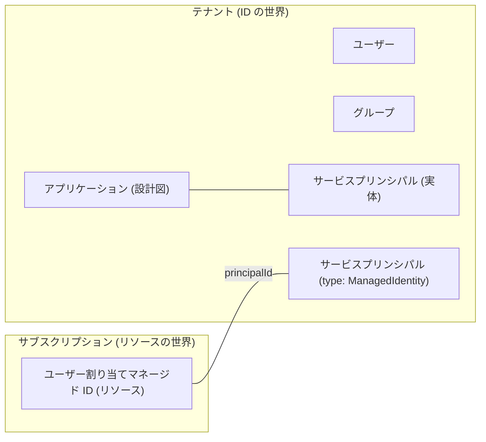

# 第 5 章 Entra ID の基本 ― ユーザー・グループ・サービスプリンシパル・マネージド ID

第 1 章で、Entra ID は認証と台帳の管理を担う共通基盤であり、テナントはその中の仕切られた 1 区画だと述べました。本章ではその台帳の中身、つまり台帳に記録される ID の種類を 1 つずつ確かめます。

本章で押さえてほしいことが 1 つあります。ID の実体はテナントに属し、リソースはサブスクリプションに属します。所属する先が違うということは、片方を消しても、もう片方は自動では消えないということです。第 3 章のクリーンアップ演習で、リソースグループを消したのに台帳側の後片付けが別に要ったのは、この所属の違いが理由でした。2 つを繋ぐ唯一の道具がロール割り当てで、第 6 章で扱います。

以下の出力はすべて本書の検証環境で実際に実行した結果です。ID やドメインなどの実値は伏せ字にしています。

## まず自分は誰なのか

いまサインインしている自分自身を、台帳の側から見てみます。

```bash
az ad signed-in-user show --query "{displayName:displayName, upn:userPrincipalName, id:id}" -o json
```

```text
{
  "displayName": "<表示名>",
  "id": "<あなたのオブジェクトID>",
  "upn": "taro.yamada_example.com#EXT#@<初期ドメイン>.onmicrosoft.com"
}
```

upn（ユーザープリンシパル名）の形に注目してください。第 0 章で GitHub 連携で作ったのはメールアドレス形式の Microsoft アカウントでしたが、テナントの台帳の中では `元のアドレスの @ を _ に変えたもの#EXT#@テナントのドメイン` という別の名前で記録されています。`#EXT#` は外部ユーザーの印です。

つまり、自分で作った自分のテナントであっても、個人の Microsoft アカウントは「外から招かれた ID」としてテナントに投影されています（投影 = 本体は別の場所にあり、このテナント用の写しが台帳に置かれる、という意味です）。第 1 章の ARM のエラーで `live.com#メールアドレス` という表記を見ましたが、あれも同じ人物の別表記です。1 人の人間が、文脈によって 3 つの表記（元のメールアドレス、live.com# 付き、#EXT# 付き）で現れることを知っておくと、ログやエラーを読むときに混乱しません。

## ユーザーとグループ

ユーザーは台帳に記録された人です。作りたてのテナントには 1 人しかいません。

```bash
az ad user list --query "[].{name:displayName, upn:userPrincipalName}" -o table
```

```text
Name      Upn
--------  -------------------------------------------------------------
<表示名>  taro.yamada_example.com#EXT#@<初期ドメイン>.onmicrosoft.com
```

グループはユーザーをまとめる器です。権限は個人にではなくグループに割り当て、人の出入りはグループのメンバー管理で吸収する、というのが組織運用の基本形になります（第 6 章で扱います）。作って確かめます。

```bash
az ad group create --display-name azp-ch05-group --mail-nickname azp-ch05-group \
  --query "{name:displayName, id:id}" -o json
```

```text
{
  "id": "44445555-6666-7777-8888-9999aaaabbbb",
  "name": "azp-ch05-group"
}
```

ここで作ったものはテナントの台帳に入ります。サブスクリプションもリソースグループも一切関与していないことに注意してください。作成コマンドにサブスクリプションを指定する引数がそもそもありません。

## サービスプリンシパル ― プログラムのための ID

人だけが Azure を操作するわけではありません。デプロイを自動化する仕組みや、アプリケーション自身も Azure の API を呼びます。そのための ID がサービスプリンシパルです。

できることは、ユーザーとほとんど同じです。テナントの台帳に載っているのでサインインでき、ロール割り当てを受け取れます。第 0 章の表で「誰が・どの範囲で・何をできるか」と紹介したロール割り当ての、誰にあたる位置を、人の代わりに占められるということです。読み取りだけを許すことも、特定のリソースグループの中だけで作らせることもできます。範囲の決め方は第 6 章で扱います。

ユーザーと違うのは、画面の前に人がいないことを前提にしている点です。サインインのたびに本人へ確認を求める方式は使えないので、あらかじめ渡しておいた資格情報（パスワードに相当するシークレットや、証明書）を提示して認証します。この「渡しておいた秘密」をどう減らすかが第 8 章の主題になります。

では、人の ID を自動化に使い回してはいけないのでしょうか。理由が 3 つあります。1 つ目は、担当者が退職してアカウントが無効になると、その人の ID で動いていた自動化が同時に止まることです。2 つ目は、ログで人の操作と機械の操作が混ざり、誰が何をしたのかを後から追えなくなることです。3 つ目は、人のアカウントにはその人の仕事に必要な権限が付いているので、自動化に必要な範囲より広くなりがちなことです。仕組みには仕組みの ID を用意し、必要な範囲だけを与える。これがサービスプリンシパルの存在理由です。

具体例を挙げます。GitHub Actions からテンプレートをデプロイするとき、監視ツールがリソースの一覧を読むとき、アプリケーションがストレージのデータを読み書きするとき。いずれも人が画面の前にいない場面で、操作の主体になるのがサービスプリンシパルです。

作成したてのテナントにも、既存のサービスプリンシパルが大量に定義されています。

まず数を数えます。

```bash
az ad sp list --all --query "length(@)" -o tsv
```

```text
116
```

この数は環境によって変わります。本書の検証環境では、テナントを作った直後は 47 でしたが、各章のハンズオンを一通り進めたあとに数え直すと 116 になりました。理由はこの節の最後で分かります。まずは、自分では 1 つも作っていないのに 3 桁あるという事実を受け取ってください。

先頭から 6 つだけ名前を見ます。

```bash
az ad sp list --all --query "[0:6].displayName" -o tsv
```

```text
Cosmos DB Fleet Analytics
Windows Azure Active Directory
OneCert-AzureDns-Prod
Azure Compute
Compute Artifacts Publishing Service
AKS Deployment Safeguards
```

並ぶのは Microsoft のサービス自身の ID です。Cosmos DB や AKS といったサービスがあなたのテナントで動作するとき、それぞれがこの投影された ID を使います。名前に見覚えのあるサービスが混ざっているのは、この環境で実際に使ったからです。数が増えるのもこれが理由で、触れたサービスの ID が順次テナントへ投影されます。

### アプリケーションとサービスプリンシパルは別物

自分でも 1 つ作って、構造を確かめます。

```bash
az ad sp create-for-rbac --name azp-ch05-sp
```

```text
WARNING: The output includes credentials that you must protect. Be sure that you do not
include these credentials in your code or check the credentials into your source control.
{
  "appId": "11112222-3333-4444-5555-666677778888",
  "displayName": "azp-ch05-sp",
  "password": "<シークレット。二度と表示されません>",
  "tenant": "<テナントID>"
}
```

このコマンドの裏では 2 つのオブジェクトが作られています。見比べます。

1 つ目、アプリケーションの側を見ます。

```bash
az ad app show --id 11112222-3333-4444-5555-666677778888 --query "{id:id, appId:appId}" -o json
```

```text
{
  "appId": "11112222-3333-4444-5555-666677778888",
  "id": "22223333-4444-5555-6666-777788889999"
}
```

2 つ目、サービスプリンシパルの側を、同じ appId で引きます。

```bash
az ad sp show --id 11112222-3333-4444-5555-666677778888 --query "{id:id, appId:appId}" -o json
```

```text
{
  "appId": "11112222-3333-4444-5555-666677778888",
  "id": "33334444-5555-6666-7777-88889999aaaa"
}
```

appId は同じなのに、id が違います。前者がアプリケーション（設計図。どんな権限を要求するかの定義）、後者がサービスプリンシパル（そのアプリがこのテナントで実際に動作するときの実体）です。Microsoft Graph のような他社製アプリの場合、設計図は Microsoft のテナントにあり、あなたのテナントには実体だけが投影されます。先ほど数えた 116 も、この仕組みで増えたものです。

もう 1 つ、出力の警告にも意味があります。サービスプリンシパルはパスワード（シークレット）で認証するため、その値の保管と定期的な更新が運用の重荷になります。この重荷を消すのが次のマネージド ID です。

## マネージド ID ― シークレットを持たないサービスプリンシパル

マネージド ID は、Azure がシークレットの発行と更新を肩代わりしてくれるサービスプリンシパルです。ユーザー割り当てマネージド ID を作って、2 つの世界にまたがる構造を見ます。

この章の器になるリソースグループを作ります。

```bash
az group create --name azp-ch05-rg --location japaneast \
  --tags azp-book=azure-practice azp-chapter=ch05 azp-lifecycle=ephemeral
```

その中にユーザー割り当てマネージド ID を作り、2 つの ID を表示させます。

```bash
az identity create --name azp-ch05-id --resource-group azp-ch05-rg \
  --query "{id:id, principalId:principalId}" -o json
```

```text
{
  "id": "/subscriptions/<サブスクリプションID>/resourcegroups/azp-ch05-rg/providers/Microsoft.ManagedIdentity/userAssignedIdentities/azp-ch05-id",
  "principalId": "55556666-7777-8888-9999-aaaabbbbcccc"
}
```

id はサブスクリプションの中のリソースのパスです。一方 principalId は、テナントの台帳に作られたサービスプリンシパルを指しています。台帳の側から見ます。

```bash
az ad sp show --id 55556666-7777-8888-9999-aaaabbbbcccc \
  --query "{displayName:displayName, servicePrincipalType:servicePrincipalType}" -o json
```

```text
{
  "displayName": "azp-ch05-id",
  "servicePrincipalType": "ManagedIdentity"
}
```

servicePrincipalType が ManagedIdentity になっています。つまりマネージド ID とは、リソース（サブスクリプション側）とサービスプリンシパル（テナント側）が対になったものです。1 つのものが 2 つの世界の両方に実体を持ちます。



### クリーンアップ演習 ― 2 つの世界の掃除は別々

作ったものを消しながら、どちらの世界の操作なのかを意識してください。

テナント側の掃除。アプリを消すとサービスプリンシパルも一緒に消えます。

```bash
az ad app delete --id 11112222-3333-4444-5555-666677778888
```

グループも台帳側のオブジェクトなので、同じくテナント側の操作で消します。

```bash
az ad group delete --group azp-ch05-group
```

サブスクリプション側の掃除。

```bash
az group delete --name azp-ch05-rg --yes
```

リソースグループの削除でマネージド ID のリソースが消えると、対になっていたテナント側のサービスプリンシパルも追随して消えます。削除完了後に確認した実際の出力です。

```bash
az ad sp show --id 55556666-7777-8888-9999-aaaabbbbcccc
```

```text
ERROR: Resource '55556666-...' does not exist or one of its queried reference-property
objects are not present.
```

第 3 章では「追随には時間差がありうる」と書きました。本書の検証では、リソースグループの削除完了を待った直後の照会で既に消えていました。時間差はゼロのこともあれば数分のこともある、という揺らぎ込みで覚えておいてください。

## 検証環境

| 項目           | 値         |
| -------------- | ---------- |
| 検証状態       | verified   |
| 検証日         | 2026-08-09 |
| Azure CLI      | 2.77.0     |
| Bicep CLI      | 0.46.1     |
| API バージョン | -          |

## 理解度チェック

1. 同僚に「このテナントの管理者なのに、自分の upn が `#EXT#` 付きの見慣れない形式になっている。乗っ取られたのか」と相談されました。何が起きているのか説明してください
2. `az ad sp create-for-rbac` で作った ID と、ユーザー割り当てマネージド ID は、テナントの台帳の上ではどちらもサービスプリンシパルです。運用上の最大の違いは何で、それはどちらを選ぶ判断にどう効きますか
3. アプリケーションの id とサービスプリンシパルの id を取り違えて権限操作をすると、何が起きると考えられますか。同じ appId を持つ 2 つのオブジェクトがなぜ別々に存在するのか、他社製アプリの例で説明してください
