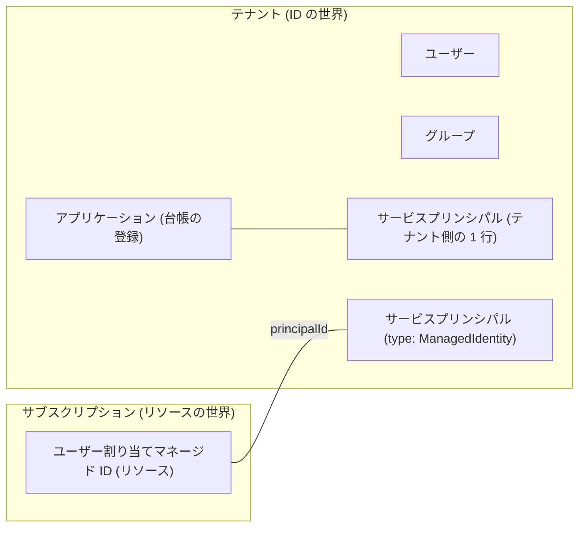

# 第 5 章 Entra ID の基本 ― ユーザー・グループ・サービスプリンシパル・マネージド ID

第 1 章で、Entra ID は認証と台帳の管理を担う共通基盤であり、テナントはその中の仕切られた 1 区画だと述べました。本章ではその台帳の中身、つまり台帳に記録される ID の種類を 1 つずつ確かめます。

本章で押さえてほしいことが 1 つあります。ID はテナントの台帳に属し、リソースはサブスクリプションに属します。所属する先が違うということは、片方を消しても、もう片方は自動では消えないということです。第 3 章のクリーンアップ演習で、リソースグループを消したのに台帳側の後片付けが別に要ったのは、この所属の違いが理由でした。2 つを繋ぐ唯一の道具がロール割り当てで、第 6 章で扱います。

以下の出力はすべて本書の検証環境で実際に実行した結果です。ID やドメインなどの実値は伏せ字にしています。

## まず自分は誰なのか

いまサインインしている自分自身を、台帳の側から見てみます。

```bash
az ad signed-in-user show --query "{displayName:displayName, upn:userPrincipalName, id:id}" -o json
```

```text
{
  "displayName": "<表示名>",
  "id": "<あなたのオブジェクトID>",
  "upn": "taro.yamada_example.com#EXT#@<初期ドメイン>.onmicrosoft.com"
}
```

upn（ユーザープリンシパル名）の形に注目してください。第 0 章で GitHub 連携で作ったのはメールアドレス形式の Microsoft アカウントでしたが、テナントの台帳の中では `元のアドレスの @ を _ に変えたもの#EXT#@テナントのドメイン` という別の名前で記録されています。`#EXT#` は外部ユーザーの印です。

つまり、自分で作った自分のテナントであっても、個人の Microsoft アカウントは外部から招待されたユーザーとして扱われています。アカウント自体は Microsoft アカウントの側にあり、このテナントの台帳にあるのは、それを指す 1 行です。だから台帳の中での名前も、元のメールアドレスそのものではなく、上のような別の形になります。第 1 章の ARM のエラーで `live.com#メールアドレス` という表記を見ましたが、あれも同じ人物の別表記です。1 人の人間が、文脈によって 3 つの表記（元のメールアドレス、live.com# 付き、#EXT# 付き）で現れることを知っておくと、ログやエラーを読むときに混乱しません。

## ユーザーとグループ

ユーザーは台帳に記録された人です。作りたてのテナントには 1 人しかいません。

```bash
az ad user list --query "[].{name:displayName, upn:userPrincipalName}" -o table
```

```text
Name      Upn
--------  -------------------------------------------------------------
<表示名>  taro.yamada_example.com#EXT#@<初期ドメイン>.onmicrosoft.com
```

グループはユーザーをまとめる器です。権限は個人にではなくグループに割り当て、人の出入りはグループのメンバー管理で吸収する、というのが組織運用の基本形になります（第 6 章で扱います）。作って確かめます。

```bash
az ad group create --display-name azp-ch05-group --mail-nickname azp-ch05-group \
  --query "{name:displayName, id:id}" -o json
```

```text
{
  "id": "44445555-6666-7777-8888-9999aaaabbbb",
  "name": "azp-ch05-group"
}
```

ここで作ったものはテナントの台帳に入ります。サブスクリプションもリソースグループも一切関与していないことに注意してください。作成コマンドにサブスクリプションを指定する引数がそもそもありません。

## サービスプリンシパル ― プログラムのための ID

人だけが Azure を操作するわけではありません。デプロイを自動化する仕組みや、アプリケーション自身も Azure の API を呼びます。そのための ID がサービスプリンシパルです。

できることは、ユーザーとほとんど同じです。テナントの台帳に載っているのでサインインでき、ロール割り当てを受け取れます。第 0 章の表で「誰が・どの範囲で・何をできるか」と紹介したロール割り当ての、誰にあたる位置を、人の代わりに占められるということです。読み取りだけを許すことも、特定のリソースグループの中だけで作らせることもできます。範囲の決め方は第 6 章で扱います。

ユーザーと違うのは、画面の前に人がいないことを前提にしている点です。サインインのたびに本人へ確認を求める方式は使えないので、あらかじめ渡しておいた資格情報を提示して認証します。資格情報には 2 種類あり、1 つはシークレット、もう 1 つは証明書です。シークレットとは、認証のときに提示するパスワードに相当する文字列で、作成時に一度だけ表示され、あとから取り出すことはできません。この、あらかじめ渡しておく資格情報をどう減らすかが第 8 章の主題になります。

では、人の ID を自動化に使い回してはいけないのでしょうか。理由が 3 つあります。1 つ目は、担当者が退職してアカウントが無効になると、その人の ID で動いていた自動化が同時に止まることです。2 つ目は、ログで人の操作と機械の操作が混ざり、誰が何をしたのかを後から追えなくなることです。3 つ目は、人のアカウントにはその人の仕事に必要な権限が付いているので、自動化に必要な範囲より広くなりがちなことです。仕組みには仕組みの ID を用意し、必要な範囲だけを与える。これがサービスプリンシパルの存在理由です。

具体例を挙げます。GitHub Actions からテンプレートをデプロイするとき、監視ツールがリソースの一覧を読むとき、アプリケーションがストレージのデータを読み書きするとき。いずれも人が画面の前にいない場面で、操作の主体になるのがサービスプリンシパルです。

作成したてのテナントにも、既存のサービスプリンシパルが大量に定義されています。

まず数を数えます。

```bash
az ad sp list --all --query "length(@)" -o tsv
```

```text
116
```

この数は環境によって変わります。本書の検証環境では、テナントを作った直後は 47 でしたが、各章のハンズオンを一通り進めたあとに数え直すと 116 になりました。自分では 1 つも作っていないのに 3 桁ある、という事実をまず受け取ってください。

先頭から 6 つだけ名前を見ます。

```bash
az ad sp list --all --query "[0:6].displayName" -o tsv
```

```text
Cosmos DB Fleet Analytics
Windows Azure Active Directory
OneCert-AzureDns-Prod
Azure Compute
Compute Artifacts Publishing Service
AKS Deployment Safeguards
```

実行したのは `az ad sp list` なので、ここに並ぶ 6 件はすべてサービスプリンシパルです。つまり、あなたのテナントの台帳にある 6 行です。名前を見ると、Cosmos DB（第 18 章）や AKS（第 17 章）のように、Microsoft が提供するサービスのものだと分かります。自分で作った覚えのないサービスプリンシパルが、自分のテナントの台帳に 116 行ある、というのがいま見えている状態です。

他社が提供するサービスのものが、なぜ自分の台帳の側に並ぶのか。次の節で自分のサービスプリンシパルを 1 つ作ると、その構造が実際の値で見えます。

### アプリケーションとサービスプリンシパルは別物

先に、この節で使う「アプリケーション」の意味を決めておきます。ここまで本章では、この語をプログラムという普通の意味で使ってきました（「アプリケーション自身も Azure の API を呼びます」）。Entra ID の台帳でアプリケーションと呼ぶものは、それとは別です。

Entra ID のアプリケーションとは、プログラムそのものではなく、その登録内容です。アプリの名前、要求する権限、認証に使う資格情報、どのテナントからの利用を許すか。こうした定義をまとめた 1 件のオブジェクトが台帳に置かれ、これをアプリケーションと呼びます。`az ad app` が扱うのがこれです。

サービスプリンシパルは、その登録が特定のテナントで実際に動作するときの、そのテナント側の 1 行です。アプリケーションが 1 件でも、それを使うテナントが 100 あれば、サービスプリンシパルは 100 行になります。ロール割り当てを受け取るのはこちらです。`az ad sp` が扱うのがこれです。

この 2 つが別のオブジェクトであることを、自分で 1 つ作って確かめます。

```bash
az ad sp create-for-rbac --name azp-ch05-sp
```

```text
WARNING: The output includes credentials that you must protect. Be sure that you do not
include these credentials in your code or check the credentials into your source control.
{
  "appId": "11112222-3333-4444-5555-666677778888",
  "displayName": "azp-ch05-sp",
  "password": "<シークレット。二度と表示されません>",
  "tenant": "<テナントID>"
}
```

このコマンドの裏では 2 つのオブジェクトが作られています。見比べます。

1 つ目、アプリケーションの側を見ます。

```bash
az ad app show --id 11112222-3333-4444-5555-666677778888 --query "{id:id, appId:appId}" -o json
```

```text
{
  "appId": "11112222-3333-4444-5555-666677778888",
  "id": "22223333-4444-5555-6666-777788889999"
}
```

2 つ目、サービスプリンシパルの側を、同じ appId を指定して取得します。

```bash
az ad sp show --id 11112222-3333-4444-5555-666677778888 --query "{id:id, appId:appId}" -o json
```

```text
{
  "appId": "11112222-3333-4444-5555-666677778888",
  "id": "33334444-5555-6666-7777-88889999aaaa"
}
```

appId は同じなのに、id が違います。appId は登録に付く識別子で、その登録から作られたサービスプリンシパルにも同じ値が入ります。id は各オブジェクト自身の識別子なので、アプリケーションとサービスプリンシパルで別の値になります。権限を割り当てる相手として指定するのは、`az ad sp` 側の id です。

Microsoft Graph のような他社製アプリでも構造は同じですが、登録の置き場所が違います。他社製アプリの登録は提供元のテナントにあり、あなたのテナントに作られるのはサービスプリンシパルだけです。1 つ前の節で数えた 116 行の正体がこれで、自分で 1 つも登録しなくても、あなたの台帳の側にだけ行が増えていきます。

もう 1 つ、出力の警告にも意味があります。いま作ったサービスプリンシパルはシークレットで認証するため、その値を安全な場所に保管し、期限が切れる前に新しい値へ差し替える作業が付いてきます。この作業を無くすのが次のマネージド ID です。

## マネージド ID ― シークレットを持たないサービスプリンシパル

マネージド ID も、テナントの台帳に置かれるサービスプリンシパルです。違うのは資格情報の扱いだけです。発行も更新も Azure の側で行われ、利用者はシークレットの値を受け取りません。受け取らないので、保管する場所を決める必要も、期限が切れる前に差し替える手順もありません。直前の節で付いてきた 2 つの作業が、どちらも無くなります。

マネージド ID には 2 種類あります。ここで作るのはユーザー割り当てで、もう 1 つのシステム割り当てとの違いは第 7 章で扱います。

この節で確かめるのは作り方ではなく、できるものの形です。マネージド ID を 1 つ作ると、同じ名前のものが 2 か所に同時にできます。1 つはリソースグループの中のリソース、もう 1 つはテナントの台帳の 1 行です。作成コマンドが返す `id` と `principalId` という 2 つの値が、それぞれを指しています。

この章の器になるリソースグループを作ります。

```bash
az group create --name azp-ch05-rg --location japaneast \
  --tags azp-book=azure-practice azp-chapter=ch05 azp-lifecycle=ephemeral
```

その中にユーザー割り当てマネージド ID を作り、2 つの ID を表示させます。

```bash
az identity create --name azp-ch05-id --resource-group azp-ch05-rg \
  --query "{id:id, principalId:principalId}" -o json
```

```text
{
  "id": "/subscriptions/<サブスクリプションID>/resourcegroups/azp-ch05-rg/providers/Microsoft.ManagedIdentity/userAssignedIdentities/azp-ch05-id",
  "principalId": "55556666-7777-8888-9999-aaaabbbbcccc"
}
```

id はサブスクリプションの中のリソースのパスです。一方 principalId は、テナントの台帳に作られたサービスプリンシパルを指しています。台帳の側から見ます。

```bash
az ad sp show --id 55556666-7777-8888-9999-aaaabbbbcccc \
  --query "{displayName:displayName, servicePrincipalType:servicePrincipalType}" -o json
```

```text
{
  "displayName": "azp-ch05-id",
  "servicePrincipalType": "ManagedIdentity"
}
```

servicePrincipalType が ManagedIdentity になっています。displayName も、リソースとして付けた名前と同じ azp-ch05-id です。同じ名前のものが 2 か所にある、という状態をこれで確かめました。

2 か所それぞれの役目は違います。リソースグループの中のリソースは、ストレージアカウントなどと同じ扱いで、リソースグループを消せば一緒に消えます。いま `az identity create` で作ったのはこちらで、`id` が指しているのもこちらです。台帳の 1 行のほうは、いま実行した `az ad sp show` のように `az ad sp` で扱います。ロール割り当ての相手として指定できるのはこちらだけで（第 6 章）、`principalId` が指しているのもこちらです。

2 か所に分かれているのは、権限を受け取れるのが台帳の行だけである一方、作る・タグを付ける・消すという管理はリソースへの操作だからです。マネージド ID を使うときは、どちらの値を渡す場面なのかを毎回意識することになります。



### クリーンアップ演習 ― テナント側とサブスクリプション側を別々に消す

作ったものを消しながら、テナント側の操作なのかサブスクリプション側の操作なのかを意識してください。

テナント側の掃除。アプリケーションの登録を消すと、そこから作られたサービスプリンシパルも一緒に消えます。

```bash
az ad app delete --id 11112222-3333-4444-5555-666677778888
```

グループも台帳側のオブジェクトなので、同じくテナント側の操作で消します。

```bash
az ad group delete --group azp-ch05-group
```

サブスクリプション側の掃除。

```bash
az group delete --name azp-ch05-rg --yes
```

リソースグループの削除でマネージド ID のリソースが消えると、対になっていたテナント側のサービスプリンシパルも追随して消えます。削除完了後に確認した実際の出力です。

```bash
az ad sp show --id 55556666-7777-8888-9999-aaaabbbbcccc
```

```text
ERROR: Resource '55556666-...' does not exist or one of its queried reference-property
objects are not present.
```

第 3 章では「追随には時間差がありうる」と書きました。本書の検証では、リソースグループの削除完了を待った直後の照会で既に消えていました。時間差はゼロのこともあれば数分のこともある、という揺らぎ込みで覚えておいてください。

## 検証環境

| 項目           | 値         |
| -------------- | ---------- |
| 検証状態       | verified   |
| 検証日         | 2026-08-09 |
| Azure CLI      | 2.77.0     |
| Bicep CLI      | 0.46.1     |
| API バージョン | -          |

## 理解度チェック

1. 同僚に「このテナントの管理者なのに、自分の upn が `#EXT#` 付きの見慣れない形式になっている。乗っ取られたのか」と相談されました。何が起きているのか説明してください
2. `az ad sp create-for-rbac` で作った ID と、ユーザー割り当てマネージド ID は、テナントの台帳の上ではどちらもサービスプリンシパルです。運用上の最大の違いは何で、それはどちらを選ぶ判断にどう効きますか
3. アプリケーションの id とサービスプリンシパルの id を取り違えて権限操作をすると、何が起きると考えられますか。同じ appId を持つ 2 つのオブジェクトがなぜ別々に存在するのか、他社製アプリの例で説明してください
