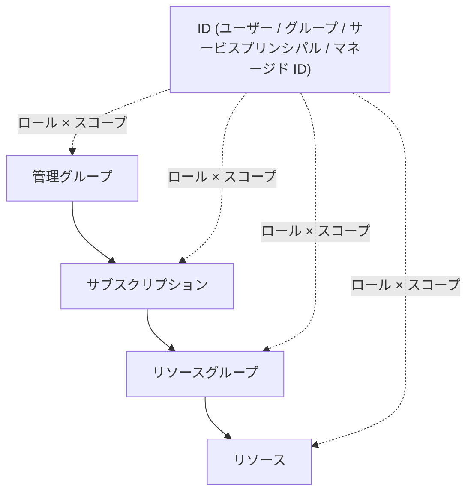

# 第 6 章 RBAC ― スコープとロールの組み合わせで権限が決まる

第 5 章で ID の種類が揃いました。本章では、その ID に「何をさせるか」を決める仕組み、RBAC（ロールベースのアクセス制御）を扱います。

RBAC の 1 回の設定は、3 つの要素の組です。誰に（ID）、何の役割を（ロール）、どの範囲で（スコープ）。この 3 つ目のスコープの選び方が本章の主題です。権限の強さはロールだけでは決まらず、ロールとスコープの組み合わせで決まります。

本章の出力はすべて本書の検証環境での実測です。ID の実値は伏せています。

## ロールは操作の束

ロールは、許可する操作をまとめたものです。組み込みロールの代表格を中から見てみます。

```bash
az role definition list --name Reader \
  --query "[0].{name:roleName, actions:permissions[0].actions, notActions:permissions[0].notActions}" -o json
```

```text
{
  "actions": [
    "*/read"
  ],
  "name": "Reader",
  "notActions": []
}
```

Reader の実体は「すべての read 操作」という 1 行です。よく使う組み込みロールは 4 つ覚えれば当面足ります。

| ロール                    | できること                                             |
| ------------------------- | ------------------------------------------------------ |
| Reader                    | すべての読み取り                                       |
| Contributor               | リソースの作成・変更・削除。ただし権限の操作はできない |
| Owner                     | Contributor に加えて権限の操作もできる                 |
| User Access Administrator | 権限の操作だけができる                                 |

Contributor と Owner の境界が「権限の操作」であることは、後半の演習で実際に確かめます。

## スコープは権限が効く範囲

ロールは、第 1 部で見た階層のどこに対しても割り当てられます。管理グループ、サブスクリプション、リソースグループ、そして個々のリソースです。上の階層に割り当てれば配下すべてに継承され（第 2 章）、下位で打ち消すことはできません。

ここで大事なのは、スコープの選択はガバナンス階層の設計と独立だということです。第 4 章のハンズオンでは、マネージド ID へのロールを、リソースグループでもサブスクリプションでもなく、ストレージアカウント 1 つのスコープに割り当てました。組織の階層をどう分けたかとは無関係に、権限は必要な最小の範囲へ直接割り当てられます。



## 壊す演習 ― スコープを 1 段広く割り当ててみる

「とりあえずサブスクリプション全体に付けておけば動く」という誘惑がどんな結果を生むかを、実際に見ます。

準備として、リソースグループを 2 つと、検証用のサービスプリンシパルを 1 つ作ります。この演習ではサービスプリンシパルとしてサインインし直して「その ID から世界がどう見えるか」を確かめるので、普段の自分のログインを壊さないよう、CLI のプロファイルを分離します。

1 つ目のリソースグループを作ります。

```bash
az group create --name azp-ch06-a --location japaneast \
  --tags azp-book=azure-practice azp-chapter=ch06 azp-lifecycle=ephemeral
```

2 つ目も作ります。スコープを絞ったときに、片方だけが見える状態を作るためです。

```bash
az group create --name azp-ch06-b --location japaneast \
  --tags azp-book=azure-practice azp-chapter=ch06 azp-lifecycle=ephemeral
```

権限を与える相手になるサービスプリンシパルを作ります。

```bash
az ad sp create-for-rbac --name azp-ch06-sp
```

出力の appId / password / tenant を控えます。password の扱いは第 5 章の警告のとおりです。

まず、広すぎる割り当てをします。サブスクリプション全体に Reader です。

```bash
sub=$(az account show --query id -o tsv)
az role assignment create --assignee <appId> --role Reader --scope "/subscriptions/$sub"
```

サービスプリンシパルとしてサインインし直します。`AZURE_CONFIG_DIR` を指定すると、CLI は別のプロファイルを使うので、普段のログインと混ざりません。

```bash
export AZURE_CONFIG_DIR=/tmp/azp-sp-profile
az login --service-principal --username <appId> --password <password> --tenant <tenantId>
```

この ID から何が見えるかを確かめます。

```bash
az group list --query "[].name" -o tsv
```

```text
azp-ch01-rg
azp-ch06-a
azp-ch06-b
```

演習用に作った 2 つだけでなく、このサブスクリプションにあるすべてのリソースグループが見えています。読み取り専用とはいえ、構成・命名・タグはすべて閲覧できる状態です。必要なのは azp-ch06-a の読み取りだけだったとすれば、明確に広すぎます。

なお、割り当ての直後はサインインや一覧が失敗することがあります。第 2 章で見た伝播遅延で、本書の検証でも数十秒待ってから成功しました。

書き込みはどうでしょうか。

```bash
az group create --name azp-ch06-c --location japaneast
```

```text
ERROR: (AuthorizationFailed) The client '<appId>' with object id '<objectId>' does not have
authorization to perform action 'Microsoft.Resources/subscriptions/resourcegroups/write' over scope
'/subscriptions/<サブスクリプションID>/resourcegroups/azp-ch06-c' or the scope is invalid.
```

Reader の actions は `*/read` だけなので、write は拒否されます。エラーには「どの操作（action）が」「どのスコープで」足りなかったかが正確に書かれています。RBAC のエラーはこの 2 点を読み取れば原因が特定できます。

### 最小権限へ絞り直す

管理者側のプロファイル（`AZURE_CONFIG_DIR` を外した通常のシェル）に戻り、割り当てを外して RG 単位に付け直します。

まず広い方を外します。

```bash
az role assignment delete --assignee <appId> --role Reader --scope "/subscriptions/$sub"
```

同じ Reader を、リソースグループ 1 つのスコープで付け直します。

```bash
az role assignment create --assignee <appId> --role Reader \
  --scope "/subscriptions/$sub/resourceGroups/azp-ch06-a"
```

サービスプリンシパル側で見え方を確認します。

```bash
az group list --query "[].name" -o tsv
```

```text
azp-ch06-a
```

同じ Reader というロールでも、スコープが変わるだけで世界がここまで狭まります。権限の強さはロール × スコープの積である、というのが本章の主張です。

## Contributor と Owner の境界を確かめる

もう 1 つ、ロール側の境界も実測します。azp-ch06-a への割り当てを Reader から Contributor に差し替えます（管理者側で実行）。

Reader の割り当てを外します。

```bash
az role assignment delete --assignee <appId> --role Reader \
  --scope "/subscriptions/$sub/resourceGroups/azp-ch06-a"
```

スコープは変えずに、ロールだけ Contributor にして付け直します。

```bash
az role assignment create --assignee <appId> --role Contributor \
  --scope "/subscriptions/$sub/resourceGroups/azp-ch06-a"
```

サービスプリンシパル側で、まずリソースの変更を試します。

```bash
az group update --name azp-ch06-a --set tags.azp-test=contributor
```

これは成功します。次に、権限の操作を試します。自分の持つスコープの中で、誰かにロールを割り当てようとしてみます。

```bash
az role assignment create --assignee <objectId> --role Reader \
  --scope "/subscriptions/$sub/resourceGroups/azp-ch06-a"
```

```text
ERROR: (AuthorizationFailed) The client '<appId>' ... does not have authorization to perform action
'Microsoft.Authorization/roleAssignments/write' over scope '.../resourceGroups/azp-ch06-a/providers/
Microsoft.Authorization/roleAssignments/...'
```

リソースは触れるのに、権限は配れません。エラーの action 欄にある Microsoft.Authorization こそ、Contributor の定義から除外されている名前空間です。Contributor を配っても権限管理は渡らない、この一線が Owner との違いです。逆に言えば、Owner を配ることは権限を配る権限まで渡すことを意味します。

## クリーンアップ演習

管理者側で実行します。順序に意味があるので、1 手ずつ確認しながら進めてください。

最初にロール割り当てを消します。

```bash
az role assignment delete --assignee <appId> \
  --scope "/subscriptions/$sub/resourceGroups/azp-ch06-a"
```

割り当てが無くなってから、ID 側を消します。

```bash
az ad app delete --id <appId>
```

リソースグループを 2 つとも消します。まず 1 つ目。

```bash
az group delete --name azp-ch06-a --yes
```

2 つ目も消します。

```bash
az group delete --name azp-ch06-b --yes
```

順序に注意してください。先にサービスプリンシパルを消すと、残った割り当てが第 3 章で見た「principalName が空の残骸」になります。割り当てを先に消し、それから ID を消すのが行儀の良い順序です。分離プロファイル（/tmp/azp-sp-profile）も忘れずに削除してください。password がその中に保存されています。

## 検証環境

| 項目           | 値                                                                                          |
| -------------- | ------------------------------------------------------------------------------------------- |
| 検証状態       | verified                                                                                    |
| 検証日         | 2026-08-08                                                                                  |
| Azure CLI      | 2.77.0                                                                                      |
| Bicep CLI      | 0.46.1                                                                                      |
| API バージョン | Microsoft.Authorization/roleAssignments@2022-04-01, Microsoft.Authorization/roleDefinitions |

## 理解度チェック

1. あるチームに「開発用リソースグループでは自由に作業でき、他のチームのリソースは見えもしない」状態を作りたいとします。ロールとスコープをどう組みますか。サブスクリプションスコープの Reader を足すと何が壊れますか
2. Contributor を持つメンバーが「自分のリソースグループに新メンバーの権限を追加できない」と言っています。これは不具合でしょうか。エラーメッセージのどこを見れば設計どおりだと確認できますか
3. 本章の演習でサービスプリンシパルを先に削除してからロール割り当てを消そうとすると、何が起きるでしょうか。第 3 章の内容と合わせて説明してください
