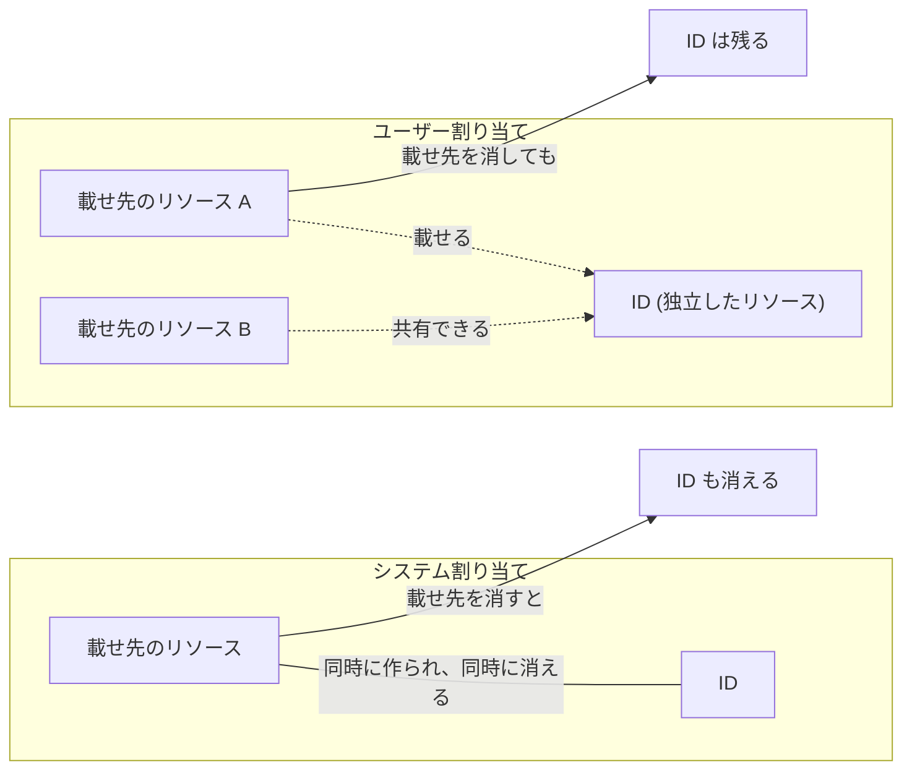
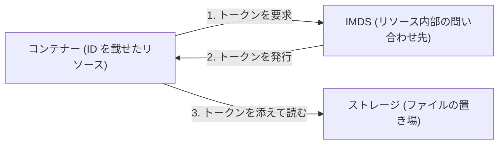

# 第 7 章 マネージド ID ― リソース間の内向き認証

第 5 章の最後で、マネージド ID はシークレットを持たないサービスプリンシパルだと述べました。本章では、それが実際に何に使われるのかを 1 つ動かして確かめ、そのうえで 2 つの種類、システム割り当てとユーザー割り当ての使い分けを理解します。

動かすのは最小形です。コンテナーを 1 つ実行し、そのコンテナーにストレージのファイルの一覧を取得させます。コンテナーの中にはキーもパスワードも置きません。

2 つの種類の違いは寿命の決まり方です。システム割り当ては載せ先のリソースと同時に作られ、同時に消えます。ユーザー割り当ては載せ先とは別に作り、載せ先が消えても残ります。この違いも実際に作って壊して確かめます。



本章の出力はすべて本書の検証環境での実測です。ID の実値とアクセストークンは伏せています。本章の手順は `scripts/chapters/ch07-managed-identity.sh` に、後始末は `scripts/teardown/ch07-managed-identity.sh` にあります。

## なぜマネージド ID なのか

第 6 章の演習では、サービスプリンシパルの password を控えて使い回しました。あの password が本番運用では問題になります。漏れれば不正利用され、期限が切れれば障害になり、更新には手順が要ります。

マネージド ID は、この password を人間の世界から消します。Azure 内部で資格情報が自動発行・自動更新され、リソースは自分の ID として他のリソースへアクセスします。取り出せる形のシークレットが存在しないので、漏らしようがありません。

使いどころは、Azure のリソースが別の Azure のリソースへアクセスする場面です。コンテナーがストレージのファイルを読む、Web アプリがデータベースへ接続する、Functions が Key Vault からシークレットを取得する（第 16 章）。どれも、接続文字列やキーを設定値としてリソースに持たせる代わりに、リソース自身の ID でアクセスします。持たせる設定値が無いので、設定値を守る運用も要らなくなります。

Azure のリソースから Azure のリソースへ、という Azure の内側で閉じる向きのアクセスを、本書では内向きと呼びます。内向きの認証では、マネージド ID が常に第一候補です。サービスプリンシパルを手で作るのは、GitHub Actions のような外部からのアクセス（第 8 章）など、マネージド ID が使えない場面に限られていきます。

## リソースは何を受け取るのか

キーを持たないリソースが、どうやって自分の ID を示すのでしょうか。Azure は、リソースの内側からだけ到達できる問い合わせ先を用意しています。169.254.169.254 というアドレスで動作するインスタンスメタデータサービス（Instance Metadata Service、IMDS）です。ここへ要求すると、アクセストークン（access token）が返ります。アクセストークンは、呼び出す相手に対して自分が誰であるかを示す、有効期限付きの文字列です。



1 と 2 に人間が関与しません。トークンの取得も更新も Azure 側で完結し、開発者が控える値はどこにも出てきません。3 でアクセスが許されるかどうかは、第 6 章のロールとスコープの組み合わせがそのまま決めます。マネージド ID が変えるのは認証の部分だけで、認可の仕組みは第 6 章と同じです。

## 権限を先に用意する

載せ先には Azure Container Instances を使います。コンテナーを 1 つ動かすだけの単純なサービスで、秒課金のため観察用途なら数円もかかりません。読ませる対象には Azure Blob Storage を使います。ファイルを置くためのサービスで、第 15 章で正面から扱います。

この章の器を作ります。

```bash
az group create --name azp-ch07-rg --location japaneast \
  --tags azp-book=azure-practice azp-chapter=ch07 azp-lifecycle=ephemeral
```

載せ先より先に、ユーザー割り当てマネージド ID だけを作ります。先に作れること自体が、この種類の性質です。

```bash
az identity create --name azp-ch07-uid --resource-group azp-ch07-rg
```

ストレージアカウントの名前は世界中で一意である必要があるため、サブスクリプション ID から作った文字列を後ろに付けます。あとで使うスコープの文字列もここで組み立てます。

```bash
sub=$(az account show --query id -o tsv)
sa="azpch07$(echo "$sub" | tr -d - | cut -c1-8)"
scope="/subscriptions/$sub/resourceGroups/azp-ch07-rg/providers/Microsoft.Storage/storageAccounts/$sa"
```

ストレージアカウントを作ります。

```bash
az storage account create --name "$sa" --resource-group azp-ch07-rg --location japaneast \
  --sku Standard_LRS --allow-blob-public-access false
```

ストレージの中のファイルを読み書きする権限は、ストレージアカウントというリソースを管理する権限とは別のロールで決まります（第 8 章）。読ませるファイルを置くために、まず自分に割り当てます。

```bash
me=$(az ad signed-in-user show --query id -o tsv)
az role assignment create --assignee "$me" --role "Storage Blob Data Contributor" --scope "$scope"
```

ファイルの入れ物を作ります。

```bash
az storage container create --name docs --account-name "$sa" --auth-mode login
```

読ませるファイルを手元で 1 つ作ります。

```bash
echo "hello from managed identity" > sample.txt
```

そのファイルを置きます。

```bash
az storage blob upload --account-name "$sa" --container-name docs \
  --name sample.txt --file sample.txt --auth-mode login --overwrite
```

ここでユーザー割り当て ID に、Blob の読み取りだけを許す組み込みロール Storage Blob Data Reader を割り当てます。載せ先のコンテナーはまだ 1 つも作っていません。それでも権限の準備が完了します。

```bash
uid_pid=$(az identity show --name azp-ch07-uid --resource-group azp-ch07-rg --query principalId -o tsv)
az role assignment create --assignee-object-id "$uid_pid" --assignee-principal-type ServicePrincipal \
  --role "Storage Blob Data Reader" --scope "$scope"
```

これがユーザー割り当てを手で作る理由の 1 つ目です。システム割り当てには、この順序が使えません。システム割り当ての ID は載せ先のリソースを作った瞬間に作られるので、載せ先が無い時点では割り当てる相手が存在しないからです。

## 載せ先を作って読ませる

コンテナーを作ります。システム割り当てを有効にし（`[system]`）、いま作ったユーザー割り当ても同時に載せます。コンテナーの中では、IMDS へトークンを要求してから、そのトークンでファイルの一覧を取得します。

まず、いま作った ID を指す識別子と、ID を指定するための clientId を取得します。

```bash
uid_id="/subscriptions/$sub/resourceGroups/azp-ch07-rg/providers/Microsoft.ManagedIdentity/userAssignedIdentities/azp-ch07-uid"
uid_client=$(az identity show --name azp-ch07-uid --resource-group azp-ch07-rg --query clientId -o tsv)
```

コンテナーの中で走らせる列を組み立てます。IMDS への要求を 2 回行い、1 回目は ID を指定せず、2 回目は clientId で指定します。

```bash
imds="http://169.254.169.254/metadata/identity/oauth2/token?api-version=2018-02-01&resource=https%3A%2F%2Fstorage.azure.com%2F"
inner="curl -s -H 'Metadata: true' '${imds}'; echo; curl -s -H 'Metadata: true' '${imds}&client_id=${uid_client}'; echo; az login --identity --client-id ${uid_client} -o none; az storage blob list --account-name ${sa} --container-name docs --auth-mode login -o table"
```

その列を渡してコンテナーを作ります。

```bash
az container create --name azp-ch07-aci --resource-group azp-ch07-rg \
  --image mcr.microsoft.com/azure-cli:latest \
  --assign-identity "[system]" "$uid_id" \
  --restart-policy Never --os-type Linux --cpu 1 --memory 1 \
  --command-line "/bin/sh -c \"$inner\""
```

なお、作りたてのサブスクリプションでは Microsoft.ContainerInstance が未登録のことがあります（本書の検証環境でも未登録でした）。その場合は第 1 章のとおり `az provider register --namespace Microsoft.ContainerInstance --wait` を先に実行してください。

できあがったコンテナーの identity ブロックを見ます。

```bash
az container show --name azp-ch07-aci --resource-group azp-ch07-rg --query identity -o json
```

```text
{
  "principalId": "66667777-8888-9999-aaaa-bbbbccccdddd",
  "tenantId": "<テナントID>",
  "type": "SystemAssigned, UserAssigned",
  "userAssignedIdentities": {
    "/subscriptions/<サブスクリプションID>/resourceGroups/azp-ch07-rg/providers/Microsoft.ManagedIdentity/userAssignedIdentities/azp-ch07-uid": {
      "clientId": "88889999-aaaa-bbbb-cccc-ddddeeeeffff",
      "principalId": "77778888-9999-aaaa-bbbb-ccccddddeeee"
    }
  }
}
```

構造の差がそのまま出ています。システム割り当ての principalId はコンテナー自身の属性として直に置かれており、名前すら持ちません。ユーザー割り当ては独立したリソースへの参照として、リソース ID をキーに載っています。

コンテナーの実行が終わったら、出力を取得します。

```bash
az container logs --name azp-ch07-aci --resource-group azp-ch07-rg
```

出力の先頭は、ID を指定せずに IMDS へ要求した結果です。

```text
Received invalid token. Please try again.
```

トークンが返っていません。このコンテナーには 2 つの ID が載っているため、どちらとして発行するのかを Azure が決められないからです。ID を 1 つしか載せていないリソースでは指定は要りませんが、複数載せる場合は clientId で指定します。

2 回目、clientId を指定した要求の結果が、Azure が発行した資格情報の実物です。

```text
{"access_token":"<アクセストークン>","refresh_token":"","expires_in":"86294","expires_on":"1786495027","not_before":"1786408672","resource":"https://storage.azure.com/","token_type":"Bearer"}
```

読みどころは access_token 以外の 4 つです。resource は、このトークンが通用する相手がストレージだけであることを示します。expires_in の 86294 は有効期間が約 24 時間であることを、expires_on はその期限を秒数で表した時刻を示します。token_type の Bearer は、この文字列を持っていること自体が資格の証明になる形式であることを示します。トークンは期限付きで、対象を限って発行されます。そして、この値を作ったのも配ったのも Azure で、人間の手元には残りません。

## 1 回目は権限エラーで失敗する

本書の検証では、続くファイルの一覧の取得が 1 回目に失敗しました。

```text
ERROR:
You do not have the required permissions needed to perform this operation.
Depending on your operation, you may need to be assigned one of the following roles:
    "Storage Blob Data Owner"
    "Storage Blob Data Contributor"
    "Storage Blob Data Reader"
    "Storage Queue Data Contributor"
    "Storage Queue Data Reader"
    "Storage Table Data Contributor"
    "Storage Table Data Reader"

If you want to use the old authentication method and allow querying for the right account key, please use the "--auth-mode" parameter and "key" value.
```

Storage Blob Data Reader は先ほど割り当て済みです。それでも失敗したのは、第 2 章と第 6 章で見た伝播遅延によるものです。ロール割り当てが実際に効くまでには数十秒かかることがあり、割り当てた直後に始まったコンテナーは、まだ効いていない状態でストレージへ要求しました。

割り当ての漏れと伝播遅延は、同じエラーで見分けが付きません。見分けるには、割り当て自体が存在するかを別のコマンドで確かめます。

```bash
az role assignment list --assignee "$uid_pid" --all --query "[].{role:roleDefinitionName, scope:scope}" -o table
```

行があれば割り当ては済んでいるので、待って実行し直します。失敗したコンテナーは停止しているため、起動し直すと同じ列がもう一度走ります。

```bash
az container start --name azp-ch07-aci --resource-group azp-ch07-rg
```

行が出ない場合は割り当て自体が届いていないので、`az role assignment create` からやり直します。

再実行後の出力が、本章の目的地です。

```text
Name        Blob Type    Blob Tier    Length    Content Type              Last Modified              Snapshot
----------  -----------  -----------  --------  ------------------------  -------------------------  ----------
sample.txt  BlockBlob    Hot          28        application/octet-stream  2026-08-11T00:36:32+00:00
```

コンテナーがストレージのファイルの一覧を取得しました。このコンテナーに渡した設定値は、ストレージアカウントの名前と ID の clientId だけです。キーも接続文字列もパスワードも渡していません。これがマネージド ID を使うということです。

テナントの台帳側を見ると、2 つの ID はどちらもサービスプリンシパルとして存在しています。システム割り当ての displayName は載せ先のリソース名そのものです。

```bash
az ad sp show --id 66667777-8888-9999-aaaa-bbbbccccdddd \
  --query "{displayName:displayName, servicePrincipalType:servicePrincipalType}" -o json
```

```text
{
  "displayName": "azp-ch07-aci",
  "servicePrincipalType": "ManagedIdentity"
}
```

## クリーンアップ演習 ― 載せ先を消すと何が起きるか

コンテナーだけを削除します。リソースグループはまだ消しません。

```bash
az container delete --name azp-ch07-aci --resource-group azp-ch07-rg --yes
```

削除の直後にシステム割り当ての ID を照会すると、まだ残っています。

```bash
az ad sp show --id 66667777-8888-9999-aaaa-bbbbccccdddd --query displayName -o tsv
```

```text
azp-ch07-aci
```

本書の検証では、この 60 秒後に同じコマンドが失敗しました。コンテナーの削除は先に完了しており、テナントの台帳から ID が消えるまでに数十秒の間があります。削除の直後に照会して ID が見つかった場合は、少し待ってからもう一度照会してください。

```text
ERROR: Resource '66667777-8888-9999-aaaa-bbbbccccdddd' does not exist or one of its queried
reference-property objects are not present.
```

ユーザー割り当てのほうは、テナントの台帳にそのまま残っています。

```bash
az ad sp show --id "$uid_pid" --query "{displayName:displayName, servicePrincipalType:servicePrincipalType}" -o json
```

```text
{
  "displayName": "azp-ch07-uid",
  "servicePrincipalType": "ManagedIdentity"
}
```

割り当てた権限も残っています。

```bash
az role assignment list --assignee "$uid_pid" --all --query "[].{role:roleDefinitionName, scope:scope}" -o table
```

```text
Role                      Scope
------------------------  -----------------------------------------------------------------------------------
Storage Blob Data Reader  /subscriptions/<サブスクリプションID>/resourceGroups/azp-ch07-rg/providers/Microsoft.Storage/storageAccounts/azpch07a1b2c3d4
```

残っているものが実際に使えるかを確かめます。同じユーザー割り当て ID だけを載せて、コンテナーを作り直します。

```bash
az container create --name azp-ch07-aci2 --resource-group azp-ch07-rg \
  --image mcr.microsoft.com/azure-cli:latest \
  --assign-identity "$uid_id" \
  --restart-policy Never --os-type Linux --cpu 1 --memory 1 \
  --command-line "/bin/sh -c \"az login --identity --client-id $uid_client -o none; az storage blob list --account-name $sa --container-name docs --auth-mode login -o table\""
```

実行が終わったら出力を取得します。

```bash
az container logs --name azp-ch07-aci2 --resource-group azp-ch07-rg
```

```text
Name        Blob Type    Blob Tier    Length    Content Type              Last Modified              Snapshot
----------  -----------  -----------  --------  ------------------------  -------------------------  ----------
sample.txt  BlockBlob    Hot          28        application/octet-stream  2026-08-11T00:36:32+00:00
```

ロールの割り当てを 1 つも作り直さずに読めました。これがユーザー割り当てを手で作る理由の 2 つ目です。載せ先を作り直しても、ID とその ID に付けた権限が残るため、権限の設計をリソースの入れ替えから切り離せます。システム割り当てで同じことをすると、コンテナーを作り直すたびに新しい principalId ができ、ロール割り当てもやり直しになります。

| 観点                 | システム割り当て                            | ユーザー割り当て                       |
| -------------------- | ------------------------------------------- | -------------------------------------- |
| 作られるとき         | 載せ先のリソースの作成・有効化と同時        | 独立して先に作れる                     |
| 消えるとき           | 載せ先と同時                                | 自分で消すまで残る                     |
| 共有                 | 載せ先 1 つ専用                             | 複数のリソースに載せられる             |
| ロール割り当ての準備 | 載せ先ができるまで principalId が存在しない | 載せ先より先に割り当てまで済ませられる |

最後の行が、実務では最も効きます。デプロイのたびにリソースを作り直す IaC（第 3 部）でユーザー割り当てが好まれる理由がこれです。第 4 章のハンズオンでユーザー割り当てを使ったのも同じ理由でした。

残りを片付けます。リソースグループを消せば、ユーザー割り当て ID も第 5 章で見たとおり、リソース側とテナントの台帳側の両方から消えます。

```bash
az group delete --name azp-ch07-rg --yes
```

## 使い分けの指針

- そのリソース専用の ID でよく、リソースと同時に消えてよいなら、システム割り当てが最も手間の少ない選択です
- ID を複数のリソースで共有したい、権限を先に整えたい、リソースを作り直しても ID を保ちたいなら、ユーザー割り当てです

迷ったら、第 3 章の問い「一緒に消えるべきか」を ID に対して問うてください。リソースグループの設計原則と同じ形の判断です。

## 検証環境

| 項目           | 値                                                                                                                                                                                                                    |
| -------------- | --------------------------------------------------------------------------------------------------------------------------------------------------------------------------------------------------------------------- |
| 検証状態       | verified                                                                                                                                                                                                              |
| 検証日         | 2026-08-11                                                                                                                                                                                                            |
| Azure CLI      | 2.77.0                                                                                                                                                                                                                |
| Bicep CLI      | 0.46.1                                                                                                                                                                                                                |
| API バージョン | Microsoft.ContainerInstance/containerGroups@2023-05-01, Microsoft.ManagedIdentity/userAssignedIdentities@2024-11-30, Microsoft.Storage/storageAccounts@2025-01-01, Microsoft.Authorization/roleAssignments@2022-04-01 |

## 理解度チェック

1. 第 14 章で扱う Flex Consumption の Function App をリソースグループごと削除すると、ユーザー割り当てマネージド ID も一緒に消えるでしょうか。同じリソースグループにある場合と、別のリソースグループにある場合で答えが変わるかも含めて説明してください
2. システム割り当てだけを使う構成で IaC を組むと、初回デプロイで「リソース作成 → 権限割り当て」の 2 段階が必要になります。ユーザー割り当てだとこの制約がどう変わるか、principalId がいつ存在するかに着目して説明してください
3. 本章のコンテナーは、IMDS へ ID を指定しない 1 回目の要求ではトークンを受け取れませんでした。指定が必要だった理由を、このコンテナーに載せた ID の数から説明してください。ID を 1 つだけ載せた `azp-ch07-aci2` では指定を省けたかどうかも答えてください
