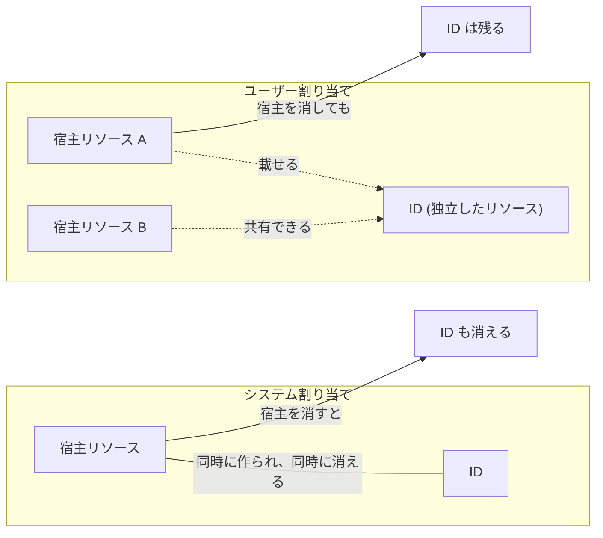

# 第 7 章 マネージド ID ― リソース間の内向き認証

第 5 章の最後で、マネージド ID はシークレットを持たないサービスプリンシパルだと述べました。本章はその 2 つの種類、システム割り当てとユーザー割り当ての使い分けを、ライフサイクルの違いから理解します。

結論を先に言えば、違いは寿命の決まり方です。システム割り当ては宿主のリソースと同時に作られ、同時に消えます。ユーザー割り当ては宿主とは別に作り、宿主が消えても残ります。この違いを実際に作って壊して確かめます。



本章の出力はすべて本書の検証環境での実測です。ID の実値の一部は伏せています。

## なぜマネージド ID なのか

第 6 章の演習では、サービスプリンシパルの password を控えて使い回しました。あの password が本番運用では問題になります。漏れれば不正利用され、期限が切れれば障害になり、更新には手順が要ります。

マネージド ID は、この password を人間の世界から消します。Azure 内部で資格情報が自動発行・自動更新され、リソースは自分の ID として他のリソースへアクセスします。取り出せる形のシークレットが存在しないので、漏らしようがありません。

Azure のリソースから Azure のリソースへ、という Azure の内側で閉じる向きのアクセスを、本書では内向きと呼びます。内向きの認証では、マネージド ID が常に第一候補です。サービスプリンシパルを手で作るのは、GitHub Actions のような外部からのアクセス（第 8 章）など、マネージド ID が使えない場面に限られていきます。

## 2 つの種類を同じリソースに載せて比べる

観察の宿主には Azure Container Instances を使います。コンテナーを 1 つ動かすだけの単純なサービスで、秒課金のため観察用途なら数円もかかりません。

まず、独立した ID であるユーザー割り当てマネージド ID を先に作ります。

この章の器を作ります。

```bash
az group create --name azp-ch07-rg --location japaneast \
  --tags azp-book=azure-practice azp-chapter=ch07 azp-lifecycle=ephemeral
```

宿主より先に、ユーザー割り当てマネージド ID だけを作ります。先に作れること自体が、この種類の性質です。

```bash
az identity create --name azp-ch07-uid --resource-group azp-ch07-rg
```

次に、コンテナーを作ります。システム割り当てを有効にし（`[system]`）、いま作ったユーザー割り当ても同時に載せます。

まず、いま作った ID を指す識別子を組み立てます。

```bash
sub=$(az account show --query id -o tsv)
uid_id="/subscriptions/$sub/resourceGroups/azp-ch07-rg/providers/Microsoft.ManagedIdentity/userAssignedIdentities/azp-ch07-uid"
```

その識別子を渡してコンテナーを作ります。

```bash
az container create --name azp-ch07-aci --resource-group azp-ch07-rg \
  --image mcr.microsoft.com/azuredocs/aci-helloworld \
  --assign-identity "[system]" "$uid_id" \
  --restart-policy Never --os-type Linux --cpu 1 --memory 1
```

なお、作りたてのサブスクリプションでは Microsoft.ContainerInstance が未登録のことがあります（本書の検証環境でも未登録でした）。その場合は第 1 章のとおり `az provider register --namespace Microsoft.ContainerInstance --wait` を先に実行してください。

できあがったコンテナーの identity ブロックを見ます。

```bash
az container show --name azp-ch07-aci --resource-group azp-ch07-rg --query identity -o json
```

```text
{
  "principalId": "66667777-8888-9999-aaaa-bbbbccccdddd",
  "tenantId": "<テナントID>",
  "type": "SystemAssigned, UserAssigned",
  "userAssignedIdentities": {
    "/subscriptions/<サブスクリプションID>/resourceGroups/azp-ch07-rg/providers/Microsoft.ManagedIdentity/userAssignedIdentities/azp-ch07-uid": {
      "clientId": "88889999-xxxx-xxxx-xxxx-xxxxxxxxxxxx",
      "principalId": "77778888-9999-aaaa-bbbb-ccccddddeeee"
    }
  }
}
```

構造の差がそのまま出ています。システム割り当ての principalId はコンテナー自身の属性として直に生えており、名前すら持ちません。ユーザー割り当ては独立したリソースへの参照として、リソース ID をキーに載っています。

テナントの台帳側を見ると、どちらもサービスプリンシパルとして存在しています。システム割り当ての displayName は宿主のリソース名そのものです。

```bash
az ad sp show --id 66667777-8888-9999-aaaa-bbbbccccdddd \
  --query "{displayName:displayName, servicePrincipalType:servicePrincipalType}" -o json
```

```text
{
  "displayName": "azp-ch07-aci",
  "servicePrincipalType": "ManagedIdentity"
}
```

## クリーンアップ演習 ― 宿主を消すと何が起きるか

ここからが本章の核心です。コンテナーだけを削除します。リソースグループはまだ消しません。

```bash
az container delete --name azp-ch07-aci --resource-group azp-ch07-rg --yes
```

削除後、2 つの ID がどうなったかをテナント側から確認します。

```bash
az ad sp show --id 66667777-8888-9999-aaaa-bbbbccccdddd   # システム割り当てだったもの
```

```text
ERROR: Resource '66667777-...' does not exist or one of its queried reference-property
objects are not present.
```

ユーザー割り当てのほうを、まずテナント側の台帳から取得します。

```bash
az ad sp show --id 77778888-9999-aaaa-bbbb-ccccddddeeee --query displayName -o tsv
```

同じものをリソース側からも取得します。

```bash
az identity show --name azp-ch07-uid --resource-group azp-ch07-rg --query name -o tsv
```

```text
azp-ch07-uid
azp-ch07-uid
```

システム割り当ての ID は、宿主と一緒に消えました。ユーザー割り当ては、サービスプリンシパルもリソースも残っています。これがライフサイクルの違いの実物です。

| 観点                 | システム割り当て                          | ユーザー割り当て                     |
| -------------------- | ----------------------------------------- | ------------------------------------ |
| 作られるとき         | 宿主リソースの作成・有効化と同時          | 独立して先に作れる                   |
| 消えるとき           | 宿主と同時                                | 自分で消すまで残る                   |
| 共有                 | 宿主 1 つ専用                             | 複数のリソースに載せられる           |
| ロール割り当ての準備 | 宿主ができるまで principalId が存在しない | 宿主より先に割り当てまで済ませられる |

最後の行が、実務では最も効きます。システム割り当ては宿主ができるまで ID が存在しないため、「リソースを作ってから権限を付ける」という順序を強制されます。ユーザー割り当てなら、ID と権限を先に用意し、あとから宿主を差し替えられます。デプロイのたびにリソースを作り直す IaC の世界（第 3 部）でユーザー割り当てが好まれる理由がこれです。第 4 章のハンズオンでユーザー割り当てを使ったのも同じ理由でした。

残りを片付けます。リソースグループを消せば、ユーザー割り当て ID も第 5 章で見たとおり両方の世界から消えます。

```bash
az group delete --name azp-ch07-rg --yes
```

## 使い分けの指針

- そのリソース専用の ID でよく、リソースと同時に消えてよいなら、システム割り当てが最も手間の少ない選択です
- ID を複数のリソースで共有したい、権限を先に整えたい、リソースを作り直しても ID を保ちたいなら、ユーザー割り当てです

迷ったら、第 3 章の問い「一緒に消えるべきか」を ID に対して問うてください。リソースグループの設計原則と同じ形の判断です。

## 検証環境

| 項目           | 値                                                                                                                  |
| -------------- | ------------------------------------------------------------------------------------------------------------------- |
| 検証状態       | verified                                                                                                            |
| 検証日         | 2026-08-08                                                                                                          |
| Azure CLI      | 2.77.0                                                                                                              |
| Bicep CLI      | 0.46.1                                                                                                              |
| API バージョン | Microsoft.ContainerInstance/containerGroups@2023-05-01, Microsoft.ManagedIdentity/userAssignedIdentities@2024-11-30 |

## 理解度チェック

1. 第 14 章で扱う Flex Consumption の Function App をリソースグループごと削除すると、ユーザー割り当てマネージド ID も一緒に消えるでしょうか。同じリソースグループにある場合と、別のリソースグループにある場合で答えが変わるかも含めて説明してください
2. システム割り当てだけを使う構成で IaC を組むと、初回デプロイで「リソース作成 → 権限割り当て」の 2 段階が必要になります。ユーザー割り当てだとこの制約がどう変わるか、principalId がいつ存在するかに着目して説明してください
3. 本章の演習でコンテナーを削除したあと、システム割り当ての ID を指していたロール割り当てはどうなるでしょうか。第 3 章・第 6 章の内容から推測し、確認に使うコマンドを挙げてください
