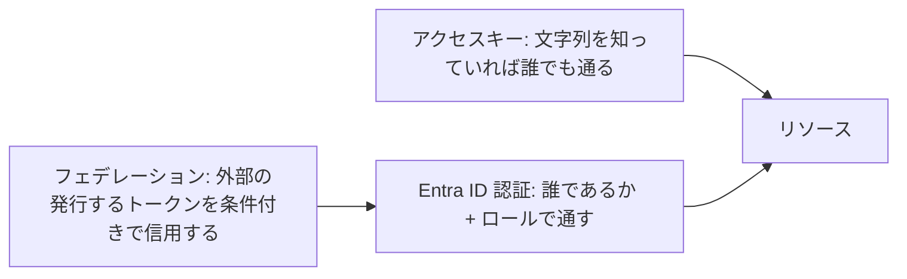

# 第8章 外向き認証 ― アクセスキー・Entra ID 認証・フェデレーションの使い分け

第7章までは、Azure の中のリソースが Azure の中のリソースへアクセスする内向きの認証を扱いました。本章は逆方向、つまりリソースへ外からアクセスする側の認証です。開発者の手元の CLI、デプロイを自動化する実行環境（GitHub Actions など）、そしてアプリケーションがそれにあたります。

手段は大きく 3 つあります。アクセスキー、Entra ID 認証、フェデレーション。この 3 つを 1 つのストレージアカウントの上で実際に切り替えながら、なぜ業界全体がキーを無効化する方向へ動いているのかを体で確かめます。



本章の出力はすべて本書の検証環境での実測です。

## アクセスキー ― リソースに付属する合鍵

多くの Azure サービスは、作成した瞬間からアクセスキーを持っています。キーを知っていれば誰でも、どこからでも、そのリソースのデータを全部操作できます。

```bash
az group create --name azp-ch08-rg --location japaneast \
  --tags azp-book=azure-practice azp-chapter=ch08 azp-lifecycle=ephemeral
az storage account create --name <ストレージ名> --resource-group azp-ch08-rg \
  --location japaneast --sku Standard_LRS
az storage container create --name demo --account-name <ストレージ名> --auth-mode key
```

```text
true
```

作れました。この経路の問題は、キーが「誰であるか」を一切問わないことです。キーは人にもプログラムにも紐づいておらず、漏れても誰が使ったのか分かりません。定期的なローテーションも人間の仕事です。第5章のサービスプリンシパルの password と同じ重荷が、リソースの数だけ増えていきます。

## Entra ID 認証 ― 誰であるかで通す

もう 1 つの経路は、第6章までに組み立てた仕組みをそのまま使います。サインインした ID と RBAC で、データへのアクセスを判定します。

ここで多くの人が引っかかる事実を、実際に踏んでみます。いまの自分はサブスクリプションの Owner です。その自分で、BLOB の一覧を Entra ID 認証で取ってみます。

```bash
az storage blob list --container-name demo --account-name <ストレージ名> --auth-mode login
```

```text
ERROR:
You do not have the required permissions needed to perform this operation.
Depending on your operation, you may need to be assigned one of the following roles:
    "Storage Blob Data Owner"
    "Storage Blob Data Contributor"
    "Storage Blob Data Reader"
```

Owner なのに拒否されました。RBAC のロールには、リソースの管理操作（作る・消す・設定を変える）を許す actions と、データそのものの操作を許す dataActions という別の系統があり、Owner が持つ `*` は actions の系統です。管理の全権とデータへのアクセス権は別物として設計されています。ストレージを管理できる人が、中の個人情報を読めるとは限らない、という分離です。

この 2 つの系統には名前が付いています。リソースの管理操作（作る・消す・設定を変える。actions の世界）の層をコントロールプレーン、データそのものの操作（dataActions の世界）の層をデータプレーンと呼びます。同じリソースに 2 枚の層があり、それぞれ別のロールで守られている、という絵で覚えてください。

エラーメッセージが親切に挙げてくれた Storage Blob Data Contributor が、dataActions を持つデータプレーンのロールです。自分に割り当てます。

```bash
sub=$(az account show --query id -o tsv)
me=$(az ad signed-in-user show --query id -o tsv)
az role assignment create --assignee "$me" --role "Storage Blob Data Contributor" \
  --scope "/subscriptions/$sub/resourceGroups/azp-ch08-rg/providers/Microsoft.Storage/storageAccounts/<ストレージ名>"
```

伝播（第6章）を待ってから再試行すると、今度は通ります。本書の検証では約 1 分後の 3 回目の試行で成功しました。

```bash
echo "hello" > hello.txt
az storage blob upload --container-name demo --account-name <ストレージ名> --auth-mode login \
  --name hello.txt --file hello.txt
az storage blob list --container-name demo --account-name <ストレージ名> --auth-mode login \
  --query "[].name" -o tsv
```

```text
hello.txt
```

なお、細かい注意を 1 つ。コンテナーの作成や一覧は、実は Owner のままでも `--auth-mode login` で通ります。コンテナーは ARM から見えるリソースでもあり、その操作は actions の系統で判定されるためです。データプレーンのロールが要るのは BLOB の中身に触れるときです。「どの操作がどちらの系統か」はエラーになってから知ることが多いので、拒否されたら本節のエラーメッセージのように必要ロールの提示を探してください。

## キーを止める ― Zero Trust への一歩

Entra ID 認証が通るようになった今、キーはもう要りません。止めます。

```bash
az storage account update --name <ストレージ名> --resource-group azp-ch08-rg \
  --allow-shared-key-access false
```

キー経路を再試行した実際の結果です。

```bash
az storage container create --name demo2 --account-name <ストレージ名> --auth-mode key
```

```text
KeyBasedAuthenticationNotPermitted
```

一方、Entra ID 経路は生きています。

```bash
az storage blob list --container-name demo --account-name <ストレージ名> --auth-mode login \
  --query "[].name" -o tsv
```

```text
hello.txt
```

これで、このストレージには「誰であるか」を示さない限り誰も入れなくなりました。すべてのアクセスが ID に紐づき、ログに残り、RBAC で範囲を制御できます。信用できるネットワークや秘密の文字列を前提にせず、毎回のアクセスで ID を検証する。この設計方針は一般に Zero Trust と呼ばれます。

Azure の各サービスはこの方向へ足並みを揃えています。第4章のハンズオンでストレージを最初からキー無効で作ったのはこの実践です。Key Vault は新規作成の既定が RBAC 認可になり（第16章）、Cosmos DB はキー認証そのものを disableLocalAuth で止められます（第18章）。さらに第20章では、キーが有効なリソースを組織として作らせない強制の仕組みを扱います。

## フェデレーション ― 外部の ID をそのまま信用する

残る問題は、Azure の外で動くプログラムです。GitHub Actions からデプロイしたいとき、これまでの道具立てだとサービスプリンシパルの password を GitHub 側に保存することになります。キーを消してきた流れに逆行します。

フェデレーション（ワークロード ID フェデレーション）は、この最後のシークレットを消します。仕組みはこうです。GitHub Actions は実行のたびに、自分の素性（どのリポジトリの、どのブランチの実行か）を記した署名済みトークンを発行できます。Entra ID 側のアプリケーションに「この発行元の、この素性のトークンが来たら、私として認めてよい」という条件を登録しておけば、パスワードの保存なしに認証が成立します。

実際に条件を登録してみます。

```bash
appid=$(az ad app create --display-name azp-ch08-fed --query appId -o tsv)
az ad app federated-credential create --id "$appid" --parameters '{
  "name": "github-main",
  "issuer": "https://token.actions.githubusercontent.com",
  "subject": "repo:example-org/example-repo:ref:refs/heads/main",
  "audiences": ["api://AzureADTokenExchange"]
}'
```

```text
{
  "issuer": "https://token.actions.githubusercontent.com",
  "name": "github-main",
  "subject": "repo:example-org/example-repo:ref:refs/heads/main"
}
```

subject に注目してください。リポジトリ名とブランチ名まで指定しています。同じ組織の別リポジトリや、同じリポジトリの別ブランチからのトークンは、素性が一致しないので拒否されます。シークレットの保管も更新も不要で、条件の合う実行だけが通る。外部システムからのアクセスの現在の標準形です。

この仕組みは第17章でもう一度登場します。AKS の中の Pod が Azure のサービスへアクセスするときも、Kubernetes が発行するトークンを同じ形で信用させます。

## クリーンアップ演習

```bash
az ad app delete --id "$appid"
az group delete --name azp-ch08-rg --yes
```

ロール割り当てはストレージアカウントのスコープに掛けたので、リソースグループの削除と一緒に消えます。第6章の教訓（ID より先に割り当てを消す）を思い出して、順序を確認してから消してください。

## 検証環境

| 項目           | 値                                                                                         |
| -------------- | ------------------------------------------------------------------------------------------ |
| 検証状態       | verified                                                                                   |
| 検証日         | 2026-08-08                                                                                 |
| Azure CLI      | 2.77.0                                                                                     |
| Bicep CLI      | 0.46.1                                                                                     |
| API バージョン | Microsoft.Storage/storageAccounts@2025-01-01, Microsoft Graph federatedIdentityCredentials |

## 理解度チェック

1. サブスクリプションの Owner が「ストレージの中身が見られない、権限がおかしい」と主張しています。おかしくない理由を、actions と dataActions の違いから説明してください
2. あるチームが GitHub Actions からのデプロイにサービスプリンシパルの password を使っています。フェデレーションへ移行すると、何がなくなり、何が新たに縛れるようになりますか。subject の形式を踏まえて答えてください
3. `--allow-shared-key-access false` にしたストレージで、古いバッチ処理が突然失敗し始めました。エラーに含まれるはずのコードは何で、復旧の選択肢としてキー再有効化と Entra ID 認証への移行のどちらを選ぶべきか、本章の文脈で論じてください
