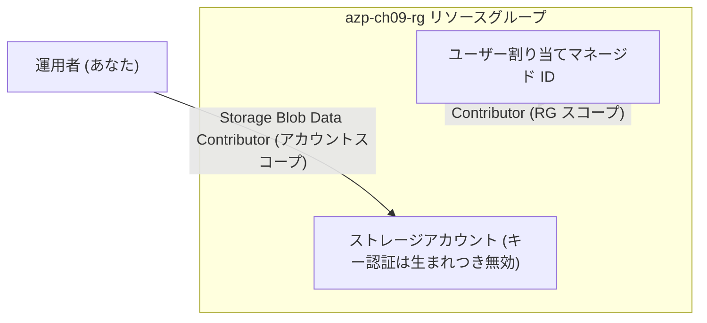

# 第9章 [統合ハンズオン] ID と権限を 1 つのシナリオで通す

第5〜8章で、ID の登場人物、ロールとスコープ、マネージド ID、そして外向きの認証手段を分解してきました。本章はそれを 1 本のシナリオに戻します。

シナリオはこうです。これから作るアプリケーションのために、ID と保管場所を用意する。ただしアクセスキーは一度も有効にしない。

Part 2 はここで閉じます。手順の実体は `scripts/chapters/ch09-identity.sh` にあり、本章の手順と出力はすべて本書の検証環境で通しで実行して確認済みです。

## このハンズオンで作るもの



同じロールを 2 つの ID に、あえて違うスコープで割り当てます。この違いが本章の設計上の論点です。

## 実行

```bash
./scripts/chapters/ch09-identity.sh
```

スクリプトは 4 段で進みます。それぞれの段に、Part 2 の章がそのまま対応しています。

### 段 1 ― 器を用意する

リソースグループを作ります。第3章のとおり、この章で作るものは全部ここに入れ、消すときは丸ごと消します。

### 段 2 ― ID を先に作る

```bash
az identity create --name azp-ch09-id --resource-group azp-ch09-rg
```

宿主になるアプリケーションはまだ存在しませんが、ユーザー割り当てマネージド ID は先に作れます（第7章）。ID が先にあるから、権限も先に配れる。アプリの実体ができる前に、セキュリティの枠組みだけが先に完成する順序です。

### 段 3 ― 保管場所を、生まれた時からキー無効で作る

```bash
az storage account create --name <ストレージ名> --resource-group azp-ch09-rg \
  --sku Standard_LRS --allow-shared-key-access false \
  --min-tls-version TLS1_2 --allow-blob-public-access false
```

第8章では、キーが有効なストレージを作ってから止めました。本章では最初から無効で作ります。キーが一度も存在しなかったのだから、漏れているキーも、ローテーションすべきキーも、この世にありません。第4章のハンズオンで既にこの形を使っていたことに、いまなら気づけるはずです。

### 段 4 ― 権限を、それぞれ適切なスコープで配る

マネージド ID には、リソースグループのスコープで割り当てます。

```bash
az role assignment create --assignee <principalId> \
  --role "Storage Blob Data Contributor" \
  --scope "/subscriptions/$sub/resourceGroups/azp-ch09-rg"
```

自分（運用者）には、ストレージアカウント単体のスコープで割り当てます。

```bash
az role assignment create --assignee <自分のobjectId> \
  --role "Storage Blob Data Contributor" \
  --scope ".../resourceGroups/azp-ch09-rg/providers/Microsoft.Storage/storageAccounts/<ストレージ名>"
```

なぜ差をつけたのか。アプリはこのリソースグループの保管場所全体を使う想定なので、あとからアカウントが増えても割り当てを増やさずに済む RG スコープを選びました。一方、運用者のアクセスは調査のための最小限であるべきなので、対象のアカウント 1 つに絞りました。どちらが正しいという話ではなく、ロール × スコープを要件から逆算して選ぶ（第6章）、その判断を 2 通り並べています。

## 検証

```bash
./scripts/verify/ch09-identity.sh
```

本書の検証環境での実行結果です。

```text
==> 第9章の状態を検証する
  OK   キー認証が無効である
  OK   キー経路は拒否される
  OK   Entra ID 認証でデータを書き込めた
  OK   マネージド ID にデータロールが割り当てられている
==> 検証に成功した
```

| 確認項目                  | 何を裏付けるか                                                |
| ------------------------- | ------------------------------------------------------------- |
| キー認証が無効            | 段 3 の構成が効いている                                       |
| キー経路の拒否            | 第8章の KeyBasedAuthenticationNotPermitted が実際に働いている |
| Entra ID 認証での書き込み | 運用者のデータロール（アカウントスコープ）が機能している      |
| マネージド ID のロール    | アプリ用の権限が宿主の誕生前に配り終わっている                |

2 番目と 3 番目が対になっています。同じストレージが、キーには閉じ、ID には開いている。Part 2 で組み立てた世界の完成形です。

なお、verify スクリプトのデータ書き込み確認にはリトライが入っています。割り当ての伝播（第6章）のため、本書の検証でも初回は拒否され、しばらく待ってから成功しています。

## クリーンアップ演習

```bash
./scripts/teardown/ch09-identity.sh
```

中身はリソースグループの削除 1 つだけです。それでも演習として意味があります。ロール割り当てをすべてリソースグループ配下のスコープに掛けたので、割り当ても ID もストレージも、この 1 操作で正しい順序のまま消えます。第6章の「ID より先に割り当てを消す」を、設計の段階で作り込んであったわけです。

スコープを広く（たとえばサブスクリプションに）掛けていたら、この teardown では割り当てが残り、第3章で見た残骸になります。スコープの選択はライフサイクルの設計でもある、というのが Part 2 の締めくくりです。

## 検証環境

| 項目           | 値                                                                                                                                                            |
| -------------- | ------------------------------------------------------------------------------------------------------------------------------------------------------------- |
| 検証状態       | verified                                                                                                                                                      |
| 検証日         | 2026-08-08                                                                                                                                                    |
| Azure CLI      | 2.77.0                                                                                                                                                        |
| Bicep CLI      | 0.46.1                                                                                                                                                        |
| API バージョン | Microsoft.Storage/storageAccounts@2025-01-01, Microsoft.ManagedIdentity/userAssignedIdentities@2024-11-30, Microsoft.Authorization/roleAssignments@2022-04-01 |

## 理解度チェック

1. 本章の構成に、あとからストレージアカウントを 1 つ追加しました。マネージド ID と運用者、それぞれ新しいアカウントの BLOB に触れるでしょうか。触れるなら理由を、触れないなら追加で必要な操作を答えてください
2. 段 2 と段 4 を入れ替えて「ストレージを先に作り、アプリをデプロイしてから権限を配る」順序にした場合、システム割り当てマネージド ID を使うとどんな制約が生まれますか。第7章の表から説明してください
3. この構成の verify で「キー経路は拒否される」の確認が、なぜ「キー認証の設定値が false である」の確認と別に必要なのでしょうか。設定と実際の挙動を分けて検証する意味を述べてください
