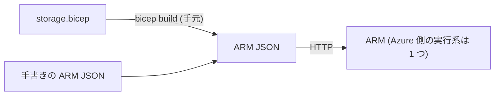

# 第10章 ARM テンプレートと Bicep の関係

第2部 までのハンズオンでは、`az` コマンドで 1 手ずつリソースを作ってきました。第3部では、同じ構成をコードとして書き、何度でも同じ結果を再現できるようにします。

その道具が第0章の表で予告した Bicep です。本章で固定したいのは 1 点だけです。Bicep は ARM テンプレート（JSON）へ変換される純粋な書き方の改善であり、実行時の挙動に差はありません。この 1 点を、実際に変換して確かめます。

本章の出力はすべて本書の検証環境での実測です。

## ARM が受け取るものは JSON

第1章で見たとおり、Azure への管理操作はすべて ARM が受け付けます。まとまった構成を渡すときの形式が ARM テンプレート、中身は JSON です。

しかし ARM テンプレートの JSON は、人間が書くには冗長です。値の参照ひとつ取っても `"[parameters('name')]"` のような文字列埋め込みの式で書くことになります。この書きにくさを解決するために作られた専用言語が Bicep です。

## 変換して確かめる

`infra/bicep/chapters/ch10-compile/storage.bicep` に、15 行の小さなテンプレートがあります。第9章で作ったものと同じ、キー無効のストレージ 1 つの定義です。これを ARM JSON に変換します。

```bash
az bicep build --file infra/bicep/chapters/ch10-compile/storage.bicep \
  --outfile storage.json
wc -l infra/bicep/chapters/ch10-compile/storage.bicep storage.json
```

```text
15 storage.bicep
35 storage.json
```

15 行が 35 行になりました。生成された JSON のリソース部分を見ます。

```text
{
  "type": "Microsoft.Storage/storageAccounts",
  "apiVersion": "2025-01-01",
  "name": "[parameters('name')]",
  "location": "[parameters('location')]",
  "sku": {
    "name": "Standard_LRS"
  },
  "kind": "StorageV2",
  "properties": {
    "allowSharedKeyAccess": false,
    "minimumTlsVersion": "TLS1_2"
  }
}
```

Bicep で `'Microsoft.Storage/storageAccounts@2025-01-01'` と 1 つに書いていたものが、type と apiVersion に分解されています。`name` への参照は `"[parameters('name')]"` という式になりました。意味はまったく同じで、表記だけが変わっています。

生成された JSON には、変換の痕跡も残っています。

```text
"metadata": {
  "_generator": {
    "name": "bicep",
    "version": "0.46.1.21595",
    "templateHash": "7445652178906837295"
  }
}
```

templateHash は生成物の指紋です。同じ Bicep からは同じハッシュの JSON が生まれるため、デプロイ履歴から「どの版のテンプレートだったか」を突き合わせられます。

逆方向の変換もあります。既存の ARM JSON を Bicep に起こす decompile です。

```bash
az bicep decompile --file storage.json
```

```text
WARNING: Decompilation is a best-effort process, as there is no guaranteed mapping
from ARM JSON to Bicep Template or Bicep Parameters.
```

警告のとおり、こちらはベストエフォートです。手書きの複雑な JSON では変換後に手直しが要ります。既存資産を引き継ぐときの入口として覚えておけば十分です。

## ランタイム差がない、とはどういうことか

`az deployment` に `.bicep` ファイルを渡したとき、CLI は手元でいまの変換を行い、ARM には JSON だけが送られます。ARM は Bicep の存在を知りません。

つまり、Bicep で書いても JSON で書いても、Azure 側から見えるものは同一です。「Bicep だと挙動が違うのでは」という心配は構造的にありえません。第4章の壊す演習で、スコープ違反が ARM に届く前に Bicep の型検査で止まったのを見ました。Bicep が足しているのはこうした手元での検査と書きやすさだけで、実行系は 1 つです。



## 実行せずに結果だけ見る ― what-if

テンプレートを ARM が解釈する側だと分かると、便利な道具が使えるようになります。what-if は、テンプレートを適用したら何が起きるかを、適用せずに ARM に計算させる操作です。

```bash
az group create --name azp-ch10-rg --location japaneast \
  --tags azp-book=azure-practice azp-chapter=ch10 azp-lifecycle=ephemeral
az deployment group what-if --resource-group azp-ch10-rg \
  --template-file infra/bicep/chapters/ch10-compile/storage.bicep \
  --parameters name=azpch10whatif001
```

```text
      apiVersion:                      "2025-01-01"
      kind:                            "StorageV2"
      location:                        "japaneast"
      name:                            "azpch10whatif001"
      properties.allowSharedKeyAccess: false
      properties.minimumTlsVersion:    "TLS1_2"
      sku.name:                        "Standard_LRS"
      type:                            "Microsoft.Storage/storageAccounts"

Resource changes: 1 to create.
```

「1 つ作られる予定」とだけ報告され、実際には何も作られていません。デプロイ前のレビューに使える実務の道具であると同時に、「テンプレートは ARM への指示書であり、解釈と実行は ARM の仕事」という本章の主張の証明にもなっています。

確認したらリソースグループを片付けます。what-if しか実行していないので、中身は空のままです。

```bash
az group delete --name azp-ch10-rg --yes
```

## 検証環境

| 項目           | 値                                                     |
| -------------- | ------------------------------------------------------ |
| 検証状態       | verified                                               |
| 検証日         | 2026-08-08                                             |
| Azure CLI      | 2.77.0                                                 |
| Bicep CLI      | 0.46.1                                                 |
| API バージョン | Microsoft.Storage/storageAccounts@2025-01-01 (what-if) |

## 理解度チェック

1. 「Bicep はまだ新しいから、実績のある ARM JSON で書くほうが本番は安全だ」という主張を、本章の内容で検討してください。両者の間に実行時の差が生まれない理由はどこにありますか
2. デプロイ履歴に残る templateHash が、手元の Bicep ファイルから生成した JSON のものと一致しません。考えられる原因は何ですか
3. what-if の結果が「1 to create」ではなく「1 to modify」になるのは、どんな状況ですか。この差分計算を ARM 側が担えるのはなぜかも説明してください
