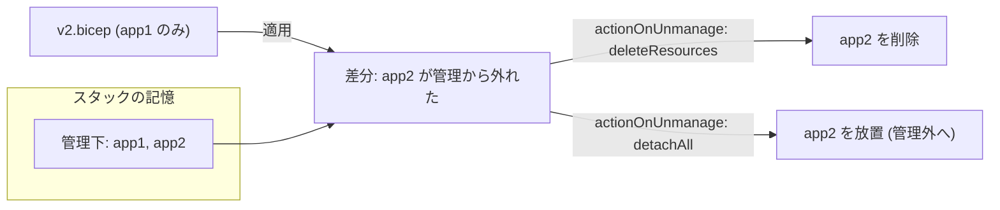

# 第11章 デプロイスコープと Deployment Stacks

第10章で、テンプレートは ARM への指示書だと確かめました。本章はその指示書にまつわる 2 つの問いを扱います。指示書はどの高さに書き込むのか（デプロイスコープ）。そして、指示書から消したものは実世界でどうなるのか（Deployment Stacks）。

後半の問いは「リソースグループ = ライフサイクルの境界」という第3章の学びの、IaC 版です。本章の出力はすべて本書の検証環境での実測です。

## デプロイスコープ ― 指示書を書き込む高さ

Part 1 の 4 階層のうち、テンプレートを差し込める場所は 4 つあり、それぞれに対応するコマンドがあります。

| スコープ           | コマンド                      | そこにしか書けない代表例           |
| ------------------ | ----------------------------- | ---------------------------------- |
| テナント           | `az deployment tenant create` | 管理グループの作成                 |
| 管理グループ       | `az deployment mg create`     | 配下へのポリシー割り当て（第20章） |
| サブスクリプション | `az deployment sub create`    | リソースグループの作成             |
| リソースグループ   | `az deployment group create`  | 通常のリソースすべて               |

テンプレート側の `targetScope` 宣言と、コマンドの選択は対応していなければなりません。第4章のハンズオンは `targetScope = 'subscription'` のテンプレートを `az deployment sub create` で流し、リソースグループの中身はモジュールでリソースグループスコープに委ねていました。壊す演習で見たとおり、この対応を崩すと手元のコンパイルで止まります。

スコープの選択は「どこに作るか」だけでなく「誰が流せるか」も決めます。管理グループスコープのテンプレートを流すには、その管理グループへの権限（第2章）が要ります。指示書の高さは、権限の高さでもあります。

## 指示書から消したものは、どうなるのか

ここからが本章の核心です。実験で確かめます。

`infra/bicep/chapters/ch11-stack/` に 2 つのテンプレートがあります。v1 はマネージド ID が 2 つ（app1、app2）、v2 は app2 を消して 1 つだけにしたものです。「アプリを 1 つ畳んだ」という状況を模しています。

### 通常のデプロイで v1 から v2 へ

```bash
az group create --name azp-ch11-rg --location japaneast \
  --tags azp-book=azure-practice azp-chapter=ch11 azp-lifecycle=ephemeral
az deployment group create -g azp-ch11-rg \
  --template-file infra/bicep/chapters/ch11-stack/v1.bicep
az identity list -g azp-ch11-rg --query "[].name" -o tsv
```

```text
azp-ch11-app2
azp-ch11-app1
```

2 つできました。次に、app2 を消した v2 を同じ場所へ流します。

```bash
az deployment group create -g azp-ch11-rg \
  --template-file infra/bicep/chapters/ch11-stack/v2.bicep
az identity list -g azp-ch11-rg --query "[].name" -o tsv
```

```text
azp-ch11-app2
azp-ch11-app1
```

app2 が残っています。通常のデプロイは既定で増分（incremental）モードで動き、テンプレートに書かれたものを作り・更新するだけで、書かれていないものには手を触れません。ARM は「以前のテンプレートに何が書かれていたか」を覚えていないので、消されたことに気づきようがないのです。

こうして、コードにはもう存在しないリソースが実世界に残り続けます。消し忘れは課金され続け、たとえばキーが有効なままの古いストレージが転がっていれば、セキュリティの穴にもなります。コードと実世界がずれていく、IaC の古典的な問題です。

### Deployment Stacks で同じことをやる

Deployment Stacks は、この「覚えていない」を解決します。スタックはテンプレートの適用結果を管理下のリソース一覧として記憶し、次の適用との差分を取ります。

先ほどの 2 つを手で消してから、今度はスタックとして v1 を適用します。

```bash
az stack group create --name azp-ch11-stack -g azp-ch11-rg \
  --template-file infra/bicep/chapters/ch11-stack/v1.bicep \
  --action-on-unmanage deleteResources --deny-settings-mode none --yes
```

`--action-on-unmanage` が本章の主役です。「管理から外れたリソースをどうするか」の指定で、deleteResources なら削除、detachAll なら管理から外すだけで実体は残します。

v2 を適用します。

```bash
az stack group create --name azp-ch11-stack -g azp-ch11-rg \
  --template-file infra/bicep/chapters/ch11-stack/v2.bicep \
  --action-on-unmanage deleteResources --deny-settings-mode none --yes \
  --query "{state:provisioningState, deleted:deletedResources[].id}" -o json
```

```text
{
  "deleted": [
    ".../resourceGroups/azp-ch11-rg/providers/Microsoft.ManagedIdentity/userAssignedIdentities/azp-ch11-app2"
  ],
  "state": "succeeded"
}
```

```bash
az identity list -g azp-ch11-rg --query "[].name" -o tsv
```

```text
azp-ch11-app1
```

今度は app2 が消えました。応答の deletedResources に、何を掃除したかが明示されています。テンプレートから消す = 実世界からも消える。コードが唯一の真実であるという IaC の理想が、ここで初めて実際の挙動になります。

スタックがいま何を管理しているかは、いつでも確認できます。

```bash
az stack group show --name azp-ch11-stack -g azp-ch11-rg --query "resources[].id" -o json
```

```text
[
  ".../providers/Microsoft.ManagedIdentity/userAssignedIdentities/azp-ch11-app1"
]
```

### スタックそのものを消す

```bash
az stack group delete --name azp-ch11-stack -g azp-ch11-rg \
  --action-on-unmanage deleteAll --yes
az identity list -g azp-ch11-rg --query "length(@)" -o tsv
```

```text
0
```

deleteAll はスタックの削除と同時に管理下のリソースをすべて消します。リソースグループの削除（第3章）と同じ「まとめて消える」動きを、リソースグループとは独立した単位で持てるということです。実際、1 つのリソースグループに複数のスタックを置いて、ライフサイクルをリソースグループより細かく切ることもできます。



## deleteResources と detachAll をどう選ぶか

deleteResources は本章のような「コードが真実」の運用に向きます。一方、スタック管理をやめたいだけでリソースは残したい移行の場面では detachAll を選びます。誤ってスタックを消してもリソースが道連れにならない、という保険として detachAll を常用する流儀もありますが、それは消し忘れ問題の再発と引き換えです。本書のハンズオンは ephemeral な検証環境なので、一貫して deleteResources を使います。

なお `--deny-settings-mode` は、スタック管理下のリソースをスタック外から変更されないよう保護する設定です。本書では none（保護なし）で進め、必要になる場面（第20章の統制）で改めて触れます。

最後に片付けです。

```bash
az group delete --name azp-ch11-rg --yes
```

## 検証環境

| 項目           | 値                                                                                                                 |
| -------------- | ------------------------------------------------------------------------------------------------------------------ |
| 検証状態       | verified                                                                                                           |
| 検証日         | 2026-08-08                                                                                                         |
| Azure CLI      | 2.77.0                                                                                                             |
| Bicep CLI      | 0.46.1                                                                                                             |
| API バージョン | Microsoft.Resources/deploymentStacks (az stack group), Microsoft.ManagedIdentity/userAssignedIdentities@2024-11-30 |

## 理解度チェック

1. 通常のデプロイを使い続けているチームで「Bicep からは消したはずのリソースが課金され続けていた」事故が起きました。なぜテンプレートから消しても実体が残ったのか、ARM が何を覚えていて何を覚えていないかで説明してください
2. あるスタックを `--action-on-unmanage deleteResources` で運用しています。テンプレートからリソースを 1 つ消して適用した場合と、スタックそのものを削除した場合（削除時にも actionOnUnmanage を指定します。deleteAll を選んだとします）、消えるものはそれぞれ何ですか
3. 本番のデータベースを含む構成をスタックで管理することになりました。deleteResources と detachAll のどちらを選びますか。第3章の「一緒に消えるべきものをまとめる」の観点から論じてください
