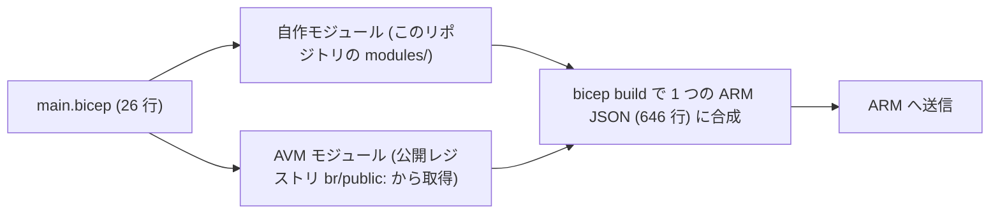

# 第 12 章 モジュール化と Azure Verified Modules

第 4 章のテンプレートは、リソースグループの中身を `contents.bicep` という別ファイルに切り出していました。スコープの違うものを 1 つのファイルに書けないという制約が理由でしたが、モジュールの価値は制約対応だけではありません。本章では、自分で切り出す判断と、公式の検証済みモジュールに乗る判断の両方を扱います。

本章の出力はすべて本書の検証環境での実測です。

## 自作モジュール ― 3 回書いたら切り出す

ここまでの章で、キー認証を無効にしたストレージの定義を 3 回書きました（第 4 章・第 9 章・第 10 章）。同じ 5 行の properties の繰り返しです。繰り返しは、そのうち 1 か所だけ直し忘れる事故になります。

切り出したものが `infra/bicep/modules/keyless-storage.bicep` です。構造は 3 部からなります。

```bicep
@description('ストレージアカウント名。グローバルに一意で、英小文字と数字のみ 3〜24 文字')
@minLength(3)
@maxLength(24)
param name string
```

入口の params には、`@description` と制約を付けます。モジュールは他人（未来の自分を含む）が使うものなので、何を渡すべきかをコードだけで説明できる必要があります。

中身は、これまで繰り返してきた定義そのものです。そして出口です。

```bicep
@description('データプレーンのロール割り当てに使うリソース ID')
output id string = storage.id
```

呼び出し側が次の一手（ロール割り当てなど）に必要とする値だけを outputs で返します。中のリソースへ直接触らせず、入口と出口だけで会話します。関数と同じ設計です。

呼び出しは相対パスで書きます。

```bicep
module storage '../../modules/keyless-storage.bicep' = {
  name: 'keyless-storage'
  params: {
    name: storageName
    location: location
  }
}
```

## Azure Verified Modules ― 公式の検証済みモジュール

自作の次の段階が、Microsoft が公式に検証・保守しているモジュール群、Azure Verified Modules（AVM）です。よく使うリソースの「正しい作り方」がモジュールとして公開レジストリに置かれていて、バージョンを指定して取り込めます。

```bicep
module identity 'br/public:avm/res/managed-identity/user-assigned-identity:0.6.0' = {
  name: 'avm-identity'
  params: {
    name: 'azp-ch12-id'
    location: location
  }
}
```

`br/public:` が公式レジストリ、続くパスがモジュール名、末尾がバージョンです。利用できるバージョンはレジストリに問い合わせられます。

```bash
curl -s https://mcr.microsoft.com/v2/bicep/avm/res/managed-identity/user-assigned-identity/tags/list
```

```text
0.4.2  0.4.3  0.5.0  0.5.1  0.6.0
```

バージョンは必ず固定してください。固定しない仕組みは提供されていませんが、「最新を使いたいから」と更新のたびに書き換えて回る運用は、デプロイのたびに結果が変わる IaC になってしまいます。上げるときは差分を確認して意図的に上げます。



### 取り込むと何が起きるか

自作モジュールと AVM モジュールを 1 つずつ使う本章のテンプレート（`infra/bicep/chapters/ch12-modules/main.bicep`）は 26 行です。これをコンパイルすると、どうなるでしょうか。

この章の器を作ります。

```bash
az group create --name azp-ch12-rg --location japaneast \
  --tags azp-book=azure-practice azp-chapter=ch12 azp-lifecycle=ephemeral
```

モジュールを取り込んだ状態でコンパイルします。

```bash
az bicep build --file infra/bicep/chapters/ch12-modules/main.bicep --outfile built.json
```

書いた行数と、できあがった行数を比べます。

```bash
wc -l infra/bicep/chapters/ch12-modules/main.bicep built.json
```

```text
 26 main.bicep
646 built.json
```

26 行が 646 行になりました。第 10 章の 15 行 → 35 行と比べて膨らみ方が桁違いです。AVM モジュールは、マネージド ID を 1 つ作るだけに見えて、ロックやロール割り当てなど運用に必要な入口を標準装備しており、その分の定義が展開されています。この標準装備こそが「検証済み」の中身です。自作するときに考慮し忘れることを、先に考慮してあります。

実際にデプロイした結果です。

```text
{
  "outputs": {
    "identityPrincipalId": { "value": "aaaa0000-xxxx-..." },
    "storageId": { "value": ".../storageAccounts/azpch122264" }
  },
  "state": "Succeeded"
}
```

デプロイ履歴を見ると、興味深いものが並んでいます。

```bash
az deployment group list -g azp-ch12-rg --query "[].name" -o tsv
```

```text
46d3xbcp.res.managedidentity-userassignedidentity.0-6-0.3iuw
avm-identity
keyless-storage
main
```

main（親）、自作の keyless-storage、AVM の avm-identity に加えて、ランダムな名前のデプロイが 1 つあります。これは AVM が既定で送る利用統計（テレメトリー）用の空デプロイです。無効にしたい場合は各モジュールの `enableTelemetry: false` を指定します。中身のない履歴が 1 件増えるだけで、リソースは作られません。

## 使い分けの指針

| 状況                                       | 選択                                     |
| ------------------------------------------ | ---------------------------------------- |
| AVM に該当モジュールがあり、要件を満たす   | AVM を使う。車輪を再発明しない           |
| 組織固有の規約を焼き込みたい               | AVM を内側で呼ぶ薄い自作モジュールで包む |
| 該当モジュールがない、または要件に合わない | 自作する。3 回書いたら切り出す           |

現在の標準スタイルは「検証済みモジュールを組み合わせ、足りない部分だけ書く」です。第 21 章で読む Landing Zone の公式実装も、この AVM の積み上げでできています。

最後に片付けます。

```bash
az group delete --name azp-ch12-rg --yes
```

## 検証環境

| 項目           | 値                                                                                                  |
| -------------- | --------------------------------------------------------------------------------------------------- |
| 検証状態       | verified                                                                                            |
| 検証日         | 2026-08-08                                                                                          |
| Azure CLI      | 2.77.0                                                                                              |
| Bicep CLI      | 0.46.1                                                                                              |
| API バージョン | avm/res/managed-identity/user-assigned-identity:0.6.0, Microsoft.Storage/storageAccounts@2025-01-01 |

## 理解度チェック

1. 自作モジュールの outputs に、ストレージのリソース ID ではなくアクセスキーを返す設計を選んだとします。第 8 章までの内容を踏まえて、この設計のどこが問題か指摘してください
2. AVM モジュールのバージョンを固定せずに済ませる方法が提供されていないのは、IaC のどの性質を守るためだと考えられますか。第 11 章のスタックの考え方と合わせて説明してください
3. チームの規約で「ストレージは必ずキー無効・TLS1.2 以上」と決まっています。AVM のストレージモジュールを直接使う場合と、それを包む社内モジュールを作る場合で、規約の強制のされ方はどう違いますか
