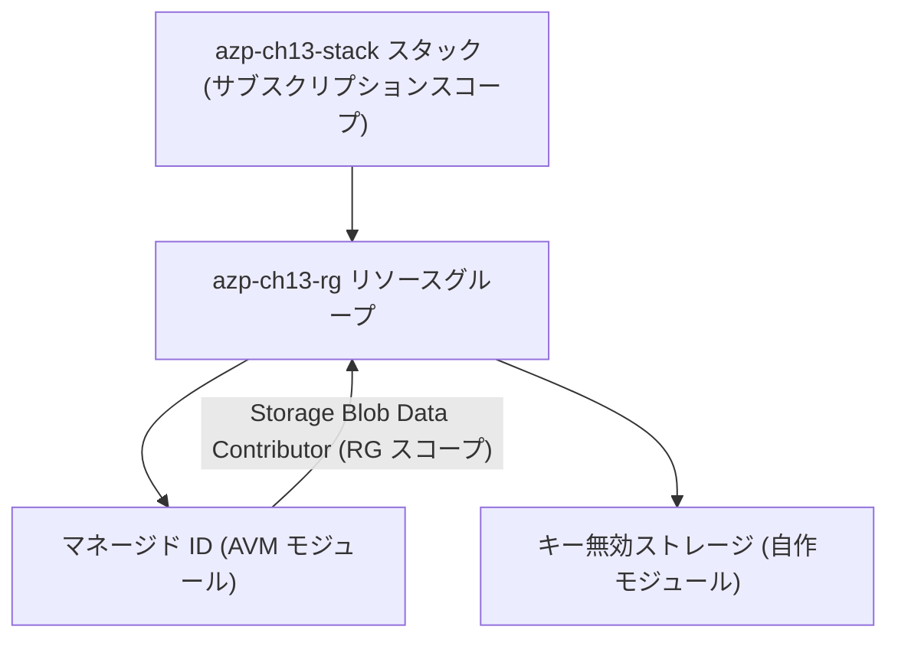

# 第13章 [統合ハンズオン] Part 1〜2 の構成を IaC で再現する

第4章では az コマンドを 1 手ずつ積み上げ、第9章では ID と権限のシナリオを通しました。本章はその到達点を、Deployment Stack 1 本の宣言に置き換えます。

CLI で理解し、IaC で固定する。本書がここまで辿ってきた流れを閉じる章です。手順の実体は `scripts/chapters/ch13-iac-rebuild.sh` にあり、本章の手順と出力はすべて本書の検証環境で通しで実行して確認済みです。

## 宣言する構成



テンプレートは `infra/bicep/chapters/ch13-iac-rebuild/` にあります。読みどころは 3 つです。

1 つ目。`main.bicep` は `targetScope = 'subscription'` で、リソースグループの作成から宣言しています（第11章のスコープ）。第4章で `az deployment sub create` に相当したものが、スタックでは `az stack sub create` になります。

2 つ目。中身は組み合わせだけでできています。ID は AVM モジュール、ストレージは第12章で切り出した自作モジュール、自分で直接書いたのはロール割り当て 1 つです。検証済みモジュールを組み合わせ、足りない部分だけ書く形がそのまま現れています。

3 つ目。`includeStorage` というパラメーターがあり、false にするとストレージとロール割り当てが構成から外れます。あとで使います。

## 実行

```bash
./scripts/chapters/ch13-iac-rebuild.sh
```

中核は 1 コマンドです。

```bash
az stack sub create --name azp-ch13-stack --location japaneast \
  --template-file infra/bicep/chapters/ch13-iac-rebuild/main.bicep \
  --parameters storageName=<ストレージ名> includeStorage=true \
  --action-on-unmanage deleteAll --deny-settings-mode none --yes
```

第4章で 3 ステップ、第9章で 4 段に分けて実行したことが、この 1 回の宣言に収まっています。順序の管理（ID が先、割り当てはあと）も、依存関係の解決も、ARM が引き受けます。

検証も第9章と同じ観点で通ります。

```bash
./scripts/verify/ch13-iac-rebuild.sh
```

```text
==> 第13章の状態を検証する
  OK   スタックが存在し succeeded である
  OK   リソースグループ azp-ch13-rg が存在する
  OK   ストレージのキー認証が無効である
  OK   マネージド ID にデータロールが割り当てられている
==> 検証に成功した
```

## 壊す演習 ― 構成から外すと実世界から消える

第11章の actionOnUnmanage を、今度は意味のある構成で使います。「保管場所はもう不要になった」という変更を、テンプレートの編集ではなくパラメーターで表現します。

```bash
az stack sub create --name azp-ch13-stack --location japaneast \
  --template-file infra/bicep/chapters/ch13-iac-rebuild/main.bicep \
  --parameters storageName=<ストレージ名> includeStorage=false \
  --action-on-unmanage deleteAll --deny-settings-mode none --yes \
  --query "{state:provisioningState, deleted:deletedResources[].id}" -o json
```

本書の検証環境での実際の応答です。

```text
{
  "deleted": [
    ".../resourceGroups/azp-ch13-rg/providers/Microsoft.Authorization/roleAssignments/395b9a3f-...",
    ".../resourceGroups/azp-ch13-rg/providers/Microsoft.Storage/storageAccounts/azpch134380"
  ],
  "state": "succeeded"
}
```

ストレージだけでなく、それに紐づくロール割り当ても一緒に掃除されています。第9章の teardown で「スコープの設計が正しければ削除の順序も正しくなる」と述べたことが、スタックでは宣言の構造から自動で導かれています。マネージド ID は宣言に残っているので、実世界にも残っています。

```bash
az resource list -g azp-ch13-rg --query "[].name" -o tsv
```

```text
azp-ch13-id
```

## クリーンアップ演習

```bash
./scripts/teardown/ch13-iac-rebuild.sh
```

実体はスタックの削除 1 つです。

```bash
az stack sub delete --name azp-ch13-stack --action-on-unmanage deleteAll --yes
az group exists --name azp-ch13-rg
```

```text
false
```

リソースグループごと消えました。第4章の teardown は 5 手の順序依存でした。第13章では、構成のすべてがスタックの管理下にあるため、1 手で正しい順序のまま畳まれます。

## 振り返り

| 観点     | 第4章・第9章（CLI）        | 第13章（スタック）          |
| -------- | -------------------------- | --------------------------- |
| 作成     | 手順を順番に実行する       | 構成を 1 回宣言する         |
| 変更     | 差分の手順を自分で考える   | 宣言を変えて再適用する      |
| 削除     | 依存の逆順を自分で管理する | 1 操作で管理下ごと畳む      |
| 消し忘れ | 起きうる（第11章 A 実験）  | actionOnUnmanage が掃除する |

CLI の操作で概念を理解し、理解した構成を宣言として固定する。Part 4 からは個々のサービスに入りますが、各章のハンズオンがこの両方の形（scripts/ の CLI と infra/ の Bicep）を持っているのは、この往復を章ごとに繰り返すためです。

## 検証環境

| 項目           | 値                                                                                                         |
| -------------- | ---------------------------------------------------------------------------------------------------------- |
| 検証状態       | verified                                                                                                   |
| 検証日         | 2026-08-08                                                                                                 |
| Azure CLI      | 2.77.0                                                                                                     |
| Bicep CLI      | 0.46.1                                                                                                     |
| API バージョン | Microsoft.Resources/deploymentStacks (az stack sub), avm/res/managed-identity/user-assigned-identity:0.6.0 |

## 理解チェック

1. 本章のスタックから includeStorage=false で再適用したとき、ストレージの中にデータが入っていたらどうなるでしょうか。この危険を減らす手立てを、actionOnUnmanage の選択（第11章）と、ストレージの論理削除（第3章）から 1 つずつ挙げてください
2. 第4章の構成には管理グループが含まれていましたが、本章のスタックには含めていません。管理グループまでスタックで宣言する場合、targetScope とコマンドはどう変わりますか。第11章の表から答えてください
3. 「スタックの再適用のたびに deletedResources を目視確認するのは不安だ」というチームに、適用前に削除予定を知る方法を提案してください。第10章で使った道具が使えます
