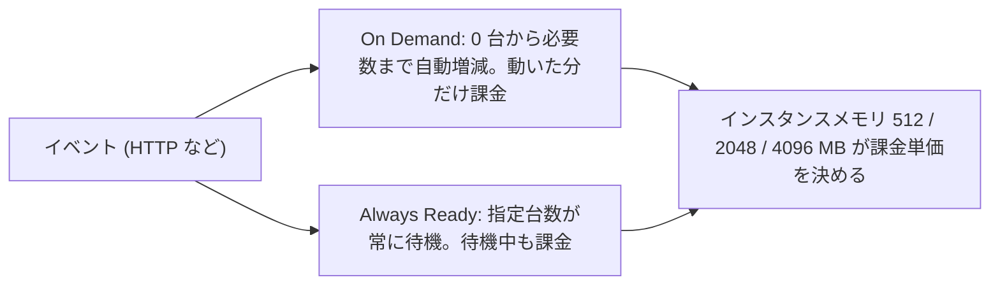

# 第 14 章 Functions ― Flex Consumption を軸に課金とネットワークの関係を辿る

第 4 部では、サービスを 1 章に 1 つずつ、同じ 6 ブロックの型で読み解きます。本章はその最初の章であり、型のひな形です。

対象は Azure Functions。ホスティングプランは Flex Consumption を使います。従来の Consumption プラン（Linux 版は 2028 年 9 月 30 日に廃止予定）はレガシーとして 1 段落だけ触れ、手順には含めません。

本章の出力はすべて本書の検証環境での実測です。

## 1. このサービスは何のためにあるか

Functions は、イベント（HTTP リクエスト、キューへの投入、タイマーなど）に反応してコードを実行するサービスです。サーバーの台数やプロセスの常駐を考えず、実行された分だけが課金されます。「コードはあるが、置いておくサーバーを持ちたくない」に対する Azure の答えです。

## 2. 縦の依存関係

このブロックでは、上の階層の設定や状態がこのサービスの挙動を変えることを「効く」と呼び、階層ごとに整理します。効かない階層があれば、効かない理由も書きます。

| 階層               | 効き方                                                                     |
| ------------------ | -------------------------------------------------------------------------- |
| テナント           | 直接は効きません。ただし後述のマネージド ID の実体はテナント側に生まれます |
| 管理グループ       | 継承されるポリシーと RBAC を通してのみ効きます（第 2 章）                  |
| サブスクリプション | 無料枠の集計単位。リソースプロバイダー登録もここの状態です                 |
| リソースグループ   | Function App と暗黙に作られる付属物のライフサイクル境界です                |

サブスクリプションの効き方が本章では具体的です。まず無料枠。Flex Consumption には毎月 250,000 実行と 100,000 GB 秒の無料付与がありますが、これは Function App ごとではなくサブスクリプション内の全 App の合算です（公式料金ページで確認。従来の Consumption は 100 万実行と 400,000 GB 秒でした）。アプリを分けても無料枠は増えません。分けたければサブスクリプションを分けることになり、第 1 章の「課金の境界」がそのまま設計判断に効いてきます。

次にリソースプロバイダー。Function App の作成は Microsoft.Web だけでなく監視系のプロバイダーも要求します。本書の検証では、CLI が次の警告とともに 2 つを自動登録しました。

```text
WARNING: Resource provider 'Microsoft.OperationalInsights' used by this operation is not registered. We are registering for you.
WARNING: Resource provider 'microsoft.insights' used by this operation is not registered. We are registering for you.
```

第 1 章で見た自動登録が、また黙って働いています。

リージョンについても 1 点。Flex Consumption は対応リージョンの一覧を持ち、`az functionapp list-flexconsumption-locations` で確認できます。本書の検証時点で 52 リージョンあり、日本の 2 リージョン（japaneast / japanwest）を含む主要リージョンは揃っていました。

## 3. 横の繋がり ― 認証認可

### 内向き

Function App から他のサービスへのアクセスは、第 7 章のマネージド ID が正道です。システム割り当てとユーザー割り当ての両方を載せられます。

ただし、既定の作成直後の状態はその理想と違います。アプリ設定を見ます。

```bash
az functionapp config appsettings list --name azp-ch14-func -g azp-ch14-rg --query "[].name" -o tsv
```

```text
AzureWebJobsStorage
DEPLOYMENT_STORAGE_CONNECTION_STRING
APPLICATIONINSIGHTS_CONNECTION_STRING
```

`AzureWebJobsStorage` と `DEPLOYMENT_STORAGE_CONNECTION_STRING` の中身は、対になるストレージへの接続文字列、つまり第 8 章で葬ったはずのキーです。デプロイの認証設定にも同じことが書かれています。

```bash
az functionapp deployment config show --name azp-ch14-func -g azp-ch14-rg \
  --query "storage.authentication" -o json
```

```text
{
  "storageAccountConnectionStringName": "DEPLOYMENT_STORAGE_CONNECTION_STRING",
  "type": "StorageAccountConnectionString",
  "userAssignedIdentityResourceId": null
}
```

既定はいまもキー認証が有効な状態で作られる。これをマネージド ID ベースの接続（`type` を UserAssignedIdentity にし、ストレージ側のキーを無効化する）へ置き換えるのが現在の推奨です。この置き換えは依存先のストレージの話そのものなので、第 15 章で正面から扱います。

### 外向き

Function App の HTTP エンドポイント（外部からアクセスするための入口の URL）へのアクセスは、関数キー（URL に付けるコード）、Entra ID 認証（App Service 認証）、匿名の 3 段階から選びます。関数キーはここでもキーです。書き込み系の関数を関数キーだけで公開しない、という判断は第 8 章の議論がそのまま当てはまります。

RBAC のスコープ選択について毎章の確認です。Function App の管理操作（設定変更・デプロイ）の権限は App 単体のスコープに掛けられます。ガバナンス階層と一致させる必要はありません。

## 4. 横の繋がり ― インフラ足回りとネットワーク

Flex Consumption の「プラン」が実際にどう見えるかを確かめます。

```bash
az appservice plan list -g azp-ch14-rg --query "[].{name:name, sku:sku.name, tier:sku.tier, workers:sku.capacity}" -o table
```

```text
Name                Sku    Tier             Workers
------------------  -----  ---------------  ---------
ASP-azpch14rg-731b  FC1    FlexConsumption  0
```

プランは暗黙に作られ、SKU は FC1、ワーカー数は 0 です。常駐する計算資源を持たない、という設計が capacity 0 に表れています。実行のスケールはプランではなく App 側の設定が受け持ちます。

```bash
az functionapp scale config show --name azp-ch14-func -g azp-ch14-rg -o json
```

```text
{
  "alwaysReady": [],
  "instanceMemoryMB": 2048,
  "maximumInstanceCount": 100,
  "triggers": null
}
```

インスタンスのメモリは既定 2048MB で、512 / 2048 / 4096 から選べます。この選択が課金の単価（GB 秒の GB）を直接決めます。

ネットワークについては、Flex Consumption は VNet 統合に対応しています。従来の Consumption プランが閉域化と縁遠かったのと対照的に、サーバーレスのまま閉域構成に入れることが Flex を標準とする大きな理由です。実際に閉域化する手順は、Storage・Key Vault と合わせて第 17 章ならぬ第 19 章で扱います。

## 5. 横の繋がり ― 契約・課金

Flex Consumption は純粋な従量課金に属します。課金の口は 2 系統です。

| 系統                     | 課金                                                          |
| ------------------------ | ------------------------------------------------------------- |
| On Demand（実行の都度）  | 実行時間（GB 秒）と実行回数（100 万件単位）。動かなければゼロ |
| Always Ready（常時待機） | 待機させるインスタンス分の GB 秒が実行がなくても発生          |



Always Ready は、コールドスタートを避けたい関数グループに対して台数を指定する設定です。実際に設定と解除を確かめます。

```bash
az functionapp scale config always-ready set --name azp-ch14-func -g azp-ch14-rg --settings http=1
```

設定が入ったかを確認します。

```bash
az functionapp scale config show --name azp-ch14-func -g azp-ch14-rg --query alwaysReady -o json
```

```text
[
  {
    "instanceCount": 1,
    "name": "http"
  }
]
```

この瞬間から、実行がなくても 2048MB × 1 台分の待機課金が始まります。観察したらすぐ戻します。

```bash
az functionapp scale config always-ready delete --name azp-ch14-func -g azp-ch14-rg --setting-names http
```

無料枠（250,000 実行 + 100,000 GB 秒/月）がサブスクリプション合算であることはブロック 2 のとおりです。

作ったものが課金上どう見えるかは、次の 1 コマンドで確認します。

```bash
sub=$(az account show --query id -o tsv)
az rest --method post \
  --url "https://management.azure.com/subscriptions/$sub/providers/Microsoft.CostManagement/query?api-version=2024-08-01" \
  --body '{"type":"ActualCost","timeframe":"MonthToDate","dataset":{"granularity":"None","aggregation":{"totalCost":{"name":"Cost","function":"Sum"}},"grouping":[{"type":"Dimension","name":"ServiceName"}]}}'
```

ただし注意があります。本書の検証環境（作成から数時間のサブスクリプション）では、このコマンドはまだ NotFound を返しました。コスト情報の反映には最大 24〜48 時間かかり、作りたてのサブスクリプションではコストの照会自体がまだ受け付けられません。この画面の読み方は第 23 章でまとめて扱います。

## 6. ハンズオン

手順の実体は `scripts/chapters/ch14-functions.sh` にあります。

```bash
./scripts/chapters/ch14-functions.sh
```

作った状態が期待どおりかを、読み取り専用のスクリプトで検査します。

```bash
./scripts/verify/ch14-functions.sh
```

本書の検証環境での verify の結果です。

```text
==> 第14章の状態を検証する
  OK   プランの tier が FlexConsumption である
  OK   インスタンスメモリが既定の 2048MB である
  OK   Always Ready は 0（アイドル時の課金なし）である
==> 検証に成功した
```

### 壊す演習

インスタンスメモリに許可されていない値を指定してみます。

```bash
az functionapp create --name azp-ch14-func3 -g azp-ch14-rg \
  --storage-account <ストレージ名> --flexconsumption-location japaneast \
  --runtime node --runtime-version 20 --instance-memory 1024
```

```text
ERROR: Site.FunctionAppConfig.ScaleAndConcurrency.InstanceMemoryMB is invalid.
The specified value of instanceMemoryMB (1024) is not allowed.
Please set it to one of the allowed values: 512,2048,4096.
```

権限でもスコープでも登録でもクォータでもない、5 つ目の失敗の軸、サービス固有の制約です。エラーが許容値まで教えてくれるので、切り分けは容易です。

### クリーンアップ演習

```bash
./scripts/teardown/ch14-functions.sh
```

リソースグループの削除 1 つですが、消える前に中を見ておく価値があります。自分で作ったのはストレージと Function App の 2 つなのに、リソースグループにはプラン（ASP-...）と Application Insights も入っています。1 回の `az functionapp create` が裏で 2 つの付属物を作っていた、というのが第 3 章の「一緒に消えるべきものをまとめる」の実例です。付属物が別のリソースグループに散らばる作り方をしていたら、この teardown は 1 手で済みません。

### 振り返り

| ブロック   | ハンズオンでの確認箇所                                                          |
| ---------- | ------------------------------------------------------------------------------- |
| 2 縦       | プロバイダー 2 つの自動登録の警告。無料枠の合算はコスト反映後に第 23 章で再確認 |
| 3 認証認可 | アプリ設定に接続文字列（キー）が既定で入っている現実                            |
| 4 足回り   | capacity 0 のプランと scale config の実測                                       |
| 5 課金     | Always Ready の設定・解除。コスト照会は反映待ちで NotFound                      |

## 検証環境

| 項目           | 値                                                                              |
| -------------- | ------------------------------------------------------------------------------- |
| 検証状態       | verified                                                                        |
| 検証日         | 2026-08-08                                                                      |
| Azure CLI      | 2.77.0                                                                          |
| Bicep CLI      | 0.46.1                                                                          |
| API バージョン | Microsoft.Web/sites@2024-11-01 (flexconsumption), Microsoft.Web/serverfarms FC1 |

## 理解度チェック

1. Flex Consumption の Function App をリソースグループごと削除すると、ユーザー割り当てマネージド ID も一緒に消えるでしょうか。消えない場合、どこに残るでしょうか（第 7 章の内容と合わせて）
2. 「無料枠の範囲で運用したいので、関数アプリを 3 つのサブスクリプションに分散させた」という判断は、無料枠の観点で意味があるでしょうか。管理コストとの引き換えも含めて論じてください
3. Always Ready を 1 台設定した Function App の月額課金は、まったく実行がなくてもゼロになりません。どのメーターで、どの設定値に比例して発生するか答えてください
