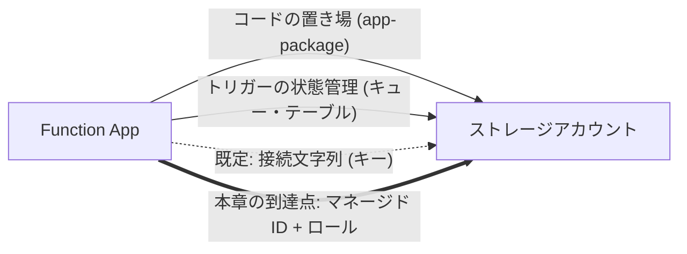

# 第15章 Storage ― Functions の隠れた依存関係から理解する

第14章で Function App を作ったとき、コマンドに `--storage-account` を渡しました。Functions はストレージなしでは作れません。本章はこの「隠れた相棒」の側から Storage を理解し、最後に相棒関係を完全キーレスに作り替えます。

本章の出力はすべて本書の検証環境での実測です。

## 1. このサービスは何のためにあるか

Azure Storage は、BLOB（ファイル）、キュー、テーブル、ファイル共有の 4 種類の保管を 1 つのアカウントで提供する基盤サービスです。他のサービスの土台としても使われており、Functions のように「利用者が意識しない場所」で働いていることが多いのが特徴です。

## 2. 縦の依存関係

| 階層               | 効き方                                                                 |
| ------------------ | ---------------------------------------------------------------------- |
| テナント           | 直接は効きません。名前の一意性はテナントとも無関係です（後述）         |
| 管理グループ       | 継承されるポリシーと RBAC を通してのみ効きます                         |
| サブスクリプション | リージョンあたりのアカウント数上限（クォータ）の単位です               |
| リソースグループ   | ライフサイクル境界。第14章の teardown で相棒ごと消えたのはこの設計です |

注目すべきは、どの階層にも属さない制約があることです。ストレージアカウントの名前は世界中で一意でなければなりません。壊す演習で実際に確かめます。

## 3. 横の繋がり ― 認証認可

### 外向き

Storage への認証は第8章で通しで実測しました。アクセスキー、Entra ID 認証（actions と dataActions の分離、データプレーンのロール）、そしてキーの無効化。本章のハンズオンはその総仕上げとして、Functions からの接続を含めてキーを根絶します。

もう 1 つの手段として SAS（共有アクセス署名。キーから派生する期限付きの URL）がありますが、キーが無効なら SAS も大半が無効になります。キーを止める判断は SAS 運用も道連れにする、と覚えておいてください。

RBAC のスコープ選択について毎章の確認です。データプレーンのロールは、アカウント単位だけでなくコンテナー単位のスコープにも掛けられます。「このコンテナーだけ読ませたい」はロール割り当てで表現でき、ガバナンス階層との一致は要りません。

### 内向き

Storage 自身が他へアクセスすることは基本ありません。本章では専ら「アクセスされる側」です。

## 4. 横の繋がり ― インフラ足回りとネットワーク

Storage の SKU は冗長性の選択です。

| SKU          | 何が起きても残るか                                        |
| ------------ | --------------------------------------------------------- |
| Standard_LRS | 1 つのデータセンター内で 3 重化。建屋の喪失には耐えません |
| Standard_ZRS | リージョン内の 3 つのゾーンに分散。建屋の喪失に耐えます   |
| Standard_GRS | LRS + ペアリージョンへの複製。リージョンの喪失に耐えます  |

本書の検証は消えて困らないデータしか置かないため、最安の LRS で通しています。SKU の選択はネットワーク機能の可否にはほぼ影響しませんが、料金と耐障害性を直接決めます。

ネットワーク面では、既定でパブリックなエンドポイントを持ちます。本書のハンズオンでは `--allow-blob-public-access false` で匿名アクセスを塞いでいますが、これは「認証なしの公開」を塞ぐだけで、エンドポイント自体はインターネットに面したままです。閉域化（Private Endpoint）は第19章で扱います。

## 5. 横の繋がり ― 契約・課金

Storage は純粋な従量課金で、保管容量（GB 月）と操作回数（トランザクション）の 2 系統で課金されます。本書の検証で作る程度のデータでは月に数円も掛かりません。

無料枠は Functions のような形では存在せず、使った分がそのまま計上されます。確認コマンドは第14章と同じコスト照会です（作りたてのサブスクリプションでは反映まで待つ必要があることも同じです）。

## 6. ハンズオン

手順の実体は `scripts/chapters/ch15-storage.sh` にあります。Function App を作り、その相棒ストレージを完全キーレス化するところまでを 1 本で実行します。

```bash
./scripts/chapters/ch15-storage.sh
./scripts/verify/ch15-storage.sh
```



### 隠れた依存の実体を見る

Function App を作った直後、ストレージの中を覗くと、頼んだ覚えのないものが入っています。

```bash
az storage container list --account-name <ストレージ名> --auth-mode login --query "[].name" -o tsv
```

```text
app-package-azpch15func-9343814
```

Functions のデプロイパッケージ（コードの zip）の置き場です。ほかにも、タイマーやキューのトリガーを使えば実行状態の管理に BLOB やキューが使われます。Functions にとってストレージは、コードと状態を置く床下収納です。床下があるからサーバーレスでいられる、とも言えます。

### 相棒関係をキーレスに作り替える

第14章で見たとおり、この関係は既定では接続文字列（キー）で結ばれています。スクリプトの後半はこれを 4 手で解体します。

```bash
# 1. Function App にシステム割り当て ID を与える（第7章）
az functionapp identity assign --name azp-ch15-func -g azp-ch15-rg

# 2. その ID にデータプレーンのロールを割り当てる（第8章）
#    ホストは BLOB・キュー・テーブルを使うため 3 つ
az role assignment create --assignee <principalId> --role "Storage Blob Data Owner" --scope <ストレージ>
az role assignment create --assignee <principalId> --role "Storage Queue Data Contributor" --scope <ストレージ>
az role assignment create --assignee <principalId> --role "Storage Table Data Contributor" --scope <ストレージ>

# 3. 接続文字列の設定を「アカウント名だけ」の設定に置き換える
az functionapp config appsettings set --settings AzureWebJobsStorage__accountName=<ストレージ名> ...
az functionapp config appsettings delete --setting-names AzureWebJobsStorage ...

# 4. デプロイ側の認証も ID へ切り替え、最後にキーを止める
az functionapp deployment config set --deployment-storage-auth-type SystemAssignedIdentity ...
az storage account update --allow-shared-key-access false ...
```

`AzureWebJobsStorage__accountName` という設定名が置き換えの鍵です。接続文字列の代わりにアカウント名だけを渡すと、Functions のランタイムは自分のマネージド ID でそのアカウントへ認証しに行きます。秘密の値がどこにも書かれていないことに注目してください。

検証の実行結果です。

```text
==> 第15章の状態を検証する
  OK   デプロイパッケージのコンテナーが存在する（隠れた依存の実体）
  OK   デプロイの認証がシステム割り当て ID である
  OK   接続文字列 AzureWebJobsStorage は存在しない
  OK   ストレージのキー認証が無効である
==> 検証に成功した
```

### 壊す演習 ― 世界で 1 つの名前

ストレージの名前の一意性を確かめます。ありそうな名前で作ってみます。

```bash
az storage account create --name storage123 -g azp-ch15-rg --location japaneast --sku Standard_LRS
```

```text
ERROR: (StorageAccountAlreadyTaken) The storage account named storage123 is already taken.
```

storage123 は、世界の誰かが使っています。この一意性はテナントともサブスクリプションとも無関係で、名前が `<アカウント名>.blob.core.windows.net` という世界共通の DNS 名になるためです。だから本書のストレージ名はサブスクリプション ID の断片を混ぜて衝突を避けています。命名の設計は付録 B で扱います。

### クリーンアップ演習

```bash
./scripts/teardown/ch15-storage.sh
```

第14章と同じくリソースグループ 1 つの削除です。Function App・プラン・Application Insights・ストレージ・ロール割り当てが一括で消えます。

### 振り返り

| ブロック   | ハンズオンでの確認箇所                                      |
| ---------- | ----------------------------------------------------------- |
| 2 縦       | 名前の一意性が階層の外にある制約だと壊す演習で確認          |
| 3 認証認可 | 3 つのデータロールと `__accountName` 設定でキーの根絶を完了 |
| 4 足回り   | LRS の選択（検証用途の判断）と匿名アクセスの遮断            |
| 5 課金     | 容量 + 操作の 2 系統。検証規模では数円未満                  |

## 検証環境

| 項目           | 値                                                                           |
| -------------- | ---------------------------------------------------------------------------- |
| 検証状態       | verified                                                                     |
| 検証日         | 2026-08-08                                                                   |
| Azure CLI      | 2.77.0                                                                       |
| Bicep CLI      | 0.46.1                                                                       |
| API バージョン | Microsoft.Storage/storageAccounts@2025-01-01, Microsoft.Web/sites@2024-11-01 |

## 理解チェック

1. Function App とその相棒ストレージを別々のリソースグループに置く設計には、どんな問題が生まれますか。第3章の原則と、本章の teardown の挙動から答えてください
2. ホストストレージの接続をマネージド ID 化する手順で、ロールを 3 つ（BLOB・キュー・テーブル）割り当てたのはなぜですか。1 つでは何が起きると考えられますか
3. 「キーを止めたのに、期限付きの共有 URL（SAS）でファイルを渡す運用が動き続けている」という報告がありました。ありえるでしょうか。SAS とキーの関係から説明してください
