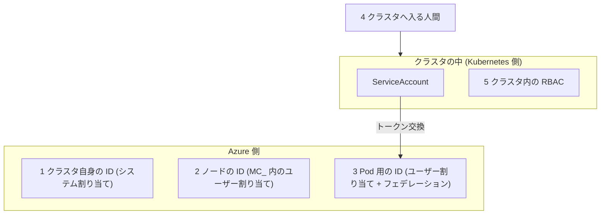
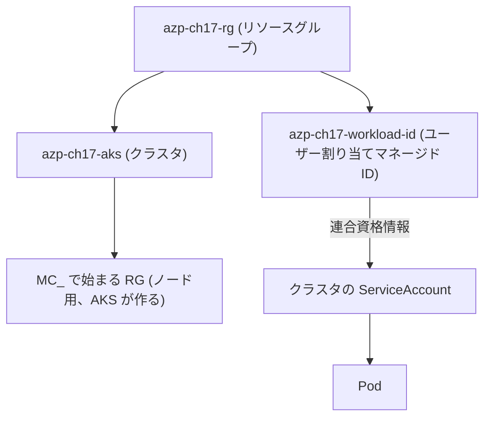

# 第 17 章 AKS ― 5 種類の ID と Workload ID

AKS（Azure Kubernetes Service）は、これまでの章のサービスと比べて関係する要素が桁違いに多いサービスです。特に ID は、1 つのクラスタに 5 種類が同居します。本章はこの 5 つを 1 つずつ実物で確かめ、山場である Workload ID（Pod から Azure への認証）まで辿ります。

課金の注意です。本章のハンズオンはノード 1 台の最小クラスタで、時間課金（本書の検証時の構成で 1 時間あたりおよそ 10 円強）が発生します。本書で唯一、動かしている間ずっと課金される章なので、観察が終わったら即座に削除してください。既定では実行せず読むだけでも、以降の章の理解に支障はありません。

本章の出力はすべて本書の検証環境での実測です。

## 1. このサービスは何のためにあるか

AKS は、コンテナ群を宣言どおりに動かし続ける Kubernetes のクラスタを、コントロールプレーンの運用を Azure に任せる形で提供するサービスです。Functions（第 14 章）がコード 1 つを動かす道具なら、AKS は多数のコンテナからなるシステム全体を運転する道具です。

## 2. 縦の依存関係

| 階層               | 効き方                                                                        |
| ------------------ | ----------------------------------------------------------------------------- |
| テナント           | 5 つの ID のうち Azure 側の 3 つが作られる場所です                            |
| 管理グループ       | 継承されるポリシーと RBAC。ノードの VM サイズ制限などの統制もここから流せます |
| サブスクリプション | VM ファミリごとのクォータと、利用可能な VM サイズの制限が直撃します（後述）   |
| リソースグループ   | 2 つ登場します。自分で作る RG と、AKS が勝手に作るノード用 RG です            |

サブスクリプションの効き方は本書の検証で痛感しました。最初に指定した VM サイズ Standard_B2s は「このサブスクリプションでは利用不可」と拒否され、許可リストにあるサイズでもクォータ 0 のファミリがありました。新しめのサブスクリプションでは、作りたいサイズ・許可されたサイズ・クォータのあるファミリ、の 3 条件の重なりを先に確認する必要があります。

```bash
az vm list-usage --location japaneast -o json   # ファミリごとのクォータ
```

リソースグループについては、クラスタを作ると頼んでいないリソースグループが出現します。

```bash
az aks show --name azp-ch17-aks -g azp-ch17-rg --query "nodeResourceGroup" -o tsv
```

```text
MC_azp-ch17-rg_azp-ch17-aks_japaneast
```

ノードの VM やディスクなどの実体は、自分の RG ではなくこの `MC_` の中に置かれます。クラスタというリソース（自分の RG）と、その部品（`MC_`）でライフサイクルの層が分かれており、クラスタを消せば `MC_` も自動で消えます。第 3 章の「一緒に消えるべきもの」を AKS が自前で実装している、と読めます。

## 3. 横の繋がり ― 認証認可

本章の核心です。5 つの ID を順に見ます。先に全体図を置きます。



### その 1: クラスタ自身の ID

コントロールプレーンが Azure を操作する（ロードバランサーを作るなど）ときの ID です。

```bash
az aks show --name azp-ch17-aks -g azp-ch17-rg --query identity -o json
```

```text
{
  "principalId": "cccc2222-xxxx-...",
  "type": "SystemAssigned"
}
```

既定でシステム割り当て（第 7 章）です。クラスタを消すと同時に消えます。

### その 2: ノード（kubelet）の ID

各ノード上のエージェントがコンテナイメージの取得などに使う ID です。

```bash
az aks show --name azp-ch17-aks -g azp-ch17-rg --query "identityProfile.kubeletidentity.resourceId" -o tsv
```

```text
.../resourcegroups/MC_azp-ch17-rg_azp-ch17-aks_japaneast/providers/
Microsoft.ManagedIdentity/userAssignedIdentities/azp-ch17-aks-agentpool
```

こちらはユーザー割り当てで、しかも置き場所は `MC_` の中です。クラスタの ID とノードの ID が別物として分かれていることを、まず押さえてください。

### その 3: Pod から Azure への ID ― Workload ID

アプリ（Pod）が Key Vault や Storage へアクセスするときの ID です。ここが本章の山場で、第 8 章のフェデレーションがそのまま再登場します。

かつては Pod-managed identity という仕組みがありましたが廃止済みで、現在は Microsoft Entra Workload ID が正解です。構造は、Kubernetes 側の ID と Azure 側の ID を結び付けるものです。

Kubernetes には ServiceAccount というクラスタ内の ID の仕組みがあり、クラスタは OIDC 発行者としてその ServiceAccount のトークンに署名できます。発行者の URL を見てみます。

```bash
az aks show --name azp-ch17-aks -g azp-ch17-rg --query "oidcIssuerProfile.issuerUrl" -o tsv
```

```text
https://japaneast.oic.prod-aks.azure.com/<テナントID>/dddd3333-.../
```

Azure 側には Pod 用のユーザー割り当てマネージド ID を用意し、「この発行者の、この ServiceAccount のトークンなら私として認めよ」という連合資格情報を登録します。

Pod 用のユーザー割り当てマネージド ID を作ります。

```bash
az identity create --name azp-ch17-workload-id -g azp-ch17-rg
```

その ID に、クラスタの発行者と ServiceAccount を信用する条件を登録します。

```bash
az identity federated-credential create --name aks-default-workload \
  --identity-name azp-ch17-workload-id -g azp-ch17-rg \
  --issuer <上の発行者URL> \
  --subject "system:serviceaccount:default:workload-sa" \
  --audiences api://AzureADTokenExchange
```

```text
{
  "issuer": "https://japaneast.oic.prod-aks.azure.com/<テナントID>/dddd3333-.../",
  "subject": "system:serviceaccount:default:workload-sa"
}
```

subject の形式が Kubernetes の語彙（namespace が default、ServiceAccount 名が workload-sa）になっています。GitHub Actions のときはリポジトリとブランチでしたが（第 8 章）、今回はクラスタ内の ID です。同じフェデレーションの型に、別の発行元の素性を差し込んでいるだけです。あとはこのマネージド ID にロールを割り当てれば（第 6 章）、Pod はシークレットなしで Azure に届きます。

### その 4: クラスタへのアクセス（人間の認証）

`az aks get-credentials` で取得する接続情報です。既定ではクラスタローカルの資格情報ですが、Entra ID 統合を有効にすれば、クラスタへの入場も第 5 章のテナントの台帳で管理できます。本書の検証では、ローカルに kubectl を入れずにクラスタ内でコマンドを実行できる `az aks command invoke` を使いました。

```bash
az aks command invoke --name azp-ch17-aks -g azp-ch17-rg --command "kubectl get nodes"
```

```text
aks-nodepool1-56922809-vmss000000 Ready v1.35.6
```

### その 5: クラスタ内の RBAC

Kubernetes 自身も RBAC を持っています（Role と RoleBinding）。Azure の RBAC がクラスタというリソースの外側を守り、Kubernetes の RBAC が中の Namespace や Pod への操作を守ります。同じ「RBAC」という名前の別の仕組みが内外に 1 つずつある、と整理してください。

## 4. 横の繋がり ― インフラ足回りとネットワーク

コントロールプレーンには Free と Standard の階層があり、Free は管理コスト無料（SLA なし）です。検証は Free で足ります。ノードは VM そのものなので、サイズ・台数・スケール設定がそのまま性能と課金を決めます。

ネットワークはそれ自体が 1 冊の本になる領域です。本書の範囲では、Pod にも IP が要るため VNet の設計がクラスタのスケール上限に直結する、とだけ覚えてください。

## 5. 横の繋がり ― 契約・課金

AKS の課金は「コントロールプレーン + ノード VM + 付随リソース」の合算です。Free tier ならコントロールプレーンは無料で、支配的なのはノードの VM 時間課金です。本書の構成（D2ls_v6 × 1 台）でおよそ 10 円強/時。Functions のような無料枠はありません。動いている限り課金される、という点で本書の他のどの章とも違います。

## 6. ハンズオン

本章のハンズオンは、ここまで引用してきたコマンド列そのものです。作成は 1 コマンドですが 5 分前後かかります。

この章の器を作ります。

```bash
az group create --name azp-ch17-rg --location japaneast \
  --tags azp-book=azure-practice azp-chapter=ch17 azp-lifecycle=ephemeral
```

クラスタを作ります。ここから時間課金が始まります。

```bash
az aks create --name azp-ch17-aks -g azp-ch17-rg \
  --node-count 1 --node-vm-size <利用可能なサイズ> \
  --enable-oidc-issuer --enable-workload-identity \
  --generate-ssh-keys --tier free
```

### 壊す演習 ― サブスクリプションが許さないサイズ

本書の検証で実際に起きた失敗です。

```bash
az aks create --name azp-ch17-aks -g azp-ch17-rg \
  --node-count 1 --node-vm-size Standard_B2s \
  --enable-oidc-issuer --enable-workload-identity \
  --generate-ssh-keys --tier free
```

```text
ERROR: (BadRequest) The VM size of Standard_B2s is not allowed in your subscription
in location 'japaneast'. The available VM sizes are 'standard_b2als_v2,...'
```

権限でもクォータでもなく、サブスクリプションに許可された VM サイズの一覧という、もう 1 つの制約です。エラーに許可されたサイズの一覧が入っているので、そこからクォータのあるファミリ（`az vm list-usage`）と突き合わせて選び直します。第 1 章から数えて、失敗の軸がまた 1 つ増えました。

### クリーンアップ演習

```bash
az group delete --name azp-ch17-rg --yes
```

自分の RG を消すと、クラスタが消え、連動して `MC_` のノード RG も自動で消えます。消し忘れがそのまま課金になる章なので、削除の完了まで確認してください。

```bash
az group list --query "[?starts_with(name,'MC_') || starts_with(name,'azp-ch17')].name" -o tsv
```

### 振り返り

| ブロック   | ハンズオンでの確認箇所                                                          |
| ---------- | ------------------------------------------------------------------------------- |
| 2 縦       | VM サイズの許可リストとクォータの二重チェック。`MC_` リソースグループの自動生成 |
| 3 認証認可 | 5 つの ID の実物。OIDC 発行者 URL と連合資格情報の subject                      |
| 4 足回り   | Free tier + 最小ノードという検証構成の選択                                      |
| 5 課金     | 時間課金ゆえの即時 teardown                                                     |

### ここまでで出来上がったもの

5 種類の ID のうち、この章で自分の手で作ったものを図にします。



見どころは、リソースグループが 2 つあることです。自分で作ったものの中にクラスタが置かれ、ノードなどの部品は AKS が作る `MC_` の中に置かれます。もう 1 つは、Pod が使う ID が連合資格情報でクラスタ側の ServiceAccount と結び付いていることです。password を渡す代わりに、どの ServiceAccount を信用するかを ID 側に書きます。

## 検証環境

| 項目           | 値                                                                               |
| -------------- | -------------------------------------------------------------------------------- |
| 検証状態       | verified                                                                         |
| 検証日         | 2026-08-08                                                                       |
| Azure CLI      | 2.77.0                                                                           |
| Bicep CLI      | 0.46.1                                                                           |
| API バージョン | Microsoft.ContainerService/managedClusters@2025-05-01 (K8s v1.35.6, Workload ID) |

## 理解度チェック

1. クラスタの ID（その 1）とノードの ID（その 2）に必要なロールは、それぞれ何に対するものになるでしょうか。「コントロールプレーンがロードバランサーを作る」「ノードがコンテナーレジストリからイメージを取得する」（ここでのコンテナーは第 7 章で実行した実行単位で、レジストリはその元になるイメージの置き場です）という 2 つの操作を割り当て先に振り分けてください
2. Workload ID の連合資格情報の subject を `system:serviceaccount:default:*` のようにワイルドカードにできたとしたら、何が危険ですか。第 8 章の GitHub の例と比べて説明してください
3. クラスタを消したのに課金が続いている、という報告がありました。本章の内容から、疑うべき消し残しはどこですか
