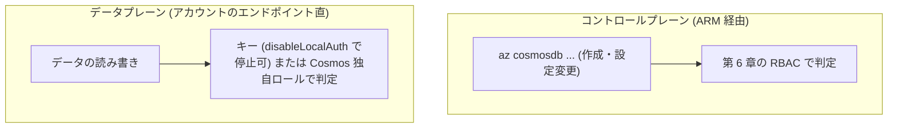

# 第 18 章 Cosmos DB ― コントロールプレーンとデータプレーンの RBAC は別物

Cosmos DB は Azure のグローバル分散データベースです。本章の主題はデータベースの機能ではなく、その認可の構造にあります。Cosmos DB のデータプレーン RBAC は、ここまで学んだ ARM の RBAC と名前も概念もよく似た、しかし完全に別の仕組みです。ポータルの IAM 画面からは設定できず、専用のロール定義と割り当てを持ちます。

この分離を実物で確かめ、キー認証を止める disableLocalAuth まで辿ります。本章の出力はすべて本書の検証環境での実測です。

## 1. このサービスは何のためにあるか

Cosmos DB は、世界中のリージョンへ複製でき、応答時間をミリ秒単位で保証する NoSQL データベースです。規模と速度の保証を最初から設計に組み込んでいることが、リレーショナルデータベースとの役割の違いです。

## 2. 縦の依存関係

| 階層               | 効き方                                                                  |
| ------------------ | ----------------------------------------------------------------------- |
| テナント           | Entra ID 認証（後述の AAD トークン）の発行元です                        |
| 管理グループ       | 継承されるポリシーと RBAC。第 20 章で disableLocalAuth の強制を掛けます |
| サブスクリプション | Free Tier の適用可否がここで決まります（後述）                          |
| リソースグループ   | ライフサイクル境界。アカウント削除は他のサービスより時間がかかります    |

サブスクリプションの効き方で注意すべきは Free Tier です。Cosmos DB の Free Tier は 1 サブスクリプションに 1 アカウントしか適用できません。教材やチームの検証で「とりあえず Free Tier」を選ぶと、2 人目・2 回目が適用できずに構成が割れます。本書は再実行可能性を優先し、Free Tier ではなくサーバーレス（serverless。使った分だけの課金で、使わなければほぼゼロ）で通します。

Cosmos DB のリソースプロバイダーが未登録なら登録します（第 1 章）。登録済みなら何も起きません。

```bash
az provider register --namespace Microsoft.DocumentDB --wait
```

この章の器を作ります。

```bash
az group create --name azp-ch18-rg --location japaneast \
  --tags azp-book=azure-practice azp-chapter=ch18 azp-lifecycle=ephemeral
```

アカウントをサーバーレスで作ります。

```bash
az cosmosdb create --name azp-ch18-cosmos -g azp-ch18-rg \
  --capabilities EnableServerless \
  --locations regionName=japaneast
```

## 3. 横の繋がり ― 認証認可



### 2 つの RBAC の分離を実測する

まず、Cosmos DB が持つデータプレーンのロール定義を、専用コマンドで一覧します。

```bash
az cosmosdb sql role definition list --account-name azp-ch18-cosmos -g azp-ch18-rg
```

```text
Cosmos DB Built-in Data Reader
Cosmos DB Built-in Data Contributor
```

次に、同じ名前を ARM の RBAC（第 6 章の世界）で探します。

```bash
az role definition list --name "Cosmos DB Built-in Data Contributor" --query "length(@)" -o tsv
```

```text
0
```

存在しません。このロールは ARM のロール定義ではなく、Cosmos DB が自分の中に持つ独自のロールです。割り当ても専用コマンドで行います。

```bash
az cosmosdb sql role assignment create --account-name azp-ch18-cosmos -g azp-ch18-rg \
  --role-definition-name "Cosmos DB Built-in Data Contributor" \
  --principal-id <objectId> --scope "/"
```

割り当てたあとに、ARM 側のロール割り当て（ポータルの IAM 画面に出るもの）を見てみます。

```bash
az role assignment list --scope <CosmosアカウントのリソースID> --query "length(@)" -o tsv
```

```text
0
```

ゼロです。いま行った割り当ては、ポータルのアクセス制御（IAM）画面のどこにも現れません。「IAM 画面で全部の権限が見える」という第 6 章までの前提が、Cosmos DB のデータプレーンには通用しません。これが本章の最重要ポイントです。権限の棚卸しをするときは、`az cosmosdb sql role assignment list` を別途確認する必要があります。

principal に割り当てるという発想、scope で範囲を絞るという発想は ARM の RBAC と同型です（scope の "/" はアカウント全体、"/dbs/mydb" ならデータベース単位）。同じ設計思想の、別実装の 2 つが並んでいる、と整理してください。

### キー認証を止める ― disableLocalAuth

Cosmos DB もアクセスキー（マスターキー）を持って生まれます。第 8 章の流れの最終形として、キー認証そのものを止める設定が disableLocalAuth です。

止める前に、キーでデータプレーンへアクセスできることを確かめます。SDK を使わず、公式の署名アルゴリズムどおりに HMAC 署名を組み立てて、データベース一覧の API を呼びました。

```text
HTTP 200 databases: {"_rid":"","Databases":[],"_count":0}
```

キーは有効です。では止めます。この設定には専用の CLI フラグがないため、汎用の更新コマンドでプロパティを直接書きます。

```bash
az resource update --ids <CosmosアカウントのリソースID> \
  --set properties.disableLocalAuth=true
```

## 4. 横の繋がり ― インフラ足回りとネットワーク

容量のモードが 3 つあります。プロビジョニング済みスループット（性能を予約して常時払う）、サーバーレス（使った分だけ）、Free Tier（1 サブスクリプション 1 つの制約付き無料枠）。この選択は SKU ではなくアカウントの性質として決まり、後から変えられないものもあります。検証・小規模はサーバーレス、常時高負荷はプロビジョニング済み、が出発点です。

ネットワークは既定でパブリックエンドポイントです。閉域化は第 19 章の対象ではなく（Functions・Storage・Key Vault で型を示します）、同じ Private Endpoint の仕組みがそのまま使えます。

## 5. 横の繋がり ― 契約・課金

サーバーレスの課金は、リクエストの処理量（RU: 要求ユニット）と保管容量の 2 系統です。本章のハンズオンで発行するリクエストは数個なので、課金は事実上ゼロです。コスト照会は第 14 章と同じコマンドで、反映後に Cosmos DB の行が現れます。

## 6. ハンズオン

本章のハンズオンは、ここまで引用してきたコマンド列そのものです。アカウントの作成には数分かかります。

### 壊す演習 ― disableLocalAuth の後で、同じキーを使う

止める前と同じ HMAC 署名のリクエストを、まったく同じキーで再送しました。

```text
HTTP 401
Local Authorization is disabled. Use an AAD token to authorize all requests.
```

明快な回答です。キーはもう鍵ではなく、Entra ID のトークン（メッセージ中の AAD は Entra ID の旧称です）だけが通ります。ここで先ほどのデータプレーン RBAC が効いてきます。トークンで認証した principal に、Cosmos 独自のロールが割り当てられているか。それが唯一の判定になります。

一方、コントロールプレーンは影響を受けません。disableLocalAuth を有効にしたまま、ARM 経由でデータベースを作ってみます。

```bash
az cosmosdb sql database create --account-name azp-ch18-cosmos -g azp-ch18-rg --name demo
```

```text
{
  "name": "demo"
}
```

成功します。disableLocalAuth が止めるのはデータプレーンのキー認証だけで、ARM の管理操作（第 6 章の RBAC で守られる世界）は別の門だからです。2 つのプレーンの分離が、遮断の場面でも一貫していることが確認できました。

この設定を組織の全アカウントに強制する方法が、第 20 章の Azure Policy です。

### クリーンアップ演習

```bash
az group delete --name azp-ch18-rg --yes
```

Cosmos アカウントの削除は他のサービスより時間がかかります（本書の検証で数分）。継続的バックアップを構成していた場合の復元候補の挙動は第 3 章の表のとおりです。

### 振り返り

| ブロック   | ハンズオンでの確認箇所                                                        |
| ---------- | ----------------------------------------------------------------------------- |
| 2 縦       | Free Tier を避け serverless を選ぶ判断                                        |
| 3 認証認可 | データプレーンロールが ARM に存在しないこと（0 件）と専用コマンドでの割り当て |
| 5 課金     | serverless でリクエスト数個なら事実上ゼロ                                     |
| 6 演習     | 200 → 401 の対比と、影響を受けないコントロールプレーン                        |

## 検証環境

| 項目           | 値                                                                                                                 |
| -------------- | ------------------------------------------------------------------------------------------------------------------ |
| 検証状態       | verified                                                                                                           |
| 検証日         | 2026-08-08                                                                                                         |
| Azure CLI      | 2.77.0                                                                                                             |
| Bicep CLI      | 0.46.1                                                                                                             |
| API バージョン | Microsoft.DocumentDB/databaseAccounts@2025-04-15 (serverless, disableLocalAuth), Cosmos data-plane REST 2018-12-31 |

## 理解度チェック

1. セキュリティ監査で「この Cosmos アカウントに誰がアクセスできるか一覧せよ」と言われました。ポータルの IAM 画面だけを見て報告すると、何を見落としますか。漏れなく調べるためのコマンドを 2 系統挙げてください
2. disableLocalAuth を有効にした直後、アプリケーションが 401 で停止しました。エラーメッセージに含まれるはずの文言と、復旧に必要な 2 つの設定（認証方式の変更とロールの割り当て）を、本章のコマンドで説明してください
3. 「検証用に Free Tier のアカウントを作ろうとしたら適用できなかった」という報告がありました。原因として何を確認しますか。本書が serverless を選んだ理由と合わせて答えてください
