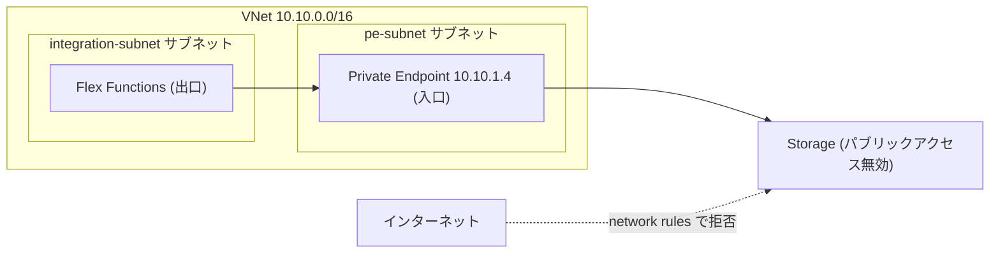

# 第 19 章 Networking ― VNet 統合と Private Endpoint が各層にどう効くか

第 4 部の締めくくりは、これまで作ってきたサービス群を閉域、つまりインターネットから見えない場所へ移す話です。第 8 章から積み上げてきた「誰であるかで守る」に、「どこから来たかで守る」の層を重ねます。

課金の注意です。Private Endpoint は存在する時間に比例して課金されます（1 つあたり月に数百円程度。時間割ならごく小さい額ですが、消し忘れは積み上がります）。ハンズオンの後は必ず削除してください。

本章の出力はすべて本書の検証環境での実測です。

## 1. このサービスは何のためにあるか

Azure Virtual Network（VNet）は、Azure 内に自分だけのプライベートなネットワーク空間を作るサービスです。その上に、PaaS サービスとの出入り口を 2 種類作れます。サービスへの入口をプライベート IP にする Private Endpoint と、サービスからの出口を VNet 経由にする VNet 統合です。

## 2. 縦の依存関係

| 階層               | 効き方                                                                |
| ------------------ | --------------------------------------------------------------------- |
| テナント           | 直接は効きません                                                      |
| 管理グループ       | ポリシーで「Private Endpoint 必須」のような統制を流せます（第 20 章） |
| サブスクリプション | VNet 数や IP アドレス数のクォータの単位です                           |
| リソースグループ   | VNet・Private Endpoint・DNS ゾーンのライフサイクルをまとめる境界です  |

本章の登場人物（VNet、サブネット、Private Endpoint、プライベート DNS ゾーン、DNS リンク）は数が多く、相互参照します。1 つのリソースグループにまとめ、消すときは丸ごと消す構成が第 3 章の原則どおり有効です。

## 3. 横の繋がり ― 認証認可

ネットワークの遮断は、認証認可の代わりではありません。Private Endpoint の内側でも、ストレージへのアクセスには第 8 章のデータロールが必要です。逆に、ロールがあってもネットワークが拒否すれば届きません。2 つの門は直列であり、両方を通ったリクエストだけがデータに触れます。

このことは、後半の壊す演習でエラーの違いとして観察できます。ロール不足は 403 の認可エラー、ネットワーク遮断はネットワーク規則のエラーと、別の顔で現れます。

RBAC のスコープ選択について毎章の確認です。ネットワークリソースの管理権限（VNet の変更、Private Endpoint の作成）と、その中を通るデータへの権限は別物です。ネットワーク管理者にデータのロールを渡す必要はなく、その逆も同じです。

## 4. 横の繋がり ― インフラ足回りとネットワーク

本章はこのブロックが主役です。ホスティングプランの選択がネットワーク機能の可否を決める、という第 4 部で繰り返してきた構造の総括でもあります。Functions で言えば、従来の Consumption プランは VNet 統合を持たず、閉域化の要件が出た瞬間にプランごと変える必要がありました。Flex Consumption は VNet 統合を備えており、サーバーレスのまま閉域構成に入れます。これが本書で Flex を標準とした理由の 1 つです（第 14 章）。実測は後半で行います。

## 5. 横の繋がり ― 契約・課金

VNet とサブネット自体は無料です。課金されるのは Private Endpoint（存在時間 + 処理データ量）と、構成によっては NAT やピアリングなどの通信系です。本章のハンズオンを 1 時間で終えれば数円です。コスト照会は第 14 章と同じコマンドです。

## 6. ハンズオン

### 閉域の骨組みを作る

```bash
az group create --name azp-ch19-rg --location japaneast \
  --tags azp-book=azure-practice azp-chapter=ch19 azp-lifecycle=ephemeral
az network vnet create --name azp-ch19-vnet -g azp-ch19-rg --address-prefix 10.10.0.0/16 \
  --subnet-name pe-subnet --subnet-prefix 10.10.1.0/24
az network vnet subnet create --name integration-subnet --vnet-name azp-ch19-vnet -g azp-ch19-rg \
  --address-prefix 10.10.2.0/24 --delegations Microsoft.App/environments
```

サブネットを 2 つに分けたのは役割が違うからです。pe-subnet は入口（Private Endpoint の置き場）、integration-subnet は出口（Functions の VNet 統合用。Flex は Microsoft.App/environments への委任が必要）です。

### Storage に Private Endpoint を生やす

キー無効のストレージを作り、BLOB サービスへの Private Endpoint を作ります。

```bash
az network private-endpoint create --name azp-ch19-pe -g azp-ch19-rg \
  --vnet-name azp-ch19-vnet --subnet pe-subnet \
  --private-connection-resource-id <ストレージのリソースID> \
  --group-id blob --connection-name azp-ch19-pe-conn
```

何ができたかを見ます。Private Endpoint の実体は、サブネットに刺さったネットワークインターフェイスです。

```bash
az network nic show --ids <PEのNIC> --query "ipConfigurations[0].privateIPAddress" -o tsv
```

```text
10.10.1.4
```

ストレージが、私たちのサブネットの中のプライベート IP を 1 つ持ちました。

### 名前解決を閉域側へ向ける

IP ができても、アプリはストレージへ名前（`<アカウント名>.blob.core.windows.net`）でアクセスします。VNet の中からの名前解決だけを 10.10.1.4 へ向けるのが、プライベート DNS ゾーンの仕事です。

```bash
az network private-dns zone create -g azp-ch19-rg --name privatelink.blob.core.windows.net
az network private-dns link vnet create -g azp-ch19-rg --zone-name privatelink.blob.core.windows.net \
  --name azp-ch19-dnslink --virtual-network azp-ch19-vnet --registration-enabled false
az network private-endpoint dns-zone-group create -g azp-ch19-rg --endpoint-name azp-ch19-pe \
  --name default --private-dns-zone privatelink.blob.core.windows.net --zone-name blob
```

ゾーンにレコードが自動登録されたことを確認します。

```bash
az network private-dns record-set a list -g azp-ch19-rg --zone-name privatelink.blob.core.windows.net \
  --query "[].{name:name, ip:aRecords[0].ipv4Address}" -o table
```

```text
Name          Ip
------------  ---------
azpch1912714  10.10.1.4
```

一方、VNet の外（手元の端末）から同じ名前を解決すると、依然としてパブリックな IP が返ります。

```text
20.60.172.1
```

同じ名前が、立っている場所によって別の IP に解決される。これが Private Endpoint の DNS の仕組みです。VNet にリンクされたゾーンは VNet の中の視点だけを書き換え、世界の DNS には何も起きていません。

### 壊す演習 ― 外の世界から遮断する

ここまでの構成では、パブリックな入口もまだ生きています。閉じます。

```bash
az storage account update --name <ストレージ名> -g azp-ch19-rg --public-network-access Disabled
```

そして VNet の外である手元から、第 8 章と同じ Entra ID 認証でアクセスしてみます。

```bash
az storage container list --account-name <ストレージ名> --auth-mode login
```

```text
ERROR:
The request may be blocked by network rules of storage account. Please check network rule set
using 'az storage account show -n accountname --query networkRuleSet'.
```

データロールは持っているのに、拒否されました。第 8 章の 403（ロール不足）とはメッセージの種類が違うことに注目してください。認可の門は通ったが、ネットワークの門で止められた。エラーの顔で、どちらの門で止まったかを見分けられます。

### Flex Functions を VNet に接続する

出口側も実測します。Flex Consumption の Function App を作り、VNet 統合を追加します。

```bash
az functionapp vnet-integration add --name azp-ch19-func -g azp-ch19-rg \
  --vnet azp-ch19-vnet --subnet integration-subnet
az functionapp vnet-integration list --name azp-ch19-func -g azp-ch19-rg --query "[].vnetResourceId" -o tsv
```

```text
.../virtualNetworks/azp-ch19-vnet/subnets/integration-subnet
```

これで Functions からの通信は VNet を通り、先ほどの Private Endpoint 経由で（閉域のまま）ストレージへ届く経路が成立します。サーバーレスの実行環境が自分のネットワークの中に足を持つ、というのが VNet 統合の意味です。



### クリーンアップ演習

```bash
az group delete --name azp-ch19-rg --yes
```

Private Endpoint・DNS ゾーン・VNet・Functions・ストレージが 1 手で消えます。時間課金の Private Endpoint が含まれるので、削除の完了まで確認してください。

### 振り返り

| ブロック   | ハンズオンでの確認箇所                                |
| ---------- | ----------------------------------------------------- |
| 3 認証認可 | ロール不足の 403 とネットワーク遮断のエラーの顔の違い |
| 4 足回り   | Flex だから成立した VNet 統合（プラン選択の帰結）     |
| 5 課金     | Private Endpoint の存在時間課金ゆえの即時削除         |
| 6 演習     | 中と外で同じ名前が違う IP に解決される DNS の実測     |

## 検証環境

| 項目           | 値                                                                                                   |
| -------------- | ---------------------------------------------------------------------------------------------------- |
| 検証状態       | verified                                                                                             |
| 検証日         | 2026-08-08                                                                                           |
| Azure CLI      | 2.77.0                                                                                               |
| Bicep CLI      | 0.46.1                                                                                               |
| API バージョン | Microsoft.Network/privateEndpoints@2024-05-01, privateDnsZones, Microsoft.Web/sites vnet-integration |

## 理解度チェック

1. Private Endpoint を作ったのに、VNet 内の VM からストレージへのアクセスがパブリック IP へ向かってしまいます。本章の構成要素のうち、何が欠けていると考えられますか
2. 「ネットワークを閉じたのだから、データロールの管理はもう不要では」という提案に、本章のどの実測結果を使って反論しますか
3. Key Vault（第 16 章）を本章の型で閉域化する場合、Private Endpoint の group-id とプライベート DNS ゾーン名は何になるか調べる必要があります。どのコマンド・ドキュメントで確認しますか（本書はストレージの blob で実測しました。同じ型の適用が読者演習です）。
