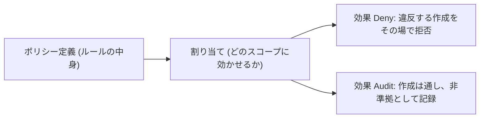

# 第 20 章 Azure Policy ― 強制（Deny）と監査（Audit）の違い

第 2 部で学んだ RBAC は「誰が操作できるか」を決めます。しかし「どんな構成なら許すか」は決められません。Contributor を持つ人は、キー認証が有効な Cosmos DB も、パブリック公開のストレージも作れてしまいます。

構成のルールを決めて機械に守らせる仕組みが Azure Policy です。本章では、第 18 章で手作業だった disableLocalAuth を組織のルールに変え、破ろうとして拒否されるところまでを実測します。

本章の出力はすべて本書の検証環境での実測です。

## ポリシーは定義と割り当てでできている



Azure Policy の構造は RBAC と同型です。ルールそのもの（ポリシー定義）と、それをどのスコープに効かせるか（ポリシー割り当て）が分かれています。定義の多くは組み込みで用意されており、まず探すところから始まります。

```bash
az policy definition list \
  --query "[?contains(displayName, 'Cosmos DB') && contains(displayName, 'local authentication')].{name:name, displayName:displayName}"
```

```text
[
  {
    "displayName": "Cosmos DB database accounts should have local authentication methods disabled",
    "name": "5450f5bd-9c72-4390-a9c4-a7aba4edfdd2"
  },
  {
    "displayName": "Configure Cosmos DB database accounts to disable local authentication",
    "name": "dc2d41d1-4ab1-4666-a3e1-3d51c43e0049"
  }
]
```

2 つ見つかりました。前者は状態を判定するタイプ（効果は Audit か Deny をパラメーターで選ぶ）、後者は Configure で始まる名前のとおり、非準拠のリソースを直しにいくタイプ（DeployIfNotExists / Modify 系）です。本章では前者を使います。

## Deny ― 作らせない

ポリシー定義をリソースグループのスコープへ、Deny の効果で割り当てます。

この章の器を作ります。

```bash
az group create --name azp-ch20-rg --location japaneast \
  --tags azp-book=azure-practice azp-chapter=ch20 azp-lifecycle=ephemeral
```

そのリソースグループのスコープに、Deny の効果で割り当てます。

```bash
az policy assignment create --name azp-ch20-deny-localauth \
  --display-name "Cosmos のローカル認証を禁止する" \
  --policy 5450f5bd-9c72-4390-a9c4-a7aba4edfdd2 \
  --scope <リソースグループのID> \
  --params '{"effect":{"value":"Deny"}}'
```

### 壊す演習 ― ルール違反の作成を試みる

第 18 章の既定の作成コマンド（disableLocalAuth を指定しない = キー認証が有効）を、この場所で実行します。

```text
ERROR: (RequestDisallowedByPolicy) Resource 'azp-ch20-cosmos' was disallowed by policy.
Policy identifiers: '[{"policyAssignment":{"name":"Cosmos のローカル認証を禁止する", ...},
"policyDefinition":{"name":"Cosmos DB database accounts should have local authentication
methods disabled", ... "version":"1.2.0"}}]'
```

作成は数秒で拒否されました。エラーコードは RequestDisallowedByPolicy。第 1 章から集めてきた失敗の軸に、最後の 1 つが加わりました。権限・スコープ・登録・クォータ・サービス固有の制約、そしてポリシー。エラーには、どの割り当てとどの定義に阻まれたかが正確に含まれており、「なぜ作れないのか」を運用者に説明する材料がそのまま出力されます。

注意点として、割り当ての反映は即時ではありません。本書の検証では割り当てから 1 分ほど待ってから試しています。

## Audit ― 記録するが止めない

同じ定義を、効果だけ Audit に変えて割り当て直します（割り当てを削除し、`--params` の effect を Audit にして再作成します）。そして、まったく同じ違反の作成を再試行します。

```text
{
  "disableLocalAuth": false,
  "state": "Succeeded"
}
```

今度は成功しました。キー認証が有効なままの、ルールに違反した Cosmos アカウントが実在しています。Audit はこれを止めず、非準拠として記録します。コンプライアンスの評価は非同期で、一覧に反映されるまで時間がかかります。

Deny と Audit の使い分けは、導入の順序の問題です。いきなり Deny を掛けると、既存の業務やデプロイが突然止まります。まず Audit で現状の違反量を把握し、直す当てが付いてから Deny に切り替える。これが定石です。

## 管理グループスコープへ ― 組織全体のルールにする

リソースグループへの割り当ては練習です。実務でこのルールは「全社の Cosmos はキー認証禁止」のような形を取り、置き場所は第 2 章の管理グループになります。

```bash
az policy assignment create --name azp-ch20-mg-audit \
  --display-name "組織全体で Cosmos のローカル認証を監査する" \
  --policy 5450f5bd-9c72-4390-a9c4-a7aba4edfdd2 \
  --scope "/providers/Microsoft.Management/managementGroups/azp-ch20-mg" \
  --params '{"effect":{"value":"Audit"}}'
```

割り当ては管理グループのスコープの照会で確認できます。

```bash
az policy assignment list --scope "/providers/Microsoft.Management/managementGroups/azp-ch20-mg" --query "[].name" -o table
```

```text
azp-ch20-mg-audit
```

1 つ、実測から注意を残します。第 2 章の RBAC の継承はサブスクリプション側の照会に比較的すぐ現れましたが、ポリシー割り当てはサブスクリプション側の一覧（`--disable-scope-strict-match`）への反映がもっと遅く、本書の検証では 1〜2 分では現れませんでした。割り当て直後に見えなくても慌てず、評価も反映も非同期であることを前提に扱ってください。

上位で割り当てたポリシーを下位で解除できないのは RBAC と同じです（第 2 章）。正当な例外は、割り当てを外すのではなく除外（exemption）として明示的に記録します。例外が構成として残ることで、「なぜこのリソースだけ許されているのか」が監査可能になります。

## クリーンアップ演習

割り当て、違反リソース、管理グループの順で片付けます。

管理グループスコープの割り当てを消します。ここが残ると組織全体に効き続けます。

```bash
az policy assignment delete --name azp-ch20-mg-audit --scope <管理グループ>
```

リソースグループスコープの割り当ても消します。

```bash
az policy assignment delete --name azp-ch20-audit-localauth --scope <リソースグループ>
```

違反リソースごとリソースグループを消します。

```bash
az group delete --name azp-ch20-rg --yes
```

サブスクリプションをルートへ戻してから管理グループを削除（第 2 章の順序）

ポリシーの割り当ては、対象のリソースが消えても残ります。リソースグループスコープの割り当てはリソースグループと共に消えますが、管理グループスコープのものは明示的に消すまで組織全体に効き続けます。teardown の順序に割り当てを含める習慣は、この章から先の運用でも重要です。

## 検証環境

| 項目           | 値                                                                              |
| -------------- | ------------------------------------------------------------------------------- |
| 検証状態       | verified                                                                        |
| 検証日         | 2026-08-08                                                                      |
| Azure CLI      | 2.77.0                                                                          |
| Bicep CLI      | 0.46.1                                                                          |
| API バージョン | Microsoft.Authorization/policyAssignments@2025-01-01, builtin 5450f5bd (v1.2.0) |

## 理解度チェック

1. RBAC で Contributor を絞ることと、Policy で Deny を掛けることは、どちらも「作らせない」結果を生めます。2 つの仕組みが答えている問いの違いを、第 6 章と本章の言葉で説明してください
2. 本番環境に新しい Deny ポリシーを入れる手順を、Audit → Deny の順序で計画してください。Audit の期間に何を観察し、何が終わったら Deny に進みますか
3. 管理グループスコープの Deny に違反する構成が、あるチームだけ業務上どうしても必要になりました。割り当てを外す・スコープから外す・除外を作る、の 3 案を監査可能性の観点で比較してください
