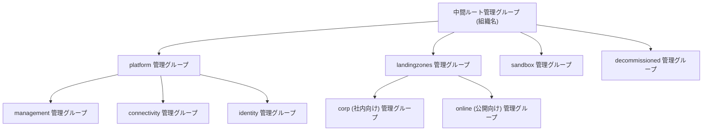

# 第 21 章 Cloud Adoption Framework と Landing Zone

第 1 部で階層を、第 2 部で ID を、第 3 部で IaC を、第 4 部でサービスを学びました。本章は、それらを組織の規模で組み立てるとどうなるかという設計思想の章です。

この章はハンズオンをしません。完全な Landing Zone のデプロイには専用のテナントと相応の権限・コストが必要で、検証サブスクリプション 1 つの世界には収まらないからです。代わりに、公式実装を読む教材として使います。読むために必要な予備知識は、ここまでの章ですべて揃っています。

## Cloud Adoption Framework とは

Cloud Adoption Framework（CAF）は、組織が Azure を導入する道のり全体（戦略、計画、準備、移行、統治、管理）をまとめた Microsoft の公式ガイドです。本書がここまで扱ってきたのは、この中の「準備（Ready）」と「統治（Govern）」の技術的中核にあたります。

CAF の準備フェーズの成果物が Landing Zone、着陸地帯です。ワークロードが着陸する前に、階層・ID・ネットワーク・統制が整えられた場所を先に作っておく、という発想です。

## プラットフォームとアプリケーションの分離

Landing Zone は 2 種類に分かれます。

| 種類                          | 中身                                                            | 誰のものか                                                         |
| ----------------------------- | --------------------------------------------------------------- | ------------------------------------------------------------------ |
| プラットフォーム Landing Zone | 管理グループ階層、ポリシー、共有ネットワーク、ID 基盤、ログ収集 | 組織に 1 つ（テナントに 1 つが原則）。プラットフォームチームが持つ |
| アプリケーション Landing Zone | ワークロードが実際に載るサブスクリプション                      | ワークロードごと。各チームが持つ                                   |

この分離は、本書で積み上げた概念の再配置です。プラットフォーム側は第 2 章（管理グループ）、第 20 章（ポリシー）、第 19 章（ネットワーク）の集合体で、アプリケーション側は第 22 章で扱うサブスクリプション払い出しの受け皿です。

推奨される管理グループ階層は次の形です。



第 2 章で「階層は効かせたいものの単位で切る」と述べました。この推奨階層はその実例です。platform 配下は共有基盤ゆえの厳しい統制、landingzones 配下はワークロード向けの標準統制、sandbox は実験のための緩い統制、decommissioned は廃止済みサブスクリプションの隔離。組織図ではなく、統制の強度で切られています。

## 実装は AVM の積み上げ

Landing Zone の公式 IaC 実装は、Bicep では Azure Verified Modules（AVM）for Platform Landing Zone が現行の正です（GA 済みで、公式アクセラレータの既定。旧来の ALZ-Bicep クラシックは 2026 年 2 月 16 日にアクセラレータから削除され、リポジトリはアーカイブ予定です）。

実在をレジストリで確かめられます。第 12 章と同じ方法です。

```bash
curl -s https://mcr.microsoft.com/v2/bicep/avm/ptn/alz/empty/tags/list
```

```text
bicep/avm/ptn/alz/empty
['0.3.4', '0.3.5', '0.3.6']
```

`avm/ptn/` という接頭辞に注目してください。第 12 章で使った `avm/res/`（単一リソース）と違い、ptn はパターン、つまり複数リソースの組み合わせ済みモジュールです。Landing Zone は、この ptn モジュールが res モジュールを束ね、それを設定ファイル（管理グループ階層の定義、ポリシーの選択）で味付けする構造になっています。

## 読み方の案内

公式ドキュメントとリポジトリを読むときの地図です。

- CAF の Landing Zone 概説: <https://learn.microsoft.com/azure/cloud-adoption-framework/ready/landing-zone/>
- Bicep 実装のドキュメント: <https://azure.github.io/Azure-Landing-Zones/bicep/>

読む順序は、本書の章立てと対応させると迷いません。

| 実装の構成要素            | 本書の対応章       | 読むときの問い                                                  |
| ------------------------- | ------------------ | --------------------------------------------------------------- |
| 管理グループ階層の定義    | 第 2 章・第 4 章   | どの単位で統制を変えたいのか                                    |
| ポリシー割り当ての一覧    | 第 20 章           | どれが Deny でどれが Audit か。なぜその強度か                   |
| ネットワーク（hub-spoke） | 第 19 章           | Private Endpoint と DNS ゾーンがどこに集約されているか          |
| モジュール構造            | 第 12 章・第 13 章 | ptn が res をどう束ねているか。バージョン固定はどうなっているか |
| デプロイのスコープ        | 第 11 章           | どのテンプレートがテナント・管理グループスコープか              |

なお、かつて同じ役割を担う Azure Blueprints というサービスがありましたが、2026 年 7 月 11 日に廃止されました。ガバナンスの配布は本書で扱った Template Specs・Deployment Stacks・Azure Policy と IaC の組み合わせに一本化されています。古い記事で Blueprints を見かけたら、この置き換えを思い出してください。

## サブスクリプションが管理単位である、ということ

Landing Zone の設計で最も重要な判断は、既に第 1 章で学んでいます。サブスクリプションは課金・クォータ・使えるサービスの境界であり、アプリケーション Landing Zone とは「ワークロードに 1 つずつ配られるサブスクリプション」のことです。

ワークロードごとにサブスクリプションを切ることで、課金は自然に分離され、クォータの取り合いは起きず、統制は管理グループの配置だけで決まります。この「サブスクリプションを量産して配る」運用の実際が、次章のマルチサブスクリプション設計です。

## 検証環境

| 項目           | 値                                                                  |
| -------------- | ------------------------------------------------------------------- |
| 検証状態       | verified                                                            |
| 検証日         | 2026-08-08                                                          |
| Azure CLI      | 2.77.0                                                              |
| Bicep CLI      | 0.46.1                                                              |
| API バージョン | avm/ptn/alz/empty:0.3.6 (registry), 公式ドキュメント確認 2026-08-08 |

## 理解度チェック

1. プラットフォーム Landing Zone を「テナントに 1 つ」とする原則は、本書で学んだどの境界の性質から導かれますか。第 1 章・第 2 章の言葉で説明してください
2. 推奨階層の sandbox 管理グループには、どんな統制を置くべきでしょうか。第 20 章の Audit / Deny と、第 1 章のクォータの観点から設計してください
3. 自社の Landing Zone を AVM の ptn モジュールで組むとき、モジュールのバージョンを固定すべき理由と、上げるときの手順を、第 12 章の内容から説明してください
