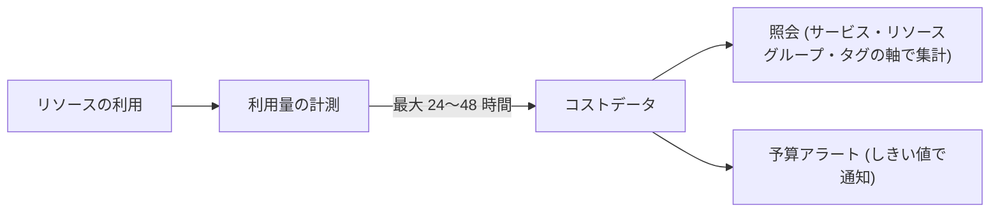

# 第23章 コストの見方 ― タグとスコープで課金を切り分ける

Part 4 の各章は「作ったものが課金上どう見えるか」を確認するコマンドで終わっていました。本章はその受け皿です。課金データがどこから来て、どの単位で集計され、どう切り分けるかをまとめます。

本章の出力はすべて本書の検証環境（第0章で作った従量課金サブスクリプション）での実測です。

## 課金データは遅れて届く



最初に、本書の検証で繰り返し確かめた事実からです。リソースの利用からコストデータの反映までには最大 24〜48 時間の遅延があり、作りたてのサブスクリプションではコストの照会そのものがまだ受け付けられません。

```bash
sub=$(az account show --query id -o tsv)
az rest --method post \
  --url "https://management.azure.com/subscriptions/$sub/providers/Microsoft.CostManagement/query?api-version=2024-08-01" \
  --body '{"type":"ActualCost","timeframe":"MonthToDate","dataset":{"granularity":"None","aggregation":{"totalCost":{"name":"Cost","function":"Sum"}},"grouping":[{"type":"Dimension","name":"ServiceName"}]}}'
```

サブスクリプション作成から数時間の時点で、この照会は次を返しました（作成 7 時間後の再試行でも同じでした）。

```text
ERROR: Not Found({"error":{"code":"NotFound","message":"GtmDimensionDataProvider.GetAzureSubscriptionsById returns null or empty list for id: ..."}})
```

「コストが 0 と表示される」ではなく「照会自体が404」という顔で現れるのがつまずきどころです。使った直後に見えないのは正常であり、課金の監視はリアルタイムの仕組みではない、という前提から出発してください。

## 何をどの軸で切るか

データが反映されたあと、上の照会の grouping を替えることが「切り分け」の実体です。よく使う軸は 3 つあります。

| 軸               | grouping の指定                                   | 答えられる問い               |
| ---------------- | ------------------------------------------------- | ---------------------------- |
| サービス         | `{"type":"Dimension","name":"ServiceName"}`       | 何のサービスに払っているか   |
| リソースグループ | `{"type":"Dimension","name":"ResourceGroupName"}` | どの塊に払っているか         |
| タグ             | `{"type":"TagKey","name":"azp-chapter"}`          | 誰の・何のためかで按分すると |

3 つ目のタグが、組織の実務で最重要です。リソースグループやサブスクリプションの境界は技術の都合で切られますが、コストの説明責任は部署・プロジェクト・環境という別の軸で問われます。その橋渡しができるのはタグだけです。

本書のハンズオンがすべてのリソースグループに `azp-chapter` タグを付けてきたのは、この照会のためでした。ただしタグ集計には前提があります。タグは付けた時点から先の利用にしか効きません。あとからタグを付けても過去の課金は無タグのまま残ります。付録 B で扱う「作成時にタグを強制する」設計は、コスト按分の土台でもあります。

## 集計のスコープと請求の単位は別物

照会はサブスクリプションだけでなく、リソースグループや管理グループのスコープでも実行できます。ここで第2章の内容を思い出してください。管理グループでコストをまとめて見ることはできますが、請求書はあくまでサブスクリプション（正確にはその上の課金アカウント）の単位で発行されます。見る単位と払う単位は独立です。「部門の管理グループでコストが見えるのだから請求も分かれているはず」という誤解は、月末に発覚します。

## 使いすぎを止める ― 予算アラート

見えるのが遅いなら、守りは先に仕掛けておく必要があります。予算（budget）は、スコープに対して月額の枠と通知条件を宣言する仕組みです。本書の検証環境に実際に仕掛けたものがこれです。

```bash
az rest --method put \
  --url "https://management.azure.com/subscriptions/$sub/providers/Microsoft.Consumption/budgets/azp-monthly-budget?api-version=2024-08-01" \
  --body '{
    "properties": {
      "category": "Cost", "amount": 1000, "timeGrain": "Monthly",
      "timePeriod": {"startDate": "2026-08-01T00:00:00Z", "endDate": "2027-07-31T00:00:00Z"},
      "notifications": {
        "actual80": {"enabled": true, "operator": "GreaterThan", "threshold": 80,
                     "contactEmails": ["<通知先>"], "thresholdType": "Actual"}
      }
    }
  }'
```

```text
{
  "amount": 1000.0,
  "grain": "Monthly",
  "name": "azp-monthly-budget"
}
```

月 1,000 円の枠に対し、実績が 80% を超えたらメールが飛びます。予算は使用を止めません。通知するだけです。それでも、コストデータの遅延を考えれば「気づく仕組みを先に置く」ことの価値は大きく、検証サブスクリプションを作ったら最初に仕掛ける 1 手として勧めます。thresholdType を Forecasted にすれば、実績ではなく着地予測での通知もできます。

## 定期的な出力 ― エクスポート（Exports）

照会はその場の質問ですが、経理や分析の実務では、コストデータを毎日ストレージへ書き出して蓄積するエクスポート（機能名は Exports）を使います。出力先は第15章のストレージアカウントで、そこから先は組織の分析基盤の世界です。本書では仕組みの存在の紹介に留めます。

## 検証環境

| 項目           | 値                                                                                                  |
| -------------- | --------------------------------------------------------------------------------------------------- |
| 検証状態       | verified                                                                                            |
| 検証日         | 2026-08-08                                                                                          |
| Azure CLI      | 2.77.0                                                                                              |
| Bicep CLI      | 0.46.1                                                                                              |
| API バージョン | Microsoft.CostManagement/query@2024-08-01 (NotFound 実測), Microsoft.Consumption/budgets@2024-08-01 |

## 理解度チェック

1. 「今日のハンズオンでいくら使ったか、いますぐ確認したい」という要求に、本章の実測を踏まえてどう答えますか。代わりにできる確認と、正確な数字が得られる時期を示してください
2. 部門別のコスト按分をリソースグループ名の規約だけで実現しようとする案と、タグで実現する案の弱点をそれぞれ挙げてください。リソースが部門を移る場合に何が起きますか
3. 予算アラートの threshold を Actual 80% と Forecasted 100% の 2 本立てにする構成には、それぞれどんな役割がありますか。コストデータの遅延と合わせて説明してください
