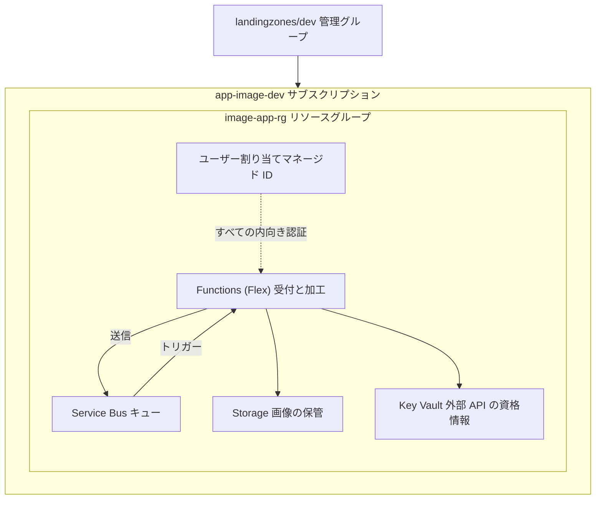

# 第 24 章 1 つのアプリケーションをゼロから設計し、全階層を貫通させる

最終章です。新しいことは 1 つしか出てきません。代わりに、ここまでのすべてを 1 つの設計に組み上げます。

題材はこうします。画像を受け取り、処理の依頼をキューに積み、非同期に加工して保存する小さなアプリケーション。ありふれた構成ですが、この「ありふれた」を Azure の全階層で正しく設計すると、本書の全章が 1 回ずつ登場します。そして構成要素の 1 つに、本書で扱っていないサービス Service Bus をあえて選びます。未習のサービスを 6 ブロックの型で読み解けること、それがこの本の主張の証明です。

## 全体設計



### 縦の設計 ― どの階層に何を置くか

| 階層               | 判断                                                                | 根拠の章                    |
| ------------------ | ------------------------------------------------------------------- | --------------------------- |
| テナント           | 会社の既存テナント。アプリのために作らない                          | 第 1 章・第 21 章           |
| 管理グループ       | landingzones/dev の配下に置く。dev の統制（Audit 中心）を継承させる | 第 2 章・第 20 章・第 21 章 |
| サブスクリプション | ワークロードと環境の組で払い出す（app-image-dev）                   | 第 22 章                    |
| リソースグループ   | 全部品を 1 つに。このアプリが消える日は全部一緒に消える             | 第 3 章                     |

### 横の設計 ― ID と認証

- ユーザー割り当てマネージド ID を 1 つ作り、Functions に載せます。ユーザー割り当てを選ぶのは、IaC の再デプロイで ID と権限を保つためです（第 7 章）
- Storage・Service Bus・Key Vault はすべてキー認証を無効にし、この ID への RBAC だけで繋ぎます（第 8 章・第 15 章・第 16 章）
- ロールは最小に。Storage Blob Data Contributor、Azure Service Bus Data Sender / Receiver、Key Vault Secrets User を、それぞれのリソーススコープで（第 6 章）
- デプロイは GitHub Actions からのフェデレーションで、シークレットレスにします（第 8 章）

### 横の設計 ― ネットワークと課金

- dev 環境は閉域化を見送り、キー無効 + 最小 RBAC を守りの主軸にします。prod へ昇格するとき、第 19 章の型（Private Endpoint + プライベート DNS）を Storage と Key Vault に適用します
- 課金は Flex の従量 + Storage 容量 + Service Bus Basic（操作課金）で、無風なら月数十円。サブスクリプションに予算アラートを最初に作ります（第 23 章）
- 全リソースに azp 系のタグを付け、タグ軸のコスト照会に備えます（第 23 章・付録 B）

### 実装の形

第 13 章の型をそのまま使います。AVM モジュール + 自作モジュールを束ねた Bicep を、Deployment Stack として `actionOnUnmanage: deleteResources` で運用します。構成から消えたものは実世界からも消えます。このアプリを畳むときも、スタックの削除 1 手で済みます（第 11 章）。

## 未習サービスを型で読む ― Service Bus

Service Bus は本書のどの章でも扱っていません。6 ブロックの型で、公式ドキュメントと最小の実測だけからどこまで読めるかをやってみます。以下の実測は本書の検証環境で実際に行ったものです。

ブロック 1（何のためにあるか）。アプリ間でメッセージを確実に受け渡すキューです。受け手が止まっていてもメッセージが失われない、処理の受け皿です。

ブロック 2（縦の依存関係）。リソースプロバイダーは Microsoft.ServiceBus で、例によって未登録から始まりました（第 1 章の型どおり `az provider register` で登録）。名前空間の名前はグローバル一意です（第 15 章の型）。

ブロック 3（認証認可）。作成直後を観察すると、見覚えのある形が出てきます。

Service Bus のリソースプロバイダーが未登録なら登録します（第 1 章）。

```bash
az provider register --namespace Microsoft.ServiceBus --wait
```

この章の器を作ります。

```bash
az group create --name azp-ch24-rg --location japaneast \
  --tags azp-book=azure-practice azp-chapter=ch24 azp-lifecycle=ephemeral
```

名前空間の名前も世界で一意である必要があるので、サブスクリプション ID から組み立てます。

```bash
sub=$(az account show --query id -o tsv)
ns="azpch24$(echo "$sub" | tr -d - | cut -c1-8)"
```

名前空間を作り、作成直後の認証まわりの既定値を表示させます。

```bash
az servicebus namespace create --name "$ns" -g azp-ch24-rg --sku Basic \
  --query "{sku:sku.name, disableLocalAuth:disableLocalAuth}"
```

```text
{
  "disableLocalAuth": false,
  "sku": "Basic"
}
```

disableLocalAuth。第 18 章の Cosmos DB と同じ語彙です。キー（Service Bus では SAS ポリシー）認証が既定で有効で、同じ設計思想で止められると読めます。実際に止まりました。

```bash
az servicebus namespace update --name "$ns" -g azp-ch24-rg --disable-local-auth true
```

```text
true
```

データプレーンのロールはどうでしょうか。Cosmos は独自の仕組みを持っていましたが、Service Bus は ARM の RBAC の中にあります。

```bash
az role definition list --name "Azure Service Bus Data Sender" \
  --query "[0].{name:roleName, dataActions:permissions[0].dataActions}"
```

```text
{
  "dataActions": [
    "Microsoft.ServiceBus/*/send/action"
  ],
  "name": "Azure Service Bus Data Sender"
}
```

dataActions（第 8 章の語彙）を持つ通常のロールです。つまり割り当ては第 6 章の `az role assignment create` がそのまま使え、Cosmos のような専用コマンドは要りません。同じ「データプレーン RBAC」でも実装の来歴が違う、という比較まで、型があるから最初のセッションで到達できます。

ブロック 4〜5（足回りと課金）。SKU は Basic / Standard / Premium で、キューだけなら Basic、トピック（出版購読）が要るなら Standard、VNet 統合や専有性能が要るなら Premium、と公式の SKU 表から読めます。課金は Basic なら操作 100 万件単位の従量です。

ブロック 6（ハンズオン）。ここまでの実測がそのまま最初のハンズオンです。壊す演習を設計するなら、第 18 章の型を借りて「disableLocalAuth 後に SAS キーでメッセージ送信して失敗を観察する」が最初の候補になるでしょう。

型に沿って問いを置いていくと、未習のサービスでも「何を確認すれば設計に組み込めるか」が最初から見えています。これが、サービスを 6 つに絞って型を深く固定した理由です。残りのサービスへの適用は、付録 A のワークシートが受け持ちます。

## 検証環境

| 項目           | 値                                                                   |
| -------------- | -------------------------------------------------------------------- |
| 検証状態       | verified                                                             |
| 検証日         | 2026-08-08                                                           |
| Azure CLI      | 2.77.0                                                               |
| Bicep CLI      | 0.46.1                                                               |
| API バージョン | Microsoft.ServiceBus/namespaces@2024-01-01 (Basic, disableLocalAuth) |

## 理解度チェック

1. この設計で、画像の保管先ストレージだけを本番昇格後も残し、他を作り直したくなったとします。リソースグループとスタックの設計をどう変更しますか（第 3 章・第 11 章・第 13 章）
2. Service Bus の Basic SKU を選んだ判断は、どんな要件が出てきたら覆りますか。SKU 表のどの行を見て判断しますか（第 14 章・第 19 章の型）
3. 本書を読み終えたあなたが、次に Container Apps を学ぶとします。6 ブロックの型で最初に発行するコマンドを 3 つ挙げてください
